# CodebaseAnaylze.md — 全专案玩法与资料流分析

> **本文档定位**：基于对 `Assets/` 下 **223 个 C# 文件、约 7.6 万行**自有代码的通读，
> 独立整理出的**玩法系统全景 + 系统间资料流**，深入到**类与方法级**，并覆盖编辑器工具链。
> 与其他文档的分工：
> `ProjectCodeGuide.md` = 逐脚本使用指南（改代码前查它）；
> `HowToUse.md` = 剧本 DSL 语法教程（写剧本时查它）；
> `WhatAiDo.md` = 按时间顺序的开发记录（查「这个功能当初为什么这么做」）；
> `SetUpGuide.md` = 从空场景手搭舞台；
> **本文** = 「这个专案到底是怎么运转的」的一次性通盘解剖。
>
> 快照时间：**2026-09-02**，分支 `main`（HEAD `a7b30e6`）。所有类名 / 方法名 / 常量名均与当前源码一致。

> ⚠ **与 `CLAUDE.md` 的路径描述不一致处（以本文为准，实测）**
>
> | CLAUDE.md 写的 | 实际路径 |
> |---|---|
> | `Assets/Scripts/VNEffects/` | `Assets/Project/Scripts/VNEffects/` |
> | `Assets/Scenes/VNEffectsDemo.unity` | `Assets/Project/Scenes/VNEffectsDemo.unity` |
> | `Assets/Shaders/` | `Assets/Art/Shaders/` |
> | `Assets/VNEffects/Materials/` | `Assets/VNEffects/`（材质与 camseq 预设库同目录） |

---

## 目录

| # | 章节 | 一句话 |
|---|---|---|
| 1 | [专案地形图](#1-专案地形图) | 规模、目录、分层 |
| 2 | [游戏是什么：主玩法循环](#2-游戏是什么主玩法循环) | 玩家实际在玩什么 |
| 3 | [全局资料流总图](#3-全局资料流总图) | 一张图看懂全部 |
| 4 | [剧本引擎：Parser → Runner → Stage](#4-剧本引擎parser--runner--stage) | 核心三层 |
| 5 | [控制流：跳转 / 子程序 / 章节](#5-控制流跳转--子程序--章节) | label/jump/call/params/chapter |
| 6 | [世界状态层：VNFlags / VNExpression](#6-世界状态层vnflags--vnexpression) | 唯一的真值来源 |
| 7 | [存档系统与三条状态恢复通道](#7-存档系统与三条状态恢复通道) | 最容易出 bug 的地方 |
| 8 | [玩法事件模块系统](#8-玩法事件模块系统) | event 命令与 12 个模块 |
| 9 | [养成 / 经济 / 装备 / 任务 / 时间](#9-养成--经济--装备--任务--时间) | 数值层 |
| 10 | [AI 自由聊天子系统](#10-ai-自由聊天子系统) | 唯一会联网的系统 |
| 11 | [内容资产层：VNGameConfig 与 Def 家族](#11-内容资产层vngameconfig-与-def-家族) | 资产即真相 |
| 12 | [演出与特效系统](#12-演出与特效系统) | 分层调色、镜头、转场 |
| 13 | [UI、皮肤与系统面板](#13-ui皮肤与系统面板) | 三条皮肤线 |
| 14 | [本地化、字体与音频](#14-本地化字体与音频) | 三语与三通道 |
| 15 | [四类持久化存储的语义分工](#15--四类持久化存储的语义分工) | ★ 全专案最重要的一张表 |
| 16 | [输入优先级栈与全局暂停](#16-输入优先级栈与全局暂停) | VNPause / VNTime |
| 17 | [编辑器工具链](#17-编辑器工具链) | 15 个窗口 + 7 个装机器 |
| 18 | [横切不变量与技术债](#18-横切不变量与技术债) | 新代码必须遵守 / 已知风险 |

---

## 1. 专案地形图

### 1.1 规模

| 指标 | 数值 |
|---|---|
| 自有 C# 文件 | 223（不含 `Plugins/`、`TextMesh Pro/`） |
| 自有代码行数 | 约 76,124 行 |
| 运行时脚本 | `Assets/Project/Scripts/VNEffects/`（根 = 特效层）+ `Script/`（剧本与玩法层） |
| 编辑器脚本 | `Assets/Project/Scripts/VNEffects/Editor/` 41 个文件，约 2.1 万行 |
| 剧本文件 | `Assets/Scenarios/*.vn.txt` 共 22 个（7 个正式剧情 + 15 个演示） |
| Shader | `Assets/Art/Shaders/` 9 个 |
| 场景 | `Assets/Project/Scenes/` 3 个（`SampleScene` / [`VNEffectsDemo`](Assets/Project/Scripts/VNEffects/VNEffectsDemo.cs) / `VNScriptDemo`） |

**最大的十个文件**（决定了维护成本落在哪）：

```
3766  Editor/VNScenarioEditorWindow.cs   剧本可视化编辑器
3289  Editor/VNCamseqEditorWindow.cs     镜头编排窗口
3097  Script/VNScriptRunner.cs           ★ 剧本解释器（全专案心脏）
1852  Script/VNPhotoBoothModule.cs       拍大头照
1706  Script/VNStage.cs                  ★ 舞台门面
1657  Editor/VNScenarioLinter.cs         静态校验器
1490  Editor/VNEffectsDemoSetup.cs       场景生成器
1176  Editor/VNCharacterVisualPreviewWindow.cs
1102  Script/VNSnsView.cs                SNS 手机聊天
1089  Editor/VNAiStudioWindow.cs         AI 试聊台
```

> 值得注意：**编辑器代码占比接近 28%**。这不是浪费——本专案的产能瓶颈是「写剧本 / 调演出」，
> 所以把成本压在工具上是刻意的架构选择（可视化编辑器、Lint、装机器、调参窗口、试聊台）。

### 1.2 目录与分层

```
Assets/
├── Project/
│   ├── Scenes/               SampleScene / VNEffectsDemo / VNScriptDemo
│   └── Scripts/VNEffects/
│       ├── *.cs              ← 【演出层】纯视觉组件：特效、镜头、粒子、转场、对话框
│       ├── Script/*.cs       ← 【逻辑层】剧本引擎、玩法模块、存档、AI、UI 面板、定义资产
│       └── Editor/*.cs       ← 【工具层】编辑器窗口、生成器、装机器、Lint、导出器
├── Scenarios/*.vn.txt        剧本（唯一真相是文本）
├── Resources/
│   ├── VNGameConfig.asset    ★ 内容总配置（运行时 Resources.Load，零场景引用）
│   ├── VNLocale/             UI 字符串表 + 剧本译文旁路表
│   └── VNFonts/              预烘焙 TMP 中文字体资产
├── Art/{Images,Shaders,Models}/
├── Audio/{BGM,SE,Voice}/
└── Plugins/{Demigiant(DOTween), Pixel Crushers(未接入)}
```

**三层依赖方向是单向的**：

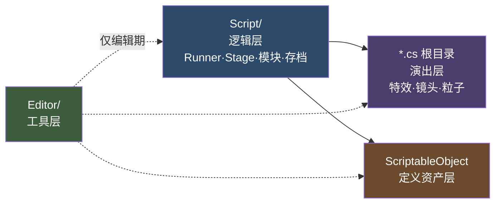

- **演出层不知道剧本存在**：[`VNCamera`](Assets/Project/Scripts/VNEffects/VNCamera.cs) / [`VNMoodGrading`](Assets/Project/Scripts/VNEffects/VNMoodGrading.cs) / [`VNAmbientParticles`](Assets/Project/Scripts/VNEffects/VNAmbientParticles.cs) 等只暴露
  `Show()/Hide()/SetXxx()/DOXxx()`，可以脱离剧本单独在演示场景里跑。
- **逻辑层通过 [`VNStage`](Assets/Project/Scripts/VNEffects/Script/VNStage.cs) 这一个门面访问演出层**——[`VNScriptRunner.Dispatch()`](Assets/Project/Scripts/VNEffects/Script/VNScriptRunner.cs) 几乎每个 case
  都是 `stage.XXX(...)`，从不直接摸 [`VNGodRays`](Assets/Project/Scripts/VNEffects/VNGodRays.cs) 之类的组件。
- **工具层可以反向读逻辑层**（Lint 复用 `VNScriptParser.Parse`（[`Assets/Project/Scripts/VNEffects/Script/VNScriptParser.cs:112`](Assets/Project/Scripts/VNEffects/Script/VNScriptParser.cs#L112)），编辑器复用 `VNCamera.ContainerZoomFor`（[`Assets/Project/Scripts/VNEffects/VNCamera.cs:63`](Assets/Project/Scripts/VNEffects/VNCamera.cs#L63)）），
  但被 `Editor` 程序集隔离，不会进 Build。

---

## 2. 游戏是什么：主玩法循环

这是一个 **Unity 6（6000.0.62f1）+ URP 17 的 2D 视觉小说（Galgame）引擎 + 游戏本体**，
自研 Ren'Py 风格纯文本剧本 DSL，玩法定位是**「重视觉演出的 AVG + 轻养成 + 可插拔小游戏」**。

### 2.1 玩家视角的循环

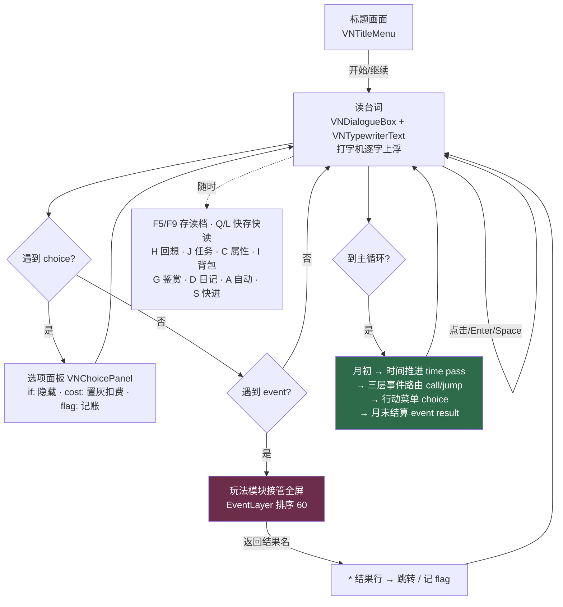

### 2.2 剧情结构（`Assets/Scenarios/`）

| 文件 | 角色 |
|---|---|
| `第1章.vn.txt` / `第2章` / `第3章` | 主线章节，纯剧情 + 演出教学 |
| `主循环.vn.txt` | ★ **养成骨架**：月初 → 事件路由 → 行动菜单 → 月末 → 结局判定 |
| `节日活动集.vn.txt` | 固定月份事件（7 月海边 / 9 月文化祭 / 12 月圣诞 / 2 月情人节） |
| `好感事件_星野结衣.vn.txt` | 好感阈值阶梯事件 |
| `公共片段.vn.txt` | 可复用子程序（换场、结算…），靠 `call 文件::标签` 调用 |
| `结局集.vn.txt` | 结局判定与各结局 |
| `*Demo.vn.txt`（15 个） | 每个子系统一个可跑的演示（`BadmintonDemo` / `FogWipeDemo` / `AiTalkDemo`…） |

**`主循环.vn.txt` 的结构心法**（源码注释原话，是整个游戏最重要的一页）：主循环**只做四件事**——
① 收束时间（`time`）② 派发事件（`call`/`jump` 到别的文件）③ 给玩家决策（`choice`）④ 记账（`stat`/`flag`/`quest`）。
具体的戏全在章节 / 节日 / 好感事件文件里，这样「改剧情」和「改数值平衡」永远不会互相打架。

**「文件头路由（进入守卫）」模式**——因为 `chapter` 一律从第一行开始执行：

```
if 主循环已初始化 jump 月初      # ← 守卫：第二次进来直接跳过初始化
flag 主循环已初始化 1
time set 4 remain:12
stat 金钱 800
stat 行动力 8
...
label 月初
```

**三种回到主循环的方式语义完全不同**（专案里最容易写错的一处）：

| 写法 | 效果 | 用途 |
|---|---|---|
| `chapter 主循环` | 从第一行进，会跑初始化（被守卫拦住重复），**清空调用栈** | 序章结束、第一次进养成 |
| `jump 主循环::月初` | 回月初，**会重跑事件路由**（可能立刻再触发同一事件） | 一个月真正结束时 |
| `jump 主循环::行动菜单` | 回菜单，跳过路由 | ★ 章节剧情结束后应该用这个 |

---

## 3. 全局资料流总图

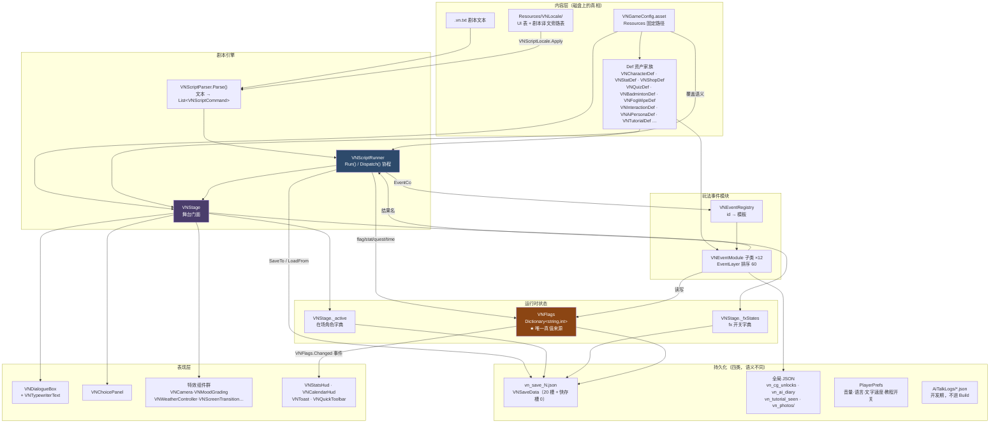

**三条最重要的资料流**：

1. **文本 → 演出**：`.vn.txt` → [`VNScriptParser`](Assets/Project/Scripts/VNEffects/Script/VNScriptParser.cs) → `VNScriptCommand` → [`VNScriptRunner.Dispatch()`](Assets/Project/Scripts/VNEffects/Script/VNScriptRunner.cs) → [`VNStage.XXX()`](Assets/Project/Scripts/VNEffects/Script/VNStage.cs) → 特效组件。
2. **玩法 → 状态**：一切玩法结果最终都落到 [`VNFlags`](Assets/Project/Scripts/VNEffects/Script/VNFlags.cs)（整数字典）。属性、任务、装备、日程、
   道具、事件成绩**没有一个有自己的存储**，全都是 flag 的命名约定（第 6 章有完整命名空间表）。
3. **状态 → 存档**：[`VNSaveData`](Assets/Project/Scripts/VNEffects/Script/VNSaveSystem.cs) = 剧本指针（`commandIndex` + `chapter` + 调用栈）+ 全部 flag + 舞台快照。

---

## 4. 剧本引擎：Parser → Runner → Stage

### 4.1 [`VNScriptParser`](Assets/Project/Scripts/VNEffects/Script/VNScriptParser.cs)（386 行，纯静态）

**职责**：把一行行文本切成 `VNScriptCommand`。**不做任何语义校验**（那是 Lint 的事）。

**核心资料结构**：

| 类型 | 字段 |
|---|---|
| `VNScriptCommand` | `keyword` / `args : List<string>` / `kwargs : Dictionary<string,string>` / `isAsync` / `line`；台词专用 `speaker`·`expression`·`text`；`localizedText`；`options : List<VNChoiceOption>`；`camPoints : List<VNCamWaypointDef>`。取值辅助 `Arg(i,def)`·`ArgF(i,def)`·`Kw(key,def)`·`KwF(key,def)` |
| `VNChoiceOption` | `text` / `flagOp` / `condition` / `costOp` / `jumpLabel` / `line` / `localizedText` |
| `VNCamWaypointDef` | `point` / `zoom` / `duration` / `ease` / `fade`（xfade）/ `hold` / `shake` / `line`；常量 `StayToken = "stay"` + [`IsStay()`](Assets/Project/Scripts/VNEffects/Script/VNScriptParser.cs#L36) |

**入口 `Parse(string source) : List<VNScriptCommand>`** 的逐行分支：

```
空行 / # 开头        → 丢弃
* 开头               → ParseChoiceOption(lastChoice, ...)  挂到上一个块命令
> 开头               → ParseCamWaypoint(lastCamseq, ...)   挂到上一个 camseq
行尾 @               → cmd.isAsync = true 后剥掉
首 token ∈ Keywords  → ParseCommand()
否则                 → ParseSay()
```

**关键字表 `Keywords`**（`CommandKeywords` 对外暴露，编辑器 / Lint 共用同一份，避免漂移）共 **48 条**：

```
bg cg show hide emote mark overlay imprint wait
camera shake weather mood fx liquid bgscroll
sakura transition reset interlude tutorial
label jump call return params flag stat time if choice chapter
move bgm se voice volume
camseq camcut camto portrait
event quest letterbox ui hideHUD sns
```

**`* 附属行`机制被三种命令复用**——这是个很省事的设计：
`choice`（玩家选项）、`event`（结果名 → 跳转）、`sns reply`（手机候选回复）三者都用 `cmd.options`：

```csharp
if (cmd.keyword == "choice" || cmd.keyword == "event" ||
    (cmd.keyword == "sns" && cmd.Arg(0) == "reply"))
{ cmd.options = new List<VNChoiceOption>(); lastChoice = cmd; lastCamseq = null; }
else if (cmd.keyword == "camseq")
{ cmd.camPoints = new List<VNCamWaypointDef>(); lastCamseq = cmd; lastChoice = null; }
else { lastChoice = null; lastCamseq = null; }   // 附属行必须紧跟块命令
```

**`ParseCommand()` 里的三个「不是 kwarg」特例**（都是踩过坑补的）：

| 特例 | 判据 | 例子 |
|---|---|---|
| 限定地址 `文件::标签` | 第一个冒号后**紧跟另一个冒号** | `jump 第2章::开场` |
| camto / camcut 首参 | `t == 1 && keyword ∈ {camto, camcut}` | `camto 亚里沙:head 1.6 0.8` |
| sns 自由文本 | `keyword == sns && t >= 2 && args[0] ∈ {time, system}` | `sns time 昨天 23:47` |

反例保护：`title:第1章::序` 的第一个冒号后是「第」，仍按 kwarg 处理，`::` 原样传给 [`VNStoryAddress`](Assets/Project/Scripts/VNEffects/Script/VNStoryAddress.cs)。

**[`ParseCamWaypoint()`](Assets/Project/Scripts/VNEffects/Script/VNScriptParser.cs#L193) 的 `stay` 数字位前移**：普通路径点第 1 个数字是 zoom、第 2 个是时长；
写 `stay` 时点位与 zoom 都沿用上一点，**唯一的数字就是时长**（默认 0 = 纹丝不动）。

**`ParseChoiceOption()`**：先从行尾找最后一个 `->` 切出跳转目标，再**从行尾逐个摘掉**
`flag:` / `if:` / `cost:` token（保持旧剧本「`flag:` 必须在文本之后」的语义），剩下的整段就是选项文本（**可含空格**）。

**`ParseSay()`**：找第一个全角 / 半角冒号切分；左侧第一个 token 是 `speaker`、第二个是 `expression`；
左侧为空（冒号开头）或整行无冒号 → `speaker = ""` = 无名牌旁白。

---

### 4.2 [`VNScriptRunner`](Assets/Project/Scripts/VNEffects/Script/VNScriptRunner.cs)（3097 行，全专案心脏）

#### 4.2.1 生命周期

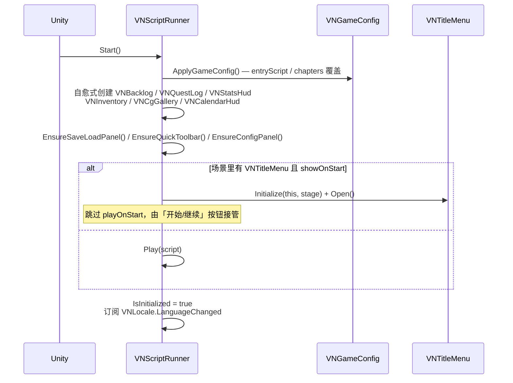

[`Start()`](Assets/Project/Scripts/VNEffects/Editor/VNAiEditorCoroutine.cs#L42) 里的**「自愈」模式**贯穿全专案：每个附属管理器都是
`FindFirstObjectByType<T>() ?? new GameObject(...).AddComponent<T>()`。
所以场景被生成器重建、或者手搭场景漏挂组件，游戏照样能跑（只是没有对应内容而已）。

#### 4.2.2 主循环 [`Run()`](Assets/Project/Scripts/VNEffects/Editor/VNSoftSkinExporter.cs#L106)

```csharp
IEnumerator Run()
{
    _running = true;
    while (_index < _commands.Count)
    {
        while (_debugPaused) { if (_debugStepRequested) { _debugStepRequested = false; break; } yield return null; }
        var cmd = ResolveParameters(_commands[_index++]);   // ${参数} 替换
        IEnumerator co = null;
        try { co = Dispatch(cmd); }
        catch (System.Exception e) { Debug.LogError(...); }  // 单条命令炸了不中断整个剧本
        if (co == null) continue;
        if (cmd.isAsync) StartCoroutine(co);                 // 行尾 @
        else yield return StartCoroutine(co);                // 默认同步等待
    }
    // 播到文件末尾但调用栈非空 → 报错并清空（子程序忘了 return）
}
```

**「同步等待 / 异步 `@`」是本 DSL 的核心语义**：`Dispatch()` 对每条命令返回一个 `IEnumerator`
（或 `null` = 瞬发）。`WaitTween(Tween)` 是最常用的包装器，把 DOTween 的 `Sequence` 转成等待。

#### 4.2.3 `Dispatch()` 命令表（完整）

| 关键字 | 落到哪里 | 是否等待 |
|---|---|---|
| `say` | `SayCo()` → `NormalSayCo()` 或 `SnsSayCo()`（按 `stage.IsSnsOpen` 分流） | 等打字完 + 玩家推进 |
| `wait` | `WaitCo(秒)` | 等 |
| `bg` | `stage.SetBackground(id, transition, line, precut, viaBlack)` | 等 Tween |
| `cg` | `stage.ShowCg(id, transition, chars:keep, fx:keep, ...)` / `stage.HideCg(...)` | 等 Tween |
| `show` / `hide` | `stage.Show(id, at, expr, with, from, dur)` / `stage.Hide(id, with, to, dur)` | 等 Sequence |
| `emote` / `mark` | `stage.Emote(id, name)` / `stage.Mark(id, name, mode, pos, size, dur)` | 等 |
| `overlay` / `imprint` | `stage.SetOverlay()` / `stage.Imprint()` | 瞬发 |
| `weather` | `stage.SetWeather(id, density, wind, windSet, speed, size)` | 瞬发 |
| `liquid` | `stage.Liquid(action, ParseLiquidArgs(cmd), line)` | 瞬发 |
| `mood` / `letterbox` / `reset` / `bgscroll` / `shake` / `portrait` / `ui` | `stage` 同名方法 | 瞬发 |
| `sns` | `SnsCo()`（子命令 open/close/voice/image/typing/read/time/system/reply） | 视子命令 |
| `camera` | `CameraCo()` → `pushin` / `snapzoom` / `pan` / `dolly` / `reset` | 等 |
| `camseq` / `camcut` / `camto` | `CamseqCo()` / `vnCamera.Cut()` / `vnCamera.GoTo()` | camseq、camto 等 |
| `transition` | `stage.transition.Play(type)` | 等 |
| `interlude` | `stage.interlude.PlayCo(def, time, audio)`；**`_skip` 时整段跳过** | 等 |
| `tutorial` | `player.PlayCo(def, force)`；**`_skip` 时跳过** | 等 |
| `sakura` / `move` | `stage.sakura.Play()` / `stage.Move(id, at, dur)` | 后者等 |
| `bgm` / `se` / `voice` / `volume` | `stage.vnAudio` 对应方法 | 瞬发 |
| `fx` | `stage.Fx(name, arg, line)` | 瞬发 |
| `label` / `params` | `return null`（纯标记） | — |
| `jump` | `JumpTo(address, line)` | 瞬发 |
| `call` / `return` | `CallTo(cmd)` / `ReturnFromCall(line, isAsync)` | 瞬发 |
| `chapter` | `SwitchChapter(name, line)` | 瞬发 |
| `flag` | `ApplyFlagCommand(cmd, silent:false)` | 瞬发 |
| `if` | 从**最后一个** `jump` token 往前重组条件串 → `VNFlags.Evaluate()`（[`Assets/Project/Scripts/VNEffects/Script/VNFlags.cs:66`](Assets/Project/Scripts/VNEffects/Script/VNFlags.cs#L66)） → `JumpTo()` | 瞬发 |
| `stat` | `_statsHud.Apply(name, valueToken, silent, line)` | 瞬发 |
| `time` | `ApplyTimeCommand(cmd, silent:false)` | 瞬发 |
| `choice` | `ChoiceCo()` | 等玩家选 |
| `event` | `EventCo()` | 等模块返回 |
| `quest` | `_questLog.Apply(op, id, stage, silent, line)` | 瞬发 |
| `hideHUD` | [`ParseHideHudArgs()`](Assets/Project/Scripts/VNEffects/Script/VNScriptRunner.cs#L1768) → `SetUiHidden(parts, hide, lock)` | 瞬发 |

> `if` 的解析很讲究：**从最后一个 `jump` 向前重组条件**，因此独立 `if` 里可以安全使用空格与括号
> （`if (好感度>=30 && !已告白) jump 告白路线`）。

#### 4.2.4 `ChoiceCo()` 的三层防卡死

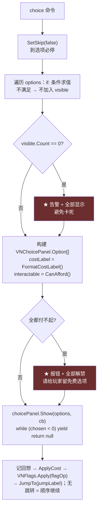

`visible` 是**可见索引 → 原始索引的映射表**，所以隐藏选项不会打乱 `flag:` / `->` 的对应关系。
显示文本走 `VNScriptLocale.TextOf(candidate)`，**匹配按索引**，所以翻译不影响分支。

#### 4.2.5 `EventCo()` — 玩法模块的完整握手

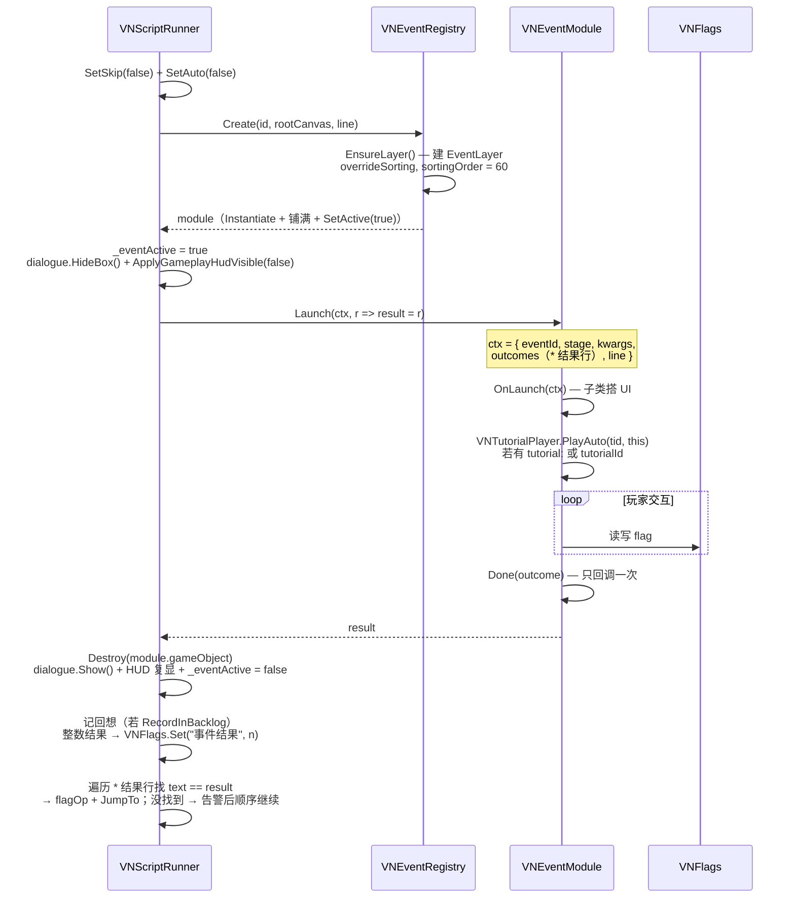

---

### 4.3 [`VNStage`](Assets/Project/Scripts/VNEffects/Script/VNStage.cs)（1706 行，舞台门面）

**它是逻辑层与演出层之间唯一的边界**。字段区就是一张「本专案有哪些演出组件」的清单：

```csharp
public RectTransform characterLayer;          // LayerFront
public Image backgroundImage;
public VNImageEffectController backgroundFx;
public VNDialogueBox dialogue;        public VNScreenTransition transition;
public VNWeatherController weather;   public VNMoodGrading mood;
public VNCamera vnCamera;             public VNScreenShake screenShake;
public VNDutchAngle dutchAngle;       public VNHeartbeat heartbeat;
public VNSakuraBurst sakura;          public VNFakeDoF fakeDoF;
public VNCloudShadows cloudShadows;   public VNGodRays godRays;
public VNSpeedLines speedLines;       public VNScreenShockwave shockwave;
public VNRetroFilter retroFilter;     public VNKenBurns kenBurns;
public VNBackgroundScroll bgScroll;   public VNLetterbox letterbox;
public VNShootingStars shootingStars; public VNDriftingClouds driftingClouds;
public VNHeatHaze heatHaze;           public VNVignetteFocus vignetteFocus;
public VNSpeakerHighlight speakerHighlight;  public VNToneMatch toneMatch;
public VNChoicePanel choicePanel;     public VNAudio vnAudio;
public VNEventRegistry eventRegistry; public VNSnsView sns;
public VNInterludeScreen interlude;   public VNTutorialPlayer tutorial;
public VNLiquidSplash liquidSplash;   public VNWetScreen wetScreen;
```

`AutoWire()`（184 行起）在 `Awake()` 里把留空的引用全部自动 Find / 自动建——
**这就是「加新组件不必重建场景」的实现**。

#### 4.3.1 在场角色 `ActiveCharacter`

```csharp
public class ActiveCharacter {
    public VNCharacterDef def;   public GameObject go;
    public Image image;          public RectTransform rect;
    public VNImageEffectController fx;      // 材质实例总控
    public VNEntranceAnimator animator;     // 出 / 退场预设
    public VNCharacterEmotes emotes;        // 情绪动作
    public VNCharacterBlink blink;          // 整张闭眼图
    public VNCharacterBlinkOverlay blinkOverlay;  // 只叠眼部；与 blink 互斥，按 def.blinkMode 二选一
    public VNCharacterMouth mouth;          // 口型
    public VNCharacterMarks marks;          // 漫符
    public VNCharacterOverlay overlay;      // 情绪叠加层（潮红/汗/泪）— 进存档
    public VNCharacterImprints imprints;    // 痕迹（掌印/口红印）— 不进存档
    public string expression;
    public bool casualEntrance;             // 日常向预设 → 不开周期扫光（进存档）
}
readonly Dictionary<string, ActiveCharacter> _active;
public ActiveCharacter Get(string id);
```

**`Show()` 的关键一步**（很容易漏）：改完 `rect.anchoredPosition` 后必须**同步三个组件缓存的基准位**，
否则出场动画会把角色重置回旧位置：

```csharp
c.rect.anchoredPosition = pos;
c.animator.SetBasePosition(pos);
c.emotes.SetBasePosition(pos);
c.fx.SetFloatBaseY(pos.y);
```

**站位常数**在 `SlotPosition(at)`：`left = (-380, -60)` / `center = (0, -60)` / `right = (380, -60)`；
`at` 直接写数字则当横向像素坐标。

**时长换算**：`show ... dur:1.2` 不是直接传秒数，而是算出**倍率**
`scale = duration / VNEntranceAnimator.BaseDuration(preset)`，这样十种预设都能用同一个 `dur:` 参数。
`Hide()` 同理。方向 `from:` / `to:` 留空时由 `SideFor(keyword, x, line)` 按站位推断。

出场完成后 `seq.OnComplete(() => c.animator.StartIdleEffects(shineInterval: shine))`——
`shine = casualEntrance ? 0f : 7f`，**日常向预设不开周期扫光**（每隔几秒闪一下对频繁的对话切换太吵）。

#### 4.3.2 `Fx(name, arg, line)` 与 `_fxStates`

`ToggleFxNames`（14 个可开关 fx，**进存档**）：

```
godrays  dof  clouds  haze  shimmer  heartbeat  dutch
speedlines  letterbox  meteor  skycloud  filmgrain  crt  kenburns
```

非开关型（**不记录状态**）：`shockwave`（一次性水波）、`speedlines burst`、`focus`（跟角色走）。

两组互斥关系写在 [`Fx()`](Assets/Project/Scripts/VNEffects/Script/VNStage.cs#L1614) 里：`filmgrain` ⇄ `crt` 互斥，且手动操作会把 `_retroAuto` 置 false
（接管 mood 自动滤镜）；`letterbox` 手动操作把 `_letterboxAuto` 置 false。

[`ResetEffects()`](Assets/Project/Scripts/VNEffects/Script/VNStage.cs#L1598)（`reset effects`）把全部 toggle 关掉、天气清空、mood 回 Neutral、液体重置，
但 **Ken Burns 是默认开启的常驻氛围**（「永不静止」），重置回默认开而非关。

#### 4.3.3 CG 的三个「保留」开关

```csharp
public Sequence ShowCg(id, transitionName, bool keepChars, bool keepFx, line, instant, viaBlack);
bool _cgKeepChars, _cgKeepFx, _cgFxPaused;
string _cgSavedWeatherId;
readonly List<string> _cgPausedFx;
static readonly string[] CgAmbientFxNames = { ... };
void PauseCgAmbientFx(bool instant) / ResumeCgAmbientFx(bool instant) / FadeCharLayer(alpha, instant);
```

`cg <id> [chars:keep] [fx:keep]`：不写 `chars:keep` 则整个立绘层淡出；不写 `fx:keep` 则
环境特效与天气被**暂停并记录**（`_cgPausedFx` / `_cgSavedWeatherId`），`cg off` 时恢复。
存档时 `CaptureSnapshot` 存的是「CG 背后」的天气与 fx——读档重放 CG 时会再次暂停，语义闭合。

---

## 5. 控制流：跳转 / 子程序 / 章节

### 5.1 地址解析 [`VNStoryAddress`](Assets/Project/Scripts/VNEffects/Script/VNStoryAddress.cs)

统一格式 `[文件::]标签`。`TryParse(address, out file, out label, out error)` 是唯一入口，
Runner 的 `JumpTo` / `CallTo` 与 Lint 的 `CheckJumpTargets` 共用同一份。

### 5.2 调用栈

```csharp
sealed class VNCallFrame {
    public TextAsset returnScript;
    public List<VNScriptCommand> returnCommands;
    public int returnIndex;
    public int sourceLine;                                  // 诊断用
    public Dictionary<string,string> returnParameters;      // 调用方的参数环境
}
readonly List<VNCallFrame> _callStack;      const int MaxCallDepth = 64;
Dictionary<string,string> _currentParameters;
```

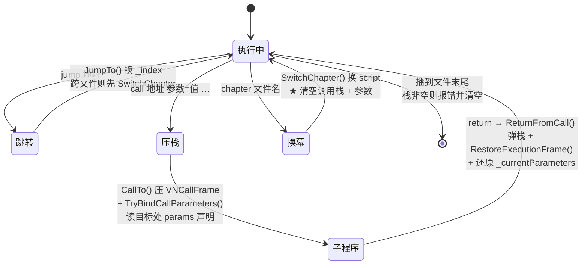

**参数化子程序**（`call` + `params`）：

1. `CallTo()` 解析 `call 公共片段::换场 背景:教室 心情:Morning`；
2. 跳到目标 label 后 `TryBindCallParameters()` 读紧随其后的 `params 背景 心情=Neutral` 声明，
   按名绑定、支持默认值、缺参报错；
3. 子程序体内用 `${背景}` 引用 → 每条命令执行前经 `ResolveParameters(cmd)` 现场替换。
   先用 `HasParameterPlaceholder(cmd)` 快速判定（扫 `args` / `kwargs` / `text` / `options` / `camPoints`），
   没有占位符就**原样返回**，零开销；
4. `ReadParameters` / `WriteParameters` 负责与 `VNSaveData.parameterNames/Values` 互转；
   `CaptureCallStack` / `RestoreCallStack` 负责整条栈的存档。

**存档版本**：`VNSaveData.saveVersion = 3`（0 / 缺省 = call 栈加入前；2 = 无参数的 call 栈）。

---

## 6. 世界状态层：VNFlags / VNExpression

### 6.1 [`VNFlags`](Assets/Project/Scripts/VNEffects/Script/VNFlags.cs)（75 行，静态）

```csharp
static readonly Dictionary<string,int> _values;
public static event System.Action Changed;      // ★ 任何变化都触发
public static IReadOnlyDictionary<string,int> All { get; }
public static int  Get(string key);             // 不存在 = 0
public static void Set(string key, int value);  // → Changed
public static void Add(string key, int delta);
public static void Clear();                     // → Changed
public static void Apply(string op);            // "名字" = 置 1；"名字+2" / "名字-1" = 增减
public static bool Evaluate(string cond, int line = 0);
```

**`Changed` 事件的使用约定**（注释明写）：读档时会连续触发多次，
订阅方必须做**「标脏 + 下帧统一刷新」**而不是立即重建——
[`VNStatsHud.MarkDirty()`](Assets/Project/Scripts/VNEffects/Script/VNStatsHud.cs) / [`VNCalendarHud.MarkDirty()`](Assets/Project/Scripts/VNEffects/Script/VNCalendarHud.cs) 就是这个模式（`_dirty` 标记 + [`Update()`](Assets/Project/Scripts/VNEffects/Script/VNFogScore.cs#L59) 里刷）。

### 6.2 [`VNExpression`](Assets/Project/Scripts/VNEffects/Script/VNExpression.cs)（278 行，纯静态递归下降解析器）

支持 `!`、算术、比较、`&&`、`||` 与括号；整数 0 / 非 0 表示假 / 真；**只读取，无副作用**。
三个入口对应三种用途：

| 方法 | 用途 |
|---|---|
| `TryEvaluate(expr, valueResolver, out bool, out error)` | 运行时求值（`VNFlags.Evaluate`（[`Assets/Project/Scripts/VNEffects/Script/VNFlags.cs:66`](Assets/Project/Scripts/VNEffects/Script/VNFlags.cs#L66)） 调它） |
| `TryValidate(expr, out error)` | Lint / 编辑器语法检查（不需要真值） |
| `TryCollectIdentifiers(expr, ICollection<string>, out error)` | Lint 收集条件里引用了哪些 flag（查「读了从没写过的 flag」） |

内部 `sealed class Parser` 三个构造参数：源串、`Func<string,int>` 取值器、
`Action<string>` 标识符访问者——同一套解析器靠这三个回调服务三种场景。

### 6.3 ★ flag 命名空间总表

**这是全专案最重要的隐性契约**——没有任何一个玩法系统有自己的存储，全在这张表里：

| 前缀 / 名字 | 常量定义处 | 写入者 | 语义 |
|---|---|---|---|
| `任务_<id>` | `VNQuestLog.FlagPrefix`（[`Assets/Project/Scripts/VNEffects/Script/VNQuestLog.cs:20`](Assets/Project/Scripts/VNEffects/Script/VNQuestLog.cs#L20)） | `VNQuestLog.Apply()`（[`Assets/Project/Scripts/VNEffects/Script/VNQuestLog.cs:72`](Assets/Project/Scripts/VNEffects/Script/VNQuestLog.cs#L72)） | 任务阶段；`StageDone = 100`、`StageFailed = -1` |
| `道具_<id>` | `VNShopDef.ItemFlagPrefix`（[`Assets/Project/Scripts/VNEffects/Script/VNShopDef.cs:30`](Assets/Project/Scripts/VNEffects/Script/VNShopDef.cs#L30)） | [`VNShopModule`](Assets/Project/Scripts/VNEffects/Script/VNShopModule.cs) | 持有数量 |
| `装备_<道具id>` | `VNEquipment.EquipFlagPrefix`（[`Assets/Project/Scripts/VNEffects/Script/VNEquipment.cs:18`](Assets/Project/Scripts/VNEffects/Script/VNEquipment.cs#L18)） | `VNEquipment.Equip()`（[`Assets/Project/Scripts/VNEffects/Script/VNEquipment.cs:48`](Assets/Project/Scripts/VNEffects/Script/VNEquipment.cs#L48)） | 部位编号（[`VNEquipSlot`](Assets/Project/Scripts/VNEffects/Script/VNShopDef.cs)） |
| `装备实增_<slot>_<statId>` | `VNEquipment.AppliedFlagPrefix`（[`Assets/Project/Scripts/VNEffects/Script/VNEquipment.cs:19`](Assets/Project/Scripts/VNEffects/Script/VNEquipment.cs#L19)） | [`VNEquipment`](Assets/Project/Scripts/VNEffects/Script/VNEquipment.cs) | **实际生效的增量**（卸下时按此扣回，防钳制不对称） |
| `装备效果_<效果id>` | `VNEquipment.EffectFlagPrefix`（[`Assets/Project/Scripts/VNEffects/Script/VNEquipment.cs:20`](Assets/Project/Scripts/VNEffects/Script/VNEquipment.cs#L20)） | [`RecomputeEffects()`](Assets/Project/Scripts/VNEffects/Script/VNEquipment.cs#L147) | 特殊效果合计（生效逻辑由剧本 `if` 判断） |
| `日程_<N>` | `VNPlanModule.SlotFlagPrefix`（[`Assets/Project/Scripts/VNEffects/Script/VNPlanModule.cs:35`](Assets/Project/Scripts/VNEffects/Script/VNPlanModule.cs#L35)） | [`VNPlanModule`](Assets/Project/Scripts/VNEffects/Script/VNPlanModule.cs) | 第 N 格排的行动编号 |
| `日程数` / `当前格` / `当前行动` | `VNPlanModule.CountFlag/CursorFlag/ActionFlag` | `VNPlanModule` | `op:next` 逐格派发用 |
| `月份` / `剩余月数` | `VNCalendarHud.MonthFlag/RemainFlag` | `ApplyTimeCommand()` | 日历 HUD；**`月份` 不存在时 HUD 自动隐藏** |
| `事件结果` | （字面量） | `EventCo()` | 模块返回**整数**结果时自动写入 |
| `<前缀>正确数` / `<前缀>总数` | `VNQuizModule.CorrectFlagSuffix/TotalFlagSuffix` | [`VNQuizModule`](Assets/Project/Scripts/VNEffects/Script/VNQuizModule.cs) | 答题成绩 |
| `<前缀>_我方得分/_对方得分/_精准数/_最长回合` | — | [`VNBadmintonModule.WriteFlags()`](Assets/Project/Scripts/VNEffects/Script/VNBadmintonModule.cs) | 羽球战绩 |
| `<前缀>_清晰度/_用时/_档位` | `VNFogWipeModule.*FlagSuffix` | [`VNFogWipeModule.WriteFlags()`](Assets/Project/Scripts/VNEffects/Script/VNFogWipeModule.cs) | 擦雾成绩 |
| `<前缀>_分数/_档位/_次数` | — | [`VNPhotoBoothModule`](Assets/Project/Scripts/VNEffects/Script/VNPhotoBoothModule.cs) | 大头贴成绩 |
| 属性 id（`金钱`/`行动力`/`好感度_结衣`…） | `VNStatDef.id`（[`Assets/Project/Scripts/VNEffects/Script/VNStatDef.cs:32`](Assets/Project/Scripts/VNEffects/Script/VNStatDef.cs#L32)） | `VNStatsHud.Apply()`（[`Assets/Project/Scripts/VNEffects/Script/VNStatsHud.cs:108`](Assets/Project/Scripts/VNEffects/Script/VNStatsHud.cs#L108)） | **属性值就是同名 flag**，[`VNStatDef`](Assets/Project/Scripts/VNEffects/Script/VNStatDef.cs) 只提供钳制 / 样式 / 等级 |
| 任意剧本自定义 | — | `flag` 命令 / `choice` 的 `flag:` | 剧情开关 |

> 这个设计的代价：**flag 名冲突没有编译期保护**。Lint 里的 `CheckLoopGuards` / [`FlagNames()`](Assets/Project/Scripts/VNEffects/Editor/VNScenarioLinter.cs#L1542)
> 部分缓解（查「读了从没写过的 flag」），但改前缀仍要全局搜索。

---

## 7. 存档系统与三条状态恢复通道

### 7.1 [`VNSaveData`](Assets/Project/Scripts/VNEffects/Script/VNSaveSystem.cs) 结构全表

```csharp
[System.Serializable] public class VNSaveData {
    public int saveVersion = 3;
    public int commandIndex;        // ★ 恢复点 = 正在显示的那句台词的命令索引
    public string chapter;          // 当前章节文件名
    public string savedAt;  public string lastLine;      // 存档预览用

    public List<CallFrameSave> callStack;                // 调用栈（含各帧参数环境）
    public List<string> parameterNames, parameterValues; // 当前参数环境
    public List<string> flagNames;  public List<int> flagValues;   // ★ 全部 flag

    // 舞台
    public string backgroundId;
    public string weather;  public float weatherDensity, weatherSpeed, weatherSize, weatherWind;
    public bool weatherWindSet;
    public bool scrollOn;   public float scrollSpeed, scrollDir;  public string scrollMode;
    public string mood;     public string bgm;  public float bgmVol;  public bool portraitOff;
    public List<string> fxOn;                            // 开启中的 fx（含被 CG 暂停的）
    public string cgId;     public bool cgKeepChars, cgKeepFx;
    public string dialogueSkin, choiceSkin, nameplateStyle;
    public string uiHidden = "";                         // 仅锁定隐藏（hideHUD keep）
    public LiquidSave liquid;                            // 液体的四个持续开关
    public List<CharSave> characters;                    // id/x/expr/marks/overlays/casualEntrance
    public List<VNAiMemoryEntry> aiMemories;             // ★ AI 跨场记忆

    // SNS
    public bool snsOpen;
    public string snsPeerId, snsSessionId, snsTitle, snsPlayerAlias;
    public List<VNSnsMessage> snsMessages;
}
```

**旧存档兼容策略**统一为「**缺字段 = `JsonUtility` 给零值 = 语义正确的默认**」：

| 字段 | 缺省语义 |
|---|---|
| `uiHidden = ""` | 界面全开 |
| `aiMemories` 空 | 那时候还没聊过 |
| `liquid` 全 false | 什么都没开 |
| `weatherWindSet = false` | 未覆盖（**风可以是负数**，所以不能用 0 当哨兵） |
| `LiquidSave.sprayDirSet = false` | 朝镜头（内部用 `float.NaN` 表示，但 **`JsonUtility` 会把 NaN 写成非法 JSON**，所以另开一个 bool） |
| `CharSave.casualEntrance = false` | 保持原来「一律开扫光」的行为 |

### 7.2 存档时机的硬约束

```csharp
public void SaveTo(int slot, Texture2D thumbnail, bool quick) {
    if (!_waitingAtSay) { VNToast.Show(VNLocale.T("runner.cannotSaveNow")); return; }
    ...
}
```

**只有停在台词上（`_waitingAtSay`）才允许存档**。这一条同时挡住了：事件模块进行中、
转场中、选项中、教程中——因为这些状态下 `commandIndex` 无法唯一确定一个可恢复点。

`QuickSaveCo()` 里还有一层保护：截图那一两帧里演出如果推进了（`!_waitingAtSay`），
**作废这次快存**，避免存到不可恢复点：

```csharp
yield return capture.CaptureThumbnailCo(320, 180, t => thumbnail = t);
_quickSaveCo = null;
if (!_waitingAtSay) { if (thumbnail != null) Destroy(thumbnail); yield break; }
SaveTo(QuickSaveSlot, thumbnail, true);
```

缩略图落盘为 `vn_save_N.png`（与 JSON 分离，旧无图存档仍可读）。
`QuickSaveSlot = 0`，面板网格只显示 `1..SlotCount`（`SlotCount = 20`）。

### 7.3 ★ 三条状态恢复通道

这是全专案最容易出 bug 的地方——**同一份「状态」有三条不同的重建路径**：

```mermaid
flowchart TD
    subgraph 通道1["① 正常读档 LoadFrom(slot)"]
        A1["VNSaveSystem.Load(slot)<br/>→ VNFlags.Clear() + 逐个 Set"] --> A2["SwitchChapter(data.chapter)"]
        A2 --> A3["RestoreCallStack(data)"]
        A3 --> A4["stage.RestoreSnapshot(data, instant:false)"]
        A4 --> A5["RestoreUiHidden(data)"]
        A5 --> A6["ResumeAt(data.commandIndex)"]
    end
    subgraph 通道2["② 编辑器「从选中行播放」PlayFromSourceLine(src, line, rebuildState:true)"]
        B1["RebuildStateBefore(index)<br/>★ 从第 0 条<b>静默重放</b>到目标行"] --> B2["产出一个虚拟 VNSaveData"]
        B2 --> B3["stage.RestoreSnapshot(snapshot, instant:true)"]
        B3 --> B4["ResumeAt(index)"]
    end
    subgraph 通道3["③ 存档时的正向捕获 SaveTo()"]
        C1["stage.CaptureSnapshot(data)"] --> C2["写 JSON"]
    end
    style B1 fill:#6b4a2d,color:#fff
```

**`RebuildStateBefore(exclusiveIndex)`（326–643 行，全专案最长的单个方法）** 是通道 ② 的核心：
它把从第 0 条到目标行的**所有会留下持续状态的命令**在内存里静默重放一遍，产出一个虚拟 `VNSaveData`。
重放的命令包括 `bg` `cg` `liquid` `weather` `bgscroll` `mood` `fx` `letterbox` `bgm` `se` `volume`
`show` `hide` `move` `emote` `mark` `overlay` `ui` `portrait` `flag` `stat` `time` `quest` `sns` `camcut` `camto`。

重放中的几处**精细语义对齐**（不对齐就会「跳到这一行看到的画面和实际游玩不一样」）：

| 细节 | 处理 |
|---|---|
| Ken Burns 默认开启 | `snapshot.fxOn.Add("kenburns")` **先种入再重放** |
| `bgscroll` 参数留空 = 沿用 | 用 `cmd.kwargs.ContainsKey("speed")` 判断是否覆盖，**不能每条都重置成默认** |
| `weather` 换天气整组重置 | 与运行时 `SetWeather` 一致：只保留本行显式写了的覆盖参数 |
| mood Memory → 自动黑边 / 胶片 | 用 `autoLetterbox` / `autoRetro` 布尔重放 `VNStage.SetMood`（[`Assets/Project/Scripts/VNEffects/Script/VNStage.cs:1357`](Assets/Project/Scripts/VNEffects/Script/VNStage.cs#L1357)） 的自动联动逻辑 |
| `liquid` | 只重放 `spray` / `click` / `wet` / `cover` 四个持续开关；`splash`（一次性）与 `dry`（一次性擦除）不重放 |
| SNS | `ReplaySnsCommand` / `ReplaySnsSay` / `AddSnsMessage` 把消息列表重建出来 |
| 立绘位置 | `RebuildShowState` / `RebuildOverlayState` / `RebuildMarkState` / `RebuildMoveState` 分工，站位靠 `DebugSlotX(at)` |

**「静默重放」的实现手法值得单独一提**：`ApplyFlagCommand(cmd, silent)`、
`VNStatsHud.Apply(..., silent, ...)`、`VNQuestLog.Apply(..., silent, ...)`、`ApplyTimeCommand(cmd, silent)`
全都带一个 `silent` 参数——**同一份实现同时服务运行时与调试重建**，避免两份逻辑漂移。
`silent = true` 时跳过 [`VNToast`](Assets/Project/Scripts/VNEffects/Script/VNToast.cs) 飘字与音效，只改状态。

### 7.4 加新状态时的三处同步（`vn-save-compat` 技能的内容）

新增任何「跳到某一行时画面应该是什么样」的运行时状态，必须同时改：

1. `VNSaveData` 加字段（并保证缺省值语义正确）；
2. `VNStage.CaptureSnapshot()`（[`Assets/Project/Scripts/VNEffects/Script/VNStage.cs:840`](Assets/Project/Scripts/VNEffects/Script/VNStage.cs#L840)） + `RestoreSnapshot()` 成对；
3. [`VNScriptRunner.RebuildStateBefore()`](Assets/Project/Scripts/VNEffects/Script/VNScriptRunner.cs) 加对应 case。

**刻意不进存档的状态**（各有明确理由）：

| 状态 | 为什么不存 |
|---|---|
| 镜头（[`VNCamera`](Assets/Project/Scripts/VNEffects/VNCamera.cs)） | 调试重建走 [`SnapReset()`](Assets/Project/Scripts/VNEffects/VNCamera.cs#L485)；镜头位置玩家看不出「读档后该不该保留」 |
| 立绘痕迹（[`VNCharacterImprints`](Assets/Project/Scripts/VNEffects/Script/VNCharacterImprints.cs)） | 它会自己褪色消失，也就没有「读档后该不该还在」的问题 |
| 过场章节卡（[`VNInterludeScreen`](Assets/Project/Scripts/VNEffects/Script/VNInterludeScreen.cs)） | 演出中不可存档；但 [`ClearStage()`](Assets/Project/Scripts/VNEffects/Script/VNStage.cs#L983) 必须 [`HideImmediate()`](Assets/Project/Scripts/VNEffects/Script/VNInterludeScreen.cs#L136) |
| 背景滚动累计偏移 | 从哪一帧接着滚玩家看不出来 |
| 空中水珠 / 已溅好的水渍 | 瞬态 |
| 教程「看过了」 | **全局 JSON**，不是存档态（读旧档不该重看，见第 15 章） |
| CG 解锁 / 日记 / 相册 | 同上，玩家收藏品语义 |

---

## 8. 玩法事件模块系统

### 8.1 契约三件套

```csharp
public class VNEventContext {
    public string eventId;  public VNStage stage;
    public Dictionary<string,string> kwargs;   // 剧本行的 key:value
    public List<string> outcomes;              // 「* 结果行」的结果名
    public int line;
    public bool AcceptsOutcome(string name);   // 无结果行 = 全部放行
    public string Kw(k, def);  public float KwF(k, def);  public int KwI(k, def);
}

public abstract class VNEventModule : MonoBehaviour {
    public string tutorialId;                                        // 首次进入自动播的教程
    public void Launch(VNEventContext ctx, System.Action<string> onDone);   // Runner 调
    protected abstract void OnLaunch(VNEventContext ctx);            // 子类实现
    protected void Done(string outcome);                             // 只生效一次
    public virtual bool RecordInBacklog => true;
    public virtual void CancelForDebug() { }
}

public class VNEventRegistry : MonoBehaviour {
    public List<Entry> modules;                        // id → VNEventModule 模板
    public const int LayerSortingOrder = 60;
    public IEnumerable<string> Ids { get; }            // 编辑器下拉 / 校验用
    public VNEventModule Create(string id, Canvas canvas, int line);
    RectTransform EnsureLayer(Canvas rootCanvas);      // overrideSorting + GraphicRaycaster
}
```

[`Launch()`](Assets/Project/Scripts/VNEffects/Script/VNEventModule.cs#L62) 里教程**必须在 `OnLaunch` 之后**播——要高亮记分板，记分板得先存在。
讲解期间 [`VNPause`](Assets/Project/Scripts/VNEffects/Script/VNPause.cs) 冻住全局，模块 [`Update()`](Assets/Project/Scripts/VNEffects/Script/VNFogScore.cs#L59) 第一行早退，所以模块虽然「开着」但一帧都不会跑：

```csharp
public void Launch(VNEventContext ctx, System.Action<string> onDone) {
    _onDone = onDone;  _finished = false;
    OnLaunch(ctx);
    string tid = ctx != null ? ctx.Kw("tutorial", tutorialId) : tutorialId;
    if (!string.IsNullOrEmpty(tid)) VNTutorialPlayer.PlayAuto(tid, this);
}
```

### 8.2 ★ 模块三铁律

| # | 铁律 | 为什么 |
|---|---|---|
| ① | **只操作自己的 UI 子树与 [`VNFlags`](Assets/Project/Scripts/VNEffects/Script/VNFlags.cs)**，不直接改舞台演出 | 背景 / 立绘交给事件前后的剧本行；否则存档与调试重建对不上 |
| ② | **计时用 `unscaledDeltaTime`，Tween 用 `SetUpdate(true)`** | 躲开 Skip 的 `DOTween.timeScale` 与存档暂停的 `Time.timeScale = 0` |
| ③ | **所有 Tween `SetLink(gameObject)`** | 模块随时可能被销毁 |

**两个刻意破例**（都在源码里明确写了边界）：

- [`VNAiTalkModule`](Assets/Project/Scripts/VNEffects/Script/VNAiTalkModule.cs) 破铁律 ①：直接驱动舞台立绘换表情。理由是自绘立绘要把眨眼 / 口型 / 色调匹配 /
  出场动画全部重接一遍。边界收紧为「只碰表情和对话框内容」，且**正常结束 / ESC / `CancelForDebug`
  三条路径都还原**（`RestoreStage()`）。
- [`VNInteractionModule`](Assets/Project/Scripts/VNEffects/Script/VNInteractionModule.cs) 同样破例：只碰表情与叠加层，三条退出路径都还原（`RestoreExpression()`）。

**铁律 ② 的现代写法**：`VNTime.Delta`（[`Assets/Project/Scripts/VNEffects/Script/VNPause.cs:144`](Assets/Project/Scripts/VNEffects/Script/VNPause.cs#L144)）（含 `MaxStep = 0.05f` 单帧上限，收编自羽毛球的防瞬移），
配合 `if (VNPause.IsPaused) return;` 作为 `Update()` 首行（**必须在 `ReadInput` 之前**，晚了照样能挥拍）。

**射线坑**：EventLayer 排序 60 在 [`VNChoicePanel`](Assets/Project/Scripts/VNEffects/VNChoicePanel.cs) 45 之上，所以模块自绘的一切默认
`raycastTarget = false`，否则会吃掉选项点击（`VNAiTalkModule` 的 ESC 确认框是唯一例外）。

### 8.3 十二个模块总览

| 模块 | 剧本写法 | 结果名 | 核心机制 |
|---|---|---|---|
| [`VNQteModule`](Assets/Project/Scripts/VNEffects/Script/VNQteModule.cs) | `event qte [time:] [target:] [title:]` | `success` / `fail` | 连打条；`Update()` 里数点击 |
| [`VNMapModule`](Assets/Project/Scripts/VNEffects/Script/VNMapModule.cs) | `event map` | 地点名 | 归一化坐标标记 + `condition` 显隐 + `AcceptsOutcome` 过滤 + `去过_xx` flag |
| [`VNBattleModule`](Assets/Project/Scripts/VNEffects/Script/VNBattleModule.cs) | `event battle enemy: ehp: eatk: phpstat: patkstat: pdefstat: escape: pname:` | 胜利 / 失败 / 逃跑 | 回合制；[`StatOrKw()`](Assets/Project/Scripts/VNEffects/Script/VNBattleModule.cs#L86) 让属性从 flag 读 = **养成联动** |
| [`VNShopModule`](Assets/Project/Scripts/VNEffects/Script/VNShopModule.cs) | `event shop id:` | — | 买卖走 `currencyStat` + `道具_<id>` flag；买 / 卖两页签 |
| [`VNPlanModule`](Assets/Project/Scripts/VNEffects/Script/VNPlanModule.cs) | `event plan id: slots: pool: title:` / `event plan op:next` | — | 排格写 `日程_<N>`；`op:next` 派发到 `当前行动`；`RecordInBacklog => !_dispatchMode` |
| [`VNResultPopupModule`](Assets/Project/Scripts/VNEffects/Script/VNResultPopupModule.cs) | `event result grade:fail\|normal\|good\|great [title:] [sub:] [se:]` | — | 冲条 0→100 悬念 → 四档大字 + 星光爆发 |
| [`VNQuizModule`](Assets/Project/Scripts/VNEffects/Script/VNQuizModule.cs) | `event quiz id: count: time: pass: pick: flag:` | 全对 / 及格 / 失败 | 三语题库；超时按答错；最后 3 秒红色脉动 |
| [`VNBadmintonModule`](Assets/Project/Scripts/VNEffects/Script/VNBadmintonModule.cs) | `event badminton vs: id: target: first: mode: powerstat:/speedstat:/jumpstat: flag:` | 胜利 / 失败 / 结束 | 弹道数学（见 8.4） |
| [`VNPhotoBoothModule`](Assets/Project/Scripts/VNEffects/Script/VNPhotoBoothModule.cs) | `event photo vs: me: theme: mode: frame: bg: time: stat:/rate: flag:` | 完美/普通/失败 **或** 完成 | 四标签页装扮 + 取景框截图 + 清单制评分 |
| [`VNFogWipeModule`](Assets/Project/Scripts/VNEffects/Script/VNFogWipeModule.cs) | `event wipefog id: cg: time: target: perfect: stat:/rate: flag:` | 完美 / 普通 / 失败 | 掩码擦除 + 回雾（见 8.5） |
| `VNInteractionModule` | `event interact vs: id: items: time: flag: zones:` | 满足 / 普通 / **拒绝** | 部位区域 + 兴奋度阶段机（见 8.6） |
| `VNAiTalkModule` | `event aitalk vs: persona: turns: topic: place: me: stat:/rate: flag: options:` | 好感提升 / 普通 / 冷场 / **失败** | 见第 10 章 |

> **两个「必须接住」的结果**（Lint 有专门检查）：
> `event interact` 的 `* 拒绝`（不接住则惹毛角色时静默跳过）、
> `event aitalk` 的 `* 失败`（不接住则玩家断网时静默跳过）。

**「资产找不到就体面返回」是统一模式**——`VNShopModule` / `VNQuizModule` / `VNFogWipeModule` /
`VNPlanModule` / `VNMapModule` 的 `OnLaunch` 开头都是同一套：
`VNGameConfig.ApplyList(cfg.xxx, ref list)` → 按 `id` 查 → 找不到就 `Debug.LogWarning` + `Done("")` + `return`。
另外都有「只登记了一套时 `id:` 可省略」的便利分支。

### 8.4 羽毛球：四层拆分

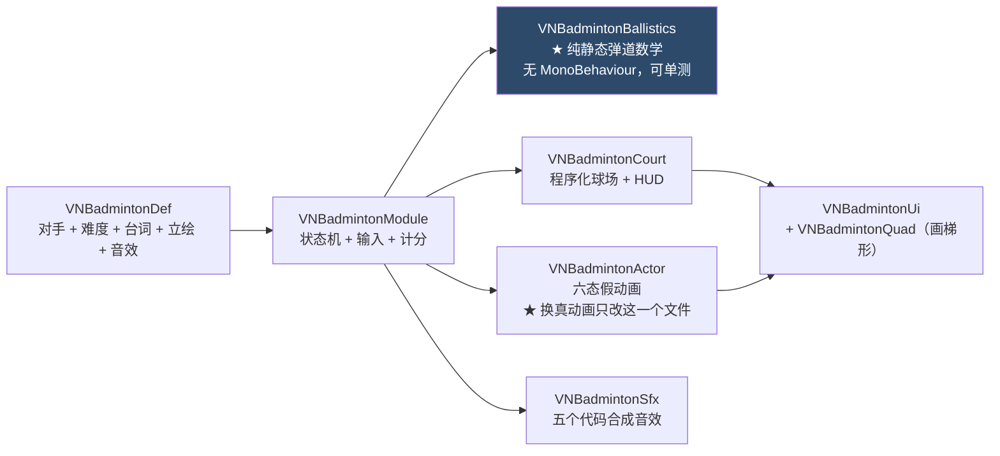

**弹道核心**（[`VNBadmintonBallistics`](Assets/Project/Scripts/VNEffects/Script/VNBadmintonBallistics.cs)，全静态）：

| 方法 | 作用 |
|---|---|
| `SolveParabola(p0, p1, p2, out a, out b, out c)` | 三点定抛物线 |
| `BuildArc(start, end, tuning, ..., out VNBadmintonArc)` | 造一条合法弧线（过网、不出界、限制顶点高度） |
| `Accuracy(distance, t, heavy)` / `IsPerfect(distance, t)` | 击球精准度判定 |
| `SampleEndPos(travelDir, accuracy, ...)` | 按精准度抽样落点 |
| `SolveXAtHeight(in arc, y, ...)` | 求某高度处的 x（判过网 / 判接球点） |
| `SolveReceivePoint(in arc, receiverDir, ...)` | 求接球点（AI 跑位用） |
| `InBounds(x, t)` | 界内判定 |

`VNBadmintonArc` 是个 struct：`a,b,c`（抛物线系数）+ `speed` + `startX,endX` + `heavy`
+ `Y(x)` / `ApexX` / `ApexY` / `Valid`。

**不用 `Physics2D`**——改纯数学判定，代价是必须**子步进**（`StepBall(dt)` 内部细分）以免高速穿网。
`VNBadmintonTuning` 有 30+ 个参数（球场几何 / 判定容差 / 速度 / 重力 / 双方能力），
`Clone()` + `CopyFrom()` 支持从 Def 复制后再叠属性加成。

**模块状态机**：`enum Phase { Intro, Serve, Rally, Point, Over }`，
主要转移在 `EnterServe` → `TickServe` → `DoServe` → `StepBall` → `TryReceive` → `ResolveHit`
→ `LandPoint` / `NetFault` → `AwardPoint` → `Finish` / `FinishFree`。
AI 走 `PlanReceive()`（用 `SolveReceivePoint` 算接球点）+ `TickAi()`。

**养成联动**：`ComputeStatBonus(ctx)` 读 `powerstat:` / `speedstat:` / `jumpstat:` 指定的属性 flag，
按 `VNBadmintonDef.powerPerStat`（[`Assets/Project/Scripts/VNEffects/Script/VNBadmintonDef.cs:110`](Assets/Project/Scripts/VNEffects/Script/VNBadmintonDef.cs#L110)） 等系数（上限 `statCap`）折算成 `_bonusPower` / `_bonusSpeed` / `_bonusJump`，
再由 `ApplyTuning()` 写进 `tuning`。

**教程锚点**：`RegisterTutorialAnchors()` 注册 6 个常量 id
（`AnchorScore` = `"badminton.scoreboard"`、`AnchorHint`、`AnchorNet`、`AnchorMe`、`AnchorOpponent`、`AnchorBall`）
到 [`VNTutorialAnchors`](Assets/Project/Scripts/VNEffects/Script/VNTutorialAnchors.cs)，`OnDestroy` 里 `UnregisterTutorialAnchors()`。

### 8.5 擦雾：两个纯逻辑层

```csharp
public class VNFogMask {                          // 无 MonoBehaviour
    public const int Width = 384, Height = 216;   // ★ 必须保持 16:9，否则笔刷变椭圆
    public float Clarity { get; private set; }
    public Texture2D Texture { get; }
    public void Build() / Reset() / Destroy() / Flush();
    public void BeginStroke() / EndStroke();
    public void StrokeTo(Vector2 uv, float radius, float feather, float strength);
    public void FogBlob(Vector2 uv, float radius, float amount);      // 中心随机冒雾团
    public void ErodeFromEdges(float ratePerSec, float dt);           // 边缘往中间吞
    public static float BlobStrengthFor(ratePerSec, interval, radius);
    public float ValueAt(int x, int y);
}
public class VNFogScore {
    public int Stage { get; } = -1;   public float Clarity { get; }   public float Peak { get; }  // ★ 历史峰值
    public void Init(IList<float> thresholds);
    public Tick Update(float clarity);        // 阶段只升不降
    public static string Grade(float peak, float perfectAt, float normalAt, ...);
    public bool Reached(float perfectAt) => Peak >= perfectAt;
}
```

**三个设计要点（都是踩坑得来的）**：

1. **内部用 `float[]` 而非 `byte[]`**：回雾每帧减 0.0005，byte 会被整数截断吃掉 = 雾根本不回来。
2. **`Stamp` 一笔之内取 max、笔与笔之间才累加**：直接累加会把羽化带填满让边缘退化成硬边；
   单纯取 max 又会让 `wipeStrength` 变成永久天花板。记住「这一笔碰到之前的值」两个毛病都没有。
3. **结算按历史峰值 `Peak` 而非结束瞬间**：时限到那帧被雾吞一口，不该把人从完美打到普通。
   HUD 进度条上同时画峰值刻度与普通档门槛线。

**剧本硬约定**：**★ 别在 `event` 之前先写 `cg`** —— 雾要到 `OnLaunch` 才铺得出来，
先 `cg` 会让谜底在开始擦之前就揭晓。用 `cg:` 参数交给模块自己铺（`ResolveBaseSprite`），
要让画面留下继续演就在结果分支里再写 `cg`（同一帧交接不会闪）。
Lint 规则 `wipefog-cg-before-event` 盯着这件事。

**为什么不破模块三铁律**：角色是**被动 CG**，模块只是铺一份自己的清晰 CG 打底 + 自绘台词条
（事件层 60 盖住对话框是必然的，雾要铺满）。也因此**不进存档**。

配套：[`VNFogSfx`](Assets/Project/Scripts/VNEffects/Script/VNFogSfx.cs)（四个代码合成音效——**擦拭循环音是唯一的速度反馈**，用一段 1 秒滤波白噪改 pitch
而非切多段素材，切段会爆音）、[`VNFogTextures`](Assets/Project/Scripts/VNEffects/Script/VNFogTextures.cs)（四种道具光标的程序化 SDF 贴图）、
[`VNFogTuneWindow`](Assets/Project/Scripts/VNEffects/Editor/VNFogTuneWindow.cs)（调参窗口，见 17.1）。

### 8.6 亲密互动：部位区域与阶段机

```csharp
public class VNTouchZone {                 // 归一化坐标，与 markAnchor 同语义
    public string id, displayName;   public VNZoneShape shape;   // Ellipse / Rect
    public Vector2 center, size;     public float rotation;
    public int priority;             public float gainScale;
    public int unlockStage;          public bool enabled;         // 禁忌部位的解禁阶段
}
public class VNTouchZoneDef : ScriptableObject {
    public string characterId;
    public List<VNTouchZone> baseZones;                              // 基准一套
    public List<VNZoneSpriteOverride> overrides;                     // 按立绘 / 表情覆盖，带继承
    public List<VNTouchZone> ZonesFor(Sprite, string expression);    // 带缓存
    public static bool Contains(VNTouchZone zone, Vector2 p);        // ★ 纯静态
    public VNTouchZone Pick(Vector2 p, Sprite, string expression);
    public VNTouchZone FindById(string zoneId);
    public void InvalidateCache();
}
public class VNTouchScore {                // 纯逻辑，可单测
    public float Excite { get; }   public int Stage { get; }   public int RejectCount { get; }
    public float TotalUnits { get; }   public float StageProgress { get; }
    public Tick AddUnits(zoneId, units, gain, feedbackEvery);
    public Tick Reject(now, cooldown, limit);
    public void Decay(perSecond, dt);   public void AddExcite(delta);
    public bool CoolDownReady(key, now);   public void MarkCoolDown(key, now, cooldown);
    public float ZoneAmount(zoneId);   public int ZoneTouches(zoneId);
    public static int StageFor(IList<float> thresholds, float excite, int current);
}
```

**`Contains` / `Pick` 是纯静态的**——所以**编辑器画框工具（[`VNTouchZoneEditorWindow`](Assets/Project/Scripts/VNEffects/Editor/VNTouchZoneEditorWindow.cs)）与运行时用同一份命中判定**，
画布上点得中的地方游戏里就摸得到。

**阶段只升不降**（`StageFor` 的 `current` 参数）：允许回退的话玩家一停手，表情就会在阈值边界反复横跳。

**[`VNTouchCursor`](Assets/Project/Scripts/VNEffects/Script/VNTouchCursor.cs)（247 行）不用 `Cursor.SetCursor`**——硬件光标做不了「摆动 / 按住震动 / 速度倾斜 / 悬停发光」
这四件事，而它们正是手感来源（[`VNCursorIdleAnim`](Assets/Project/Scripts/VNEffects/Script/VNInteractionDef.cs) / `VNCursorPressAnim` 两个枚举 + 8 个动画参数）。
代价是 `Dispose()` 必须在 **`Finish` · `CancelForDebug` · `OnDestroy` · `OnDisable` 四处都调**，
漏一条玩家鼠标指针就永久消失。（`VNFogWipeModule` 复用了同一个光标，`RunCleanup()` 同样挂在四处。）

**其他清理约束**：部位框可视化挂在立绘下面（要跟着立绘缩放位移），所以模块销毁时**必须显式删**
（`DestroyZoneOverlay()`），否则互动结束后框留在角色脸上；`ClearImprints()` 同理——
痕迹不进存档，留在脸上的印子读档后会莫名消失。

**不铺全屏暗幕**（会盖住对话框，而这个玩法全程要角色说话），HUD 缩左下、道具栏走右侧竖排。

### 8.7 大头贴：六层拆分

| 层 | 职责 |
|---|---|
| `VNPhotoBoothModule`（1852 行） | 主状态机、四标签页（边框｜背景｜贴纸｜涂鸦）、手势、布局常数 |
| [`VNPhotoScore`](Assets/Project/Scripts/VNEffects/Script/VNPhotoScore.cs) | **纯静态评分数学**：`Evaluate(VNPhotoDressing, VNPhotoThemeDef) : Result`（清单制加分 + 命中评语）；结果名常量 `OutcomePerfect/Normal/Fail/Free` |
| [`VNPhotoTextures`](Assets/Project/Scripts/VNEffects/Script/VNPhotoTextures.cs) | 程序化边框 / 遮罩 / 10 种贴纸 / 相纸 |
| [`VNPhotoCapture`](Assets/Project/Scripts/VNEffects/Script/VNPhotoCapture.cs) | **取景框截图**：`Capture(RectTransform, Canvas, ...)` + [`ScreenRectOf()`](Assets/Project/Scripts/VNEffects/Script/VNPhotoCapture.cs#L80) + [`Crop()`](Assets/Project/Scripts/VNEffects/Script/VNPhotoCapture.cs#L100) + [`Downscale()`](Assets/Project/Scripts/VNEffects/Script/VNPhotoCapture.cs#L133)（`MaxSide = 1600`）——「怎么拍」全在这一个文件，换 RenderTexture 只改它 |
| [`VNPhotoAlbum`](Assets/Project/Scripts/VNEffects/Script/VNPhotoAlbum.cs) | 全局相册（PNG + `index.json`，LRU 纹理缓存 `TextureCacheSize = 12`、缩略图 `ThumbnailWidth = 192`、`Capacity = 200`） |
| [`VNPhotoDoodle`](Assets/Project/Scripts/VNEffects/Script/VNPhotoDoodle.cs) | 涂鸦：**两张 768×576 位图画布**（普通笔走 Alpha、荧光笔走 `VN/Additive`），线段插值补点，撤销 5 步 |

**布局常数化在文件头**：机身 1860×1020 / 取景框 1040×780 / 侧栏 340×900 / 相纸 860×770。
涂鸦画布 768×576 与取景框 1040×780 成对——放大倍率压在 1.35× 内才不糊。

**开窗内层序**：背景 → 拖动板 → 人后贴纸 → 我 → 她。**拖动板必须压最底**，否则吃掉人后贴纸的射线。

**两套结果名互斥**：写了 `theme:` = 完美 / 普通 / 失败；不写 = 自由拍照，只返回 `完成`。

---

## 9. 养成 / 经济 / 装备 / 任务 / 时间

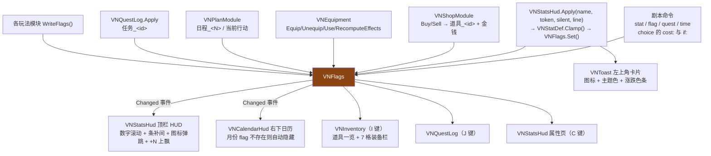

### 9.1 [`VNStatDef`](Assets/Project/Scripts/VNEffects/Script/VNStatDef.cs) + [`VNStatsHud`](Assets/Project/Scripts/VNEffects/Script/VNStatsHud.cs)

`VNStatDef`（ScriptableObject）只提供**呈现与约束**，值本身在 flag：

```csharp
public string id, displayName, displayNameEn, displayNameJa;
public Sprite icon;        public Color color;
public bool useClamp = true;   public int minValue = 0, maxValue = 100;
public int initialValue;
public VNStatStyle style;      // Number / Bar / Grade / …
public string unit;            public List<GradeStep> gradeSteps;
public bool showInHud = true;
public string DisplayName { get; }
public int Clamp(int v);   public string GradeOf(int v);
public string Format(int v);   public float Normalized(int v);
```

`VNStatsHud` 的关键方法：

| 方法 | 作用 |
|---|---|
| `Apply(name, valueToken, silent, line)` | 解析 `+5` / `-3` / `500`（也支持 `stat 金钱+5` 挤在一个 token 里）→ `Clamp` → `VNFlags.Set`（[`Assets/Project/Scripts/VNEffects/Script/VNFlags.cs:28`](Assets/Project/Scripts/VNEffects/Script/VNFlags.cs#L28)） → Toast 卡片 |
| [`EnsureInitials()`](Assets/Project/Scripts/VNEffects/Script/VNStatsHud.cs#L96) | 首次进游戏按 `initialValue` 种入 |
| `ParseCostOp(costOp, out name, out delta)`（静态） | `金钱-100` → (`金钱`, -100) |
| `CanAfford(costOp)` | 扣完是否 ≥ `minValue`（无定义则 0）——choice 置灰判据 |
| `FormatCostLabel(costOp)` | 选项上显示的花费标签（有 `unit` 就用 `-100G` 形式） |
| `ApplyCost(costOp, line)` | 真正扣费 |
| `SetHudVisible(bool)` / `Toggle` / `Open` / `Close` | 顶栏 HUD 与 C 键属性页 |
| `RollValue(e, from, to)` / `SpawnFloatingDelta(e, delta, color)` | HUD 就地演出 |

**演出双轨**：HUD 就地（数字滚动 + 条补间 + 图标弹跳 + `+N` 上飘）+ 左上角 [`VNToast`](Assets/Project/Scripts/VNEffects/Script/VNToast.cs) 卡片
（图标 + 主题色认属性、左侧竖条认涨跌）。

### 9.2 [`VNEquipment`](Assets/Project/Scripts/VNEffects/Script/VNEquipment.cs)（纯静态，194 行）

```csharp
public const string EquipFlagPrefix   = "装备_";
public const string AppliedFlagPrefix = "装备实增_";
public const string EffectFlagPrefix  = "装备效果_";
public static System.Func<string, VNShopDef.Item> ItemResolver;   // 由 VNInventory 注入
public static bool IsEquipped(string itemId);
public static string ItemInSlot(VNEquipSlot slot);
public static bool Equip(VNShopDef.Item item);
public static bool Unequip(string itemId, bool silent = false);
public static bool Use(VNShopDef.Item item);
public static void HandleItemLost(string itemId);
public static void RecomputeEffects();
```

**`装备实增_` 这个字段是关键**：装备加成会被 `VNStatDef.Clamp()`（[`Assets/Project/Scripts/VNEffects/Script/VNStatDef.cs:80`](Assets/Project/Scripts/VNEffects/Script/VNStatDef.cs#L80)） 削掉（比如魅力已经 98，
`+5` 只实际生效 `+2`）。卸下时若按「名义 +5」扣回就会凭空少 3 点。所以记录**实际生效量**，按它扣。

`ItemResolver` 是个函数指针注入点——`VNEquipment` 是纯静态的，不能直接查场景；
由 [`VNInventory`](Assets/Project/Scripts/VNEffects/Script/VNInventory.cs) 在初始化时注入 `FindItem`。

### 9.3 时间：`ApplyTimeCommand`

```
time set <月份> [remain:N]
    → 月份（钳到 1..12） / 剩余月数

time pass [months:N] [refill:off|属性名]
    月份 = (月份 - 1 + N) % 12 + 1
    剩余月数 -= N（**flag 存在才改**，不存在就不凭空造）
    行动力回满：默认属性名「行动力」，读 VNStatDef.maxValue；refill:off 关闭
    → VNToast「N 月」
```

[`VNCalendarHud`](Assets/Project/Scripts/VNEffects/Script/VNCalendarHud.cs) 订阅 `VNFlags.Changed`（[`Assets/Project/Scripts/VNEffects/Script/VNFlags.cs:21`](Assets/Project/Scripts/VNEffects/Script/VNFlags.cs#L21)） 标脏 → [`Update()`](Assets/Project/Scripts/VNEffects/Script/VNFogScore.cs#L59) 里 `Refresh()`。
**`月份` flag 不存在时整个 HUD 自动隐藏**——所以纯剧情作品不用管它。

---

## 10. AI 自由聊天子系统

**定位（源码注释明写）**：仅番外 / 自由时间，**主线不依赖**——AI 内容不进翻译表、无配音、玩家可能断网。
Key 仅本地开发用，发行须改玩家自填或自建中转。

### 10.1 完整数据流

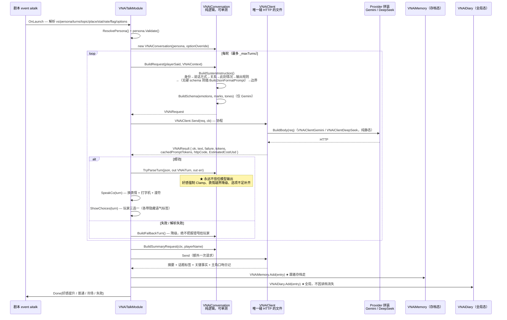

### 10.2 分层与各自的不可替代性

| 文件 | 职责 | 关键点 |
|---|---|---|
| [`VNAiProvider`](Assets/Project/Scripts/VNEffects/Script/VNAiProvider.cs) / `VNAiProviders` | 供应商能力登记表 | [`SupportsResponseSchema()`](Assets/Project/Scripts/VNEffects/Script/VNAiProvider.cs#L108) / [`SupportsSafetySettings()`](Assets/Project/Scripts/VNEffects/Script/VNAiProvider.cs#L111) / [`EnvVarFor()`](Assets/Project/Scripts/VNEffects/Script/VNAiProvider.cs#L96) / [`KeyFileFor()`](Assets/Project/Scripts/VNEffects/Script/VNAiProvider.cs#L100) / [`DefaultModelFor()`](Assets/Project/Scripts/VNEffects/Script/VNAiProvider.cs#L89) / [`TryFromModelName()`](Assets/Project/Scripts/VNEffects/Script/VNAiProvider.cs#L124)；全局默认在 `VNGameConfig.aiProvider`（[`Assets/Project/Scripts/VNEffects/Script/VNGameConfig.cs:222`](Assets/Project/Scripts/VNEffects/Script/VNGameConfig.cs#L222)）（当前 **DeepSeek `deepseek-v4-flash`**） |
| [`VNAiKey`](Assets/Project/Scripts/VNEffects/Script/VNAiKey.cs) | Key 三级回退 | 环境变量 → 仓库外 → 仓库内；**按供应商各一套**分开缓存；`#if UNITY_EDITOR \|\| VN_AI_ALLOW_LOCAL_KEY` 挡住 Build 版本读取；永不打印 |
| [`VNAiClient`](Assets/Project/Scripts/VNEffects/Script/VNAiClient.cs)（347 行） | **全专案唯一碰 HTTP 的文件** | `Send(req, onDone) : IEnumerator`；失败分 8 类 `VNAiFailure`；429 / 5xx / 网络错误指数退避（`maxRetries = 2`）；协程封装而非 async/await（与 `EventCo` 的轮询等待天然契合） |
| [`VNAiClientGemini`](Assets/Project/Scripts/VNEffects/Script/VNAiClientGemini.cs) / [`VNAiClientDeepSeek`](Assets/Project/Scripts/VNEffects/Script/VNAiClientDeepSeek.cs) | 只差「拼请求体」和「解响应」 | 纯静态，不碰网络 |
| [`VNAiConversation`](Assets/Project/Scripts/VNEffects/Script/VNAiConversation.cs)（798 行） | **纯逻辑层，无 MonoBehaviour** | prompt 组装、schema 生成、历史裁剪、响应解析与钳制 |
| [`VNAiPersonaDef`](Assets/Project/Scripts/VNEffects/Script/VNAiPersonaDef.cs) | 人格资产 | 独立于 [`VNCharacterDef`](Assets/Project/Scripts/VNEffects/Script/VNCharacterDef.cs)（一个角色可有多套人格共用立绘）；`MinOptions = 3` / `MaxOptions = 6` |
| [`VNAiMemory`](Assets/Project/Scripts/VNEffects/Script/VNAiMemory.cs) / [`VNAiDiary`](Assets/Project/Scripts/VNEffects/Script/VNAiDiary.cs) / [`VNAiDiaryPanel`](Assets/Project/Scripts/VNEffects/Script/VNAiDiaryPanel.cs) | 跨场记忆 / 日记本 / D 键面板 | **存储语义刻意相反**，见 10.4 |
| [`VNAiPricing`](Assets/Project/Scripts/VNEffects/Script/VNAiPricing.cs) / `VNAiPricingDef` | **算钱的唯一入口** | 见 10.5 |
| [`VNAiTextNormalize`](Assets/Project/Scripts/VNEffects/Script/VNAiTextNormalize.cs) | 繁转简兜底 | 提示词管「大部分时候对」，兜底管「永远不出错」；作用于台词 / 选项 / 日记 / 摘要 / 话题 |
| [`VNAiTalkLog`](Assets/Project/Scripts/VNEffects/Script/VNAiTalkLog.cs)（431 行） | 对话日志 | `VNAiLogMode`（Off / EditorOnly / Always）→ `AiTalkLogs/*.json` |

**核心资料类型**：

```csharp
public class VNAiTurn {
    public string reply;            // 台词
    public string emotion;          // 表情名（已校验在白名单内）
    public string mark;             // 漫符英文正名；null = 这轮不出符号
    public int affectionDelta;      // 已按人格的 affectionClamp 钳过
    public List<VNAiOption> options;
    public bool shouldEnd;          // AI 认为话题可以收尾了
}
public struct VNAiOption { public string text; public string tone; }   // tone = 隐藏语气标签
public struct VNAiContext {
    public string playerName, topic, place, affectionText, memory;
    public List<string> pastTopics;   // ★ 硬性回避清单
    public int turnsLeft;             // 让 AI 自己把节奏收住
}
```

### 10.3 提示词组装顺序（`BuildSystemInstruction`）

```
身份 → 说话方式 → 关系 → 此刻情况 → 输出规则
    → （没有硬 schema 的家在这里插一段 BuildJsonFormatPrompt 示例 JSON）
    → 边界（boundaries）
```

**越靠后权重越高**，所以 `boundaries` 放最后。

**「少重复」的主力是话题清单**：`VNAiMemory.TopicsOf(characterId)` 产出的话题
**单独成段作为硬性回避清单注入**，比把话题揉进摘要里说「别重复」有效得多。

**两个供应商契约坑（源码注释记录）**：

- **Gemini**：`thinkingLevel` 必须放在 `thinkingConfig` 里面且只有 minimal/low/medium/high；
  鉴权走 `x-goog-api-key` 请求头不用 `?key=`；被安全策略拦下时 `parts` 是空的，直接取 `parts[0]` 会空引用。
- **DeepSeek**：没有 `json_schema`（只有 `json_object`，格式改由提示词约束 + 解析层兜底）；
  **历史里 assistant 的消息也必须是 JSON**（是纯文本时模型会退化成吐一串空白 → 第 2 轮起必挂，
  故 `VNAiConversation.WrapReplyAsJson()`（[`Assets/Project/Scripts/VNEffects/Script/VNAiConversation.cs:209`](Assets/Project/Scripts/VNEffects/Script/VNAiConversation.cs#L209)） 存在）；system 是 messages 第一条；助手角色叫 `assistant`；
  没有 `safetySettings`；思考是开关 + 三档 `reasoning_effort`；响应带 `prompt_cache_hit_tokens`
  （命中价便宜约 30 倍，算钱要拆开）。

**总结请求的一个坑**：若按 `role:user/model` 交替发历史，模型会代入她的身份写出「她的日记」。
改成把对话**拍平成纯文本放进单条 user 消息**才对——身份认知不对时先看 role 结构，再改措辞。

**解析层的钳制**（`TryParseTurn` / `PickWhitelisted` / `StripFence`）：

- 好感强制 `Clamp`——Gemini schema 不支持 `minimum`/`maximum`，实测不钳会给 +5；
- 表情 / 漫符越界 → 降级到白名单第一项；
- 选项不足 → 用 `fallbackOptions` 补齐；
- `StripFence` 剥掉模型偶尔套上的 ```` ```json ```` 围栏。

### 10.4 记忆 vs 日记：刻意相反的存储语义

| | `VNAiMemory` | `VNAiDiary` |
|---|---|---|
| 存哪 | `VNSaveData.aiMemories`（[`Assets/Project/Scripts/VNEffects/Script/VNSaveSystem.cs:72`](Assets/Project/Scripts/VNEffects/Script/VNSaveSystem.cs#L72)）（存档槽内） | `persistentDataPath/vn_ai_diary.json`（全局） |
| 读旧档 | **跟着回退**（她不该记得未来） | **不消失**（同 CG 画廊，玩家收藏品） |
| 视角 | 第三人称摘要，给模型自己看 | 主角口吻正文，给玩家看 |
| 容量 | `DefaultCapacity = 15`，FIFO（`RemoveAt(0)`） | `Capacity = 200`，`Insert(0, ...)` 最新在最前 |
| 面板 | 无（隐式注入 prompt） | `VNAiDiaryPanel`（D 键） |
| 组装 | `BuildContext(characterId, maxEntries)` + `TopicsOf()` | — |

### 10.5 `VNAiPricing` — 算钱的唯一入口

**三个价 + 一个倍率**：未命中输入 / 命中缓存输入（DeepSeek 便宜约 30 倍）/ 输出，再乘高峰倍率
（DeepSeek 高峰翻倍，时段列表也在资产里，官方改时段不用动代码）。

两条硬规则：

1. **查表按 key 最长优先**——`gemini-3.5-flash-lite` 同时含 `flash` 和 `flash-lite`，
   `deepseek-v4-flash` 也含 `flash`；不排序会被隔壁家的价抢走。
2. **认不出的模型取最贵档并标「单价存疑」**——低估会让人放心用下去，高估最多多留意一眼。

重算历史日志时按**那场对话当时**的 UTC 时间判高峰，同一份日志今天看和明天看必须同一个数字。
思考 token 按输出价计费。资产走 `Create → VN → AI Pricing` 登记进 `VNGameConfig.aiPricing`（[`Assets/Project/Scripts/VNEffects/Script/VNGameConfig.cs:230`](Assets/Project/Scripts/VNEffects/Script/VNGameConfig.cs#L230)），
不建资产就用内置默认表。

---

## 11. 内容资产层：VNGameConfig 与 Def 家族

### 11.1 [`VNGameConfig`](Assets/Project/Scripts/VNEffects/Script/VNGameConfig.cs) 存在的理由

场景生成器 [`VNEffectsDemoSetup`](Assets/Project/Scripts/VNEffects/Editor/VNEffectsDemoSetup.cs) 内部会 `EditorSceneManager.NewScene(EmptyScene)`，
即**丢弃当前场景从零重造**。所有挂在场景组件上的引用每次重建全部清空。
`VNGameConfig` 把这些数据搬到 `Assets/Resources/VNGameConfig.asset`——
运行时 `Resources.Load` 直接取，**场景里一个引用字段都不需要**（组件上的 `config` 字段只是可选覆盖）。

```csharp
public const string ResourcesName = "VNGameConfig";
public const string AssetPath = "Assets/Resources/VNGameConfig.asset";
public static VNGameConfig Active { get; }     // 惰性 Resources.Load，找不到返回 null
public static void SetActive(VNGameConfig);    // 组件上显式指定时
public static void ClearCache();               // ★ 同时 VNAiProviders.Invalidate() + VNAiPricing.Invalidate()
public static bool ApplyList<T>(List<T> source, ref List<T> target);   // 覆盖语义的统一实现
public static GameObject FindSkin(List<UiSkinEntry> list, string id);
public VNAiPersonaDef FindAiPersona(string personaId);
```

**★ 覆盖语义只有一条规则**：本资产里**填了的**列表 / 字段 → 覆盖场景组件上的同名设置；
**留空的** → 保持场景组件原样。实现就是 `ApplyList<T>`——三行代码，全专案 20 多处调用它。

`ClearCache()` **必须连带清 AI 那两处缓存**——不然在 Inspector 里把供应商从 Gemini 改成 DeepSeek
之后还会继续发给 Gemini，直到下次域重载；这种「改了没反应」最难查。
`VNGameConfigTools.HookPlayModeCacheClear()`（[`Assets/Project/Scripts/VNEffects/Editor/VNGameConfigTools.cs:305`](Assets/Project/Scripts/VNEffects/Editor/VNGameConfigTools.cs#L305)） 在每次进出 Play Mode 时调它。

**什么该放这儿 / 什么不该**（注释原话）：

- 放：**无法从文件名推断、需要人工调的数据**——背景 `id → 图` 映射、每条音频的基准音量、
  地图地点坐标与条件、入口剧本。
- 不放：**能靠「扫目录」自动得到的**——角色 / 属性 / 商店 / 日程 / 任务定义资产、章节剧本、CG
  （由 `VNGameConfigTools.RescanAssetFolders()`（[`Assets/Project/Scripts/VNEffects/Editor/VNGameConfigTools.cs:178`](Assets/Project/Scripts/VNEffects/Editor/VNGameConfigTools.cs#L178)） 自动登记）。
- 但仍为后者留了字段：填了就覆盖扫描结果，用于「我就要手动指定顺序」的场合。

> **列表元素里的字段说明一律用 `[Tooltip]`，绝对不要用 `[Header]`**——
> 它会把控件区域往下推，在自定义 drawer 的固定 rect 里表现为文字叠印 + 输入框点不进去。

### 11.2 九个分区

[`VNGameConfigEditor`](Assets/Project/Scripts/VNEffects/Editor/VNGameConfigEditor.cs) 把它画成九页分页 Inspector：**剧本｜标题｜UI 皮肤｜舞台｜音频｜玩法｜AI｜大头贴｜全部**
（选中页进 EditorPrefs）。页签**只登记字段名**，绘制仍走 `PropertyField`，
所以没被认领的新字段会自动落到「其他」页而不是静默消失。

| 分区 | 主要字段 |
|---|---|
| 剧本 | `entryScript`、`chapters` |
| 标题 | `gameTitle` / `En` / `Ja`、`titleBackground`、`titleBgm` |
| UI 皮肤 | `dialogueSkins`、`choiceSkins`、`systemUiSkin` |
| 舞台 | `characters`、`backgrounds`、`cgLibrary`、`weatherDefs`、`interludes`、`interludeImages`、`tutorials` |
| 音频 | `bgmLibrary`、`seLibrary`、`voiceLibrary`、`typingTick`、`overrideChannelVolumes` + 三通道音量 |
| 玩法 | `mapSprite`、`mapLocations`、`stats`、`shops`、`plans`、`quests`、`quizzes`、`badmintons`、`fogWipes` |
| AI | `aiPersonas`、`aiProvider`、`aiModel`、`aiPricing` |
| 大头贴 | `photoFrames`、`photoStickers`、`photoBackdrops`、`photoThemes`、`photoMeCharacterId` |

智能列表功能：搜索 · 分页 50/页 · ▲▼✕ · id 重复与空值告警 · 批量拖入自动填文件名当 id。
用分页而非虚拟化，是因为 Inspector 里拿不到宿主 ScrollView 的可见区域。

### 11.3 Def 资产家族总表

| 资产 | 被谁读 | 关键字段 |
|---|---|---|
| [`VNCharacterDef`](Assets/Project/Scripts/VNEffects/Script/VNCharacterDef.cs) | [`VNStage`](Assets/Project/Scripts/VNEffects/Script/VNStage.cs) | `id` / 三语 `displayName` / `nameColor` / `overrideNameplateColors` + 三色 / `expressions` / 眨眼三参 + `blinkMode`（`VNBlinkMode`）/ 口型 / `overlays` / `imprints` / `markSprites` + `markAnchor` + `markScale` / `sizeScale` / `positionOffset` / `rotationZOffset` / `portraits` + `portraitScale/Offset`；方法 `GetSprite(expr)` / `ActiveBlinkSprite` / `DefaultSprite` / [`IsDefaultExpression()`](Assets/Project/Scripts/VNEffects/Script/VNCharacterDef.cs#L274) / [`GetPortrait()`](Assets/Project/Scripts/VNEffects/Script/VNCharacterDef.cs#L291) / [`GetNameplateColors()`](Assets/Project/Scripts/VNEffects/Script/VNCharacterDef.cs#L53) |
| [`VNStatDef`](Assets/Project/Scripts/VNEffects/Script/VNStatDef.cs) | [`VNStatsHud`](Assets/Project/Scripts/VNEffects/Script/VNStatsHud.cs) | 见 9.1 |
| [`VNShopDef`](Assets/Project/Scripts/VNEffects/Script/VNShopDef.cs) | [`VNShopModule`](Assets/Project/Scripts/VNEffects/Script/VNShopModule.cs) / [`VNInventory`](Assets/Project/Scripts/VNEffects/Script/VNInventory.cs) / [`VNEquipment`](Assets/Project/Scripts/VNEffects/Script/VNEquipment.cs) | `shopId` / 三语 `shopName` / `currencyStat`（默认「金钱」）/ `items`（`Item` 含 `StatOp` 列表、`PassiveEffect` 列表、装备槽 `VNEquipSlot`）；常量 `ItemFlagPrefix = "道具_"` |
| [`VNQuestDef`](Assets/Project/Scripts/VNEffects/Script/VNQuestDef.cs) | [`VNQuestLog`](Assets/Project/Scripts/VNEffects/Script/VNQuestLog.cs) | `id` / `title` / `description` / `stages`（各三语）；`StageText(stage)` |
| [`VNPlanDef`](Assets/Project/Scripts/VNEffects/Script/VNPlanDef.cs) | [`VNPlanModule`](Assets/Project/Scripts/VNEffects/Script/VNPlanModule.cs) | `planId` / 三语 `title` / `actions`（`ActionDef` 带编号、条件、消耗）；`FindByNumber(n)` |
| [`VNQuizDef`](Assets/Project/Scripts/VNEffects/Script/VNQuizDef.cs) | [`VNQuizModule`](Assets/Project/Scripts/VNEffects/Script/VNQuizModule.cs) | `quizId` / `defaultTimeLimit` / `flagPrefix` / `questions`（`MaxOptions = 4`，各三语，每题奖惩）；[`ValidQuestions()`](Assets/Project/Scripts/VNEffects/Script/VNQuizDef.cs#L128) 过滤非法题（题干空 / 选项 < 2 / 答案序号越界） |
| [`VNBadmintonDef`](Assets/Project/Scripts/VNEffects/Script/VNBadmintonDef.cs) | [`VNBadmintonModule`](Assets/Project/Scripts/VNEffects/Script/VNBadmintonModule.cs) | 三语对手名 + 立绘 + `tuning` + `powerPerStat`/`speedPerStat`/`jumpPerStat` + `statCap` + 五个音效 + `TalkSet` 台词池；`TalkEnabled` |
| [`VNFogWipeDef`](Assets/Project/Scripts/VNEffects/Script/VNFogWipeDef.cs) | [`VNFogWipeModule`](Assets/Project/Scripts/VNEffects/Script/VNFogWipeModule.cs) | 雾外观九参（`fogColor`/`fogMix`/`fogDensity`/`blurAmount`/`brightness`/`edgeNoise`/`noiseScale`/`grain`/`falloff`）+ 笔刷三参 + `cursorKind`（`VNWiperKind`）+ 回雾五参 + 三档门槛 + `stages` 分阶段台词 + 四音效；[`SortedStages()`](Assets/Project/Scripts/VNEffects/Script/VNFogWipeDef.cs#L238) |
| [`VNInteractionDef`](Assets/Project/Scripts/VNEffects/Script/VNInteractionDef.cs) | [`VNInteractionModule`](Assets/Project/Scripts/VNEffects/Script/VNInteractionModule.cs) | `VNInteractionItem`（道具 + 光标动画 8 参）、`VNInteractionStage`、`VNInteractionZoneRule`、`VNInteractionFeedback`（含 `trigger`（`VNFeedbackTrigger`）/`cooldown`/`weight`/`blocking`/`scriptLines`/`voicePool`） |
| [`VNTouchZoneDef`](Assets/Project/Scripts/VNEffects/Script/VNTouchZoneDef.cs) | 同上 + 编辑器 | 见 8.6 |
| [`VNAiPersonaDef`](Assets/Project/Scripts/VNEffects/Script/VNAiPersonaDef.cs) | [`VNAiTalkModule`](Assets/Project/Scripts/VNEffects/Script/VNAiTalkModule.cs) | 见 10.2 |
| [`VNTutorialDef`](Assets/Project/Scripts/VNEffects/Script/VNTutorialDef.cs) | [`VNTutorialPlayer`](Assets/Project/Scripts/VNEffects/Script/VNTutorialPlayer.cs) | `steps`（`anchor` / `area` / `shape`（`VNTutorialHole`）/ `padding` / `corner` / `feather` / 三语标题正文 / `image` / `card`（`VNTutorialCardSpot`）/ `se`）+ `edgeColor` / `edgeWidth` / `allowSkip` / `once` |
| [`VNInterludeDef`](Assets/Project/Scripts/VNEffects/Script/VNInterludeDef.cs) | [`VNInterludeScreen`](Assets/Project/Scripts/VNEffects/Script/VNInterludeScreen.cs) | 三语标题副标题 + `voices` 池 + `images` 池 + `loadingDuration = 1.5f` + `enter`（`VNInterludeEnter`）/ `transition`；[`PickVoice()`](Assets/Project/Scripts/VNEffects/Script/VNInterludeDef.cs#L128) / [`PickImage()`](Assets/Project/Scripts/VNEffects/Script/VNInterludeDef.cs#L134) |
| [`VNWeatherDef`](Assets/Project/Scripts/VNEffects/VNWeatherDef.cs) | [`VNWeatherController`](Assets/Project/Scripts/VNEffects/VNWeatherController.cs) / [`VNFoliageSystem`](Assets/Project/Scripts/VNEffects/VNFoliageSystem.cs) | 五套内置预设，不建资产也能用 |
| [`VNPhotoFrameDef`](Assets/Project/Scripts/VNEffects/Script/VNPhotoFrameDef.cs) / `StickerDef` / `BackdropDef` / `ThemeDef` | [`VNPhotoBoothModule`](Assets/Project/Scripts/VNEffects/Script/VNPhotoBoothModule.cs) | 主题是**清单制评分表**（`expressionRules` / `frameRules` / `backdropRules` / `stickerRules` 四张加分清单 + `perfectComment` / `normalComment` / `failComment`）；`baseScore = 20` / `perfectLine = 70` / `passLine = 40` |
| [`VNLiquidPreset`](Assets/Project/Scripts/VNEffects/VNLiquidPreset.cs) | [`VNLiquidSplash`](Assets/Project/Scripts/VNEffects/VNLiquidSplash.cs) / [`VNWetScreen`](Assets/Project/Scripts/VNEffects/VNWetScreen.cs) | water / blood / ink / slime 四套（黏度 = 重力 + 拉伸 + 下滑速度 + 干涸时间四参数合谋） |
| [`VNSystemUiSkinSet`](Assets/Project/Scripts/VNEffects/Script/VNSystemUiSkinSet.cs) | 全部系统面板 | 唯一全局主题 prefab 集 |
| [`VNAiPricingDef`](Assets/Project/Scripts/VNEffects/Script/VNAiPricing.cs) | `VNAiPricing` | 每百万 token 单价表 + 高峰时段 |

---

## 12. 演出与特效系统

### 12.1 容器层级（每种整屏运动独占一层，可任意叠加）

```
Canvas (Screen Space - Camera, planeDistance 10, 1920×1080)
├── SceneRoot      ← VNScreenShake(位置震动) + VNHeartbeat(缩放脉动)
│   └── ZoomRoot   ← VNCamera(运镜缩放/平移)
│      └── TiltRoot ← VNDutchAngle(荷兰角旋转 + 防露角放大)
│         ├── LayerBack  (背景 + 云影)   ← VNParallax 视差 8px
│         ├── LayerMid   (GodRays)       ← 视差 13px
│         └── LayerFront (立绘×2 + 光环 + 脚影) ← 视差 19px
├── HintText / DialogueBox(40) / ChoicePanel(45) / EdgeGlow(20)
├── EventLayer(60) / InterludeScreen(90) / TutorialOverlay(92) / ScreenTransition(100)
└── (场外) 粒子系统们(10~31)、EventSystem、各管理器空物体
```

**排序层级表**（记熟这张表能避免一半的「盖不住 / 被盖住」问题）：

| 排序 | 层 | 备注 |
|---|---|---|
| 10–31 | 粒子系统 | |
| 20 | [`VNEdgeGlow`](Assets/Project/Scripts/VNEffects/VNEdgeGlow.cs) | |
| 40 | [`VNDialogueBox`](Assets/Project/Scripts/VNEffects/VNDialogueBox.cs) | |
| 45 | [`VNChoicePanel`](Assets/Project/Scripts/VNEffects/VNChoicePanel.cs) | |
| 60 | [`VNEventRegistry`](Assets/Project/Scripts/VNEffects/Script/VNEventRegistry.cs) EventLayer | **在选项面板之上** → 模块自绘元素默认 `raycastTarget = false` |
| 90 | [`VNInterludeScreen`](Assets/Project/Scripts/VNEffects/Script/VNInterludeScreen.cs) | 必须挂主 Canvas（Overlay 画布会永远压在 Screen Space - Camera 之上） |
| 92 | [`VNTutorialPlayer`](Assets/Project/Scripts/VNEffects/Script/VNTutorialPlayer.cs) | 同上；且洞口 HDR 描边靠 Bloom，Overlay 吃不到 |
| 100 | [`VNScreenTransition`](Assets/Project/Scripts/VNEffects/VNScreenTransition.cs) | |
| 500 | [`VNTitleMenu`](Assets/Project/Scripts/VNEffects/Script/VNTitleMenu.cs) | 同场景覆盖层 Canvas |

### 12.2 ★ 分层调色：[`VNGrade`](Assets/Project/Scripts/VNEffects/VNGrade.cs) / `VNGradeLayer`

**全专案最重要的一条演出约定**：调色一律走 `VNImageEffectController.SetGrade(通道, ...)`，
**禁止直接写 `_Brightness` / `_Saturation`**。

理由：这两个参数被**说话者高亮（每句台词都改）、伪景深、情绪动作、退场动画、天气联动、情绪色调**
六方共用。直接写谁最后写谁赢，症状是「说一句话立绘颜色就跳回去」。

```csharp
public enum VNGradeLayer { Mood, Weather, Focus, Emote, Manual }   // 每个来源占一个通道
public struct VNGrade {
    public Color filter;                                    // RGB 乘法色滤镜
    public float hueShift, saturation, brightness, contrast;
    public static VNGrade Identity { get; }
    public static VNGrade Dim(float brightness, float saturation);
    public static VNGrade[] NewLayerSet();
    public static VNGrade Combine(VNGrade a, VNGrade b);     // 滤镜相乘 · 色相相加 · 其余相乘
    public static VNGrade Lerp(VNGrade a, VNGrade b, float t);
    public VNGrade Scaled(float strength);
}
// VNImageEffectController
public VNGrade GetGrade(VNGradeLayer layer);
public Tween SetGrade(VNGradeLayer layer, VNGrade grade, float duration);
public Tween DOGradeField(VNGradeLayer layer, ...);
public Tween ClearGrade(VNGradeLayer layer, float duration = 0f);
```

老 API（`SetHSV` / `DOBrightness` / `DOSaturation`）已改走 `Manual` 兜底通道，能用但别在新代码里用。

**同构的第二例：缩放倍率也分两通道相乘**——
`_scaleMultiplier`（说话者高亮 / 出场 / 手动，`DOScaleMultiplier`）
× `_camScaleMultiplier`（运镜，`DOCamScaleMultiplier`，只由 [`VNCamera`](Assets/Project/Scripts/VNEffects/VNCamera.cs) 写）。
合成一个 float 的话，说话者高亮每句台词都写它，症状是「推完镜头一说话立绘尺寸就跳回去」。
两通道共用一条 `_scaleTween`，后写的杀掉前一条（避免两条 DOScale 打架）。

### 12.3 [`VNMoodGrading`](Assets/Project/Scripts/VNEffects/VNMoodGrading.cs)：为什么不用全屏后处理

**单相机 + 单个 Screen Space - Camera 的 Canvas 下，Volume 调色作用于整个 color target，
物理上没法只染背景**——会把对话框和 HUD 一起染橙。

解法：按 `backgroundStrength(1.0)` / `midStrength(0.8)` / `characterStrength(0.3)`
**逐层写进各自的材质实例**，UI 不在目标列表所以完全不受影响。
Volume 只留 `FilmGrain + Vignette`（不改色相，压四角反而有电影感），仍是 A/B 双 Volume 交叉过渡。

```csharp
public List<VNImageEffectController> backgroundTargets, midTargets, characterTargets;
public float backgroundStrength = 1f, midStrength = 0.8f, characterStrength = 0.3f;
public VNMood Current { get; }
public void SetMood(VNMood mood, float duration = -1f);
public VNMood CycleNext(float duration = -1f);
public void RegisterCharacter(fx) / UnregisterCharacter(fx) / SetCharacterTargets(targets);
public void RegisterBackground(fx);   public void ApplyGradeToAll(float duration = -1f);
public static VNGrade GetGrade(VNMood mood);
```

立绘目标由 [`VNStage.RefreshRegistries()`](Assets/Project/Scripts/VNEffects/Script/VNStage.cs) 在角色进出场时自动维护。

> **别试图用 URP Camera Stack 解决**——整个 stack 共用一个 color target，后处理在最后一个相机之后
> 统一执行一次，Overlay 相机躲不掉；真能躲开的 `Screen Space - Overlay` 又会连 Bloom 一起躲开
> （对话框流光 / 名牌发光全废）。
>
> **想让某层躲开 mood**：把它移出 `VNMoodGrading` 的目标列表即可；反之新加的图层要染色就得注册进去。

八种情绪：`VNMood` 枚举（含 `Memory` 回忆、`Dream` 梦境）。
`Memory` 自动上电影黑边 + 胶片滤镜、`Dream` 自动上 CRT（由 `VNStage.autoMemoryLetterbox`（[`Assets/Project/Scripts/VNEffects/Script/VNStage.cs:1348`](Assets/Project/Scripts/VNEffects/Script/VNStage.cs#L1348)） /
`autoMoodRetroFilter` 控制，`_letterboxAuto` / `_retroAuto` 记录「是自动开的」以便离开时自动撤）。

### 12.4 镜头系统 `VNCamera`

```csharp
public enum VNCamZoomMode { Both, Depth, Bg, Char }
public const float DefaultDepthRatio = 0.5f;
public static float CharacterScaleFor(VNCamZoomMode mode, float zoom, ...);  // ★ 静态公式
public static float ContainerZoomFor(VNCamZoomMode mode, float zoom);        // ★ 静态公式
public static Vector2 ComputeOffset(Vector2 point, float zoom, ...);
public struct Waypoint { ... }
public void Cut(Vector2 point, float zoom);
public Sequence GoTo(point, zoom, duration, Ease ease = Ease.InOutSine);
public Sequence PlayPath(List<Waypoint>, ...);   public IEnumerator PlayPathCo(...);
public Sequence PushIn(zoom, duration, focus)  / SnapZoom(zoom, dur, focus, shake)
             / DollyZoom(zoom, duration)       / ResetCamera(duration);
public Tween Pan(canvasPos, centering, duration);
public void SnapReset();
public bool clampToCanvas = true;   public Vector2 canvasHalf = (960, 540), overscan = (60, 60);
```

**两个静态公式是「编辑器预览与运行时同一份」的落点**——[`VNCamseqEditorWindow`](Assets/Project/Scripts/VNEffects/Editor/VNCamseqEditorWindow.cs) 画取景框时调它们，
所以窗口里看到的构图与游戏里一致。

| `mode:` | 效果 | 用途 |
|---|---|---|
| `both`（默认） | 背景 + 立绘一起缩 | TU/TB 推拉镜 |
| `depth` | 立绘多缩 `1 + (zoom-1) × 0.5` | 速度差伪 3D（等比缩放其实是「数码变焦」不像镜头） |
| `bg` | 只缩背景 | 眩晕变焦，全篇 1~2 次 |
| `char` | 只缩立绘，背景连平移都不做 | 强调反应；也避免低分辨率背景被放糊 |

`both` 下**不碰立绘倍率**（否则每点起补间会打断说话者高亮），所以还原收口在 `SetMode()`；
`camcut` / `camto` 一律 `SetMode(Both)`，不继承上一段模式。

**`camseq` 路径点**：`> 目标点 [zoom] [时长] [ease:] [xfade:] [hold:] [shake:]`。
`shake:` 到点震屏、震完才走下一段，停顿取 `max(hold, 震动时长)`；
`stay` = 原地不动、沿用上一个点的位置与 zoom。
三级震动的「等级 → 数值」唯一一张表在 [`VNShakeSpec`](Assets/Project/Scripts/VNEffects/VNScreenShake.cs)（`TryParse` 同时被 Parser、运行时与编辑器预览共用）。

**镜头状态不进存档**（调试重建走 `SnapReset`），故无需 `vn-save-compat` 三处同步。

### 12.5 `VNScreenTransition`：两种填法

12 种转场（噪声溶解 / 百叶窗 / 瓦片 / 圆扩散 / 水墨 / 爆闪 / 光斑 / 眨眼 / 卷页 / 碎裂 / 水波 / 墨染），
**两条不同的路径**：

| API | 语义 | 适用 |
|---|---|---|
| `Play(type, onCovered, ...)` | **遮罩式**：图案里填纯色 → 必然经过一片黑，趁盖住时偷偷换场景 | 白闪 / 光斑 / 眨眼（效果本体就是那层罩）；写 `via:black` 时 |
| `PlayBackground(type, image, ...)` | **直接过渡**，专用几何 shader（`VNDirectBackgroundTransition`） | 卷页 / 碎裂 / 水波 / 墨染 |
| `PlayBackgroundPattern(type, image, ...)` | **直接过渡**，走 shader 的 `_TexMode = 1` 贴图模式 | 其余图案 |

`bg` / `cg` **默认走直接过渡**，写 `via:black` 才回老式。
`SupportsDirectBackground(type)` / `SupportsPatternBackground(type)` 决定走哪条；
[`CreatePatternMaterial()`](Assets/Project/Scripts/VNEffects/VNScreenTransition.cs#L143) / `ConfigurePattern(mat, type, aspect, ...)` 是静态共用的材质配置入口
（`VNInterludeScreen` 的 `enter = Transition` 也自己持一份，否则中间会闪一片黑）。

> **`_UVRect` 是坑**：Image 用图集 Sprite 时 texcoord 不是 0~1，不归一化回去瓦片格子会跟着图集乱跑。

### 12.6 粒子的两类混合模式（用错就出事）

| 类别 | Shader | 例子 |
|---|---|---|
| 会发光的 | `VN/Additive`（加法） | 星光 / 萤火虫 / 尘埃 / 光斑 |
| **有实体的** | `VN/ParticleAlpha`（普通透明） | **花瓣 / 落叶 / 雨 / 雪** |

加法只能加亮不能遮挡背景，彩色粒子叠明亮背景后通道溢出会被 Bloom 洗成白色。

**飘落天气走 [`VNFoliageSystem`](Assets/Project/Scripts/VNEffects/VNFoliageSystem.cs)**（三层景深 + 图集翻转 + **每粒子独立相位横摆** + 自动阵风
+ 尺寸↔速度伪透视 + 地面堆积），雨 / 雪 / 萤火虫走 [`VNAmbientParticles`](Assets/Project/Scripts/VNEffects/VNAmbientParticles.cs)；
`VNWeatherController.SetWeatherId`（[`Assets/Project/Scripts/VNEffects/VNWeatherController.cs:72`](Assets/Project/Scripts/VNEffects/VNWeatherController.cs#L72)） 三级解析 id（自定义资产 → 内置叶型别名含中文 → [`VNWeather`](Assets/Project/Scripts/VNEffects/VNWeatherController.cs) 枚举）。

### 12.7 Shader 清单（`Assets/Art/Shaders/`）

| Shader | 用途 |
|---|---|
| `VNImageEffect` | 单图特效总控（溶解 / 扫光 / 发光 / 闪白 / HSV / 波浪 / 轮廓光 / 波光 / 9-tap 模糊） |
| `VNAdditive` | 发光粒子加法混合 |
| `VNParticleAlpha` | 实体粒子普通透明 |
| `VNScreenTransition` | 12 种全屏转场图案 |
| `VNDirectBackgroundTransition` | 卷页 / 碎裂 / 水波 / 墨染的专用几何转场 |
| `VNFogWipe` | 擦雾（雾外观九参 + 掩码采样） |
| [`VNRetroFilter`](Assets/Project/Scripts/VNEffects/VNRetroFilter.cs) | 胶片颗粒 / CRT |
| `VNShockwave` | 全屏水波 |
| [`VNTutorialMask`](Assets/Project/Scripts/VNEffects/Script/VNTutorialMask.cs) | 教程挖洞（圆角矩形 / 椭圆 + 羽化 + 最多 4 洞） |

**发光 = HDR 颜色（>1）+ Bloom（阈值 1.0）**；uGUI 顶点色被钳到 1，所以 HDR 走材质属性。
**UI 不写深度缓冲** → 无真 DoF，模糊走 `VNImageEffect` 的 9-tap。

---

## 13. UI、皮肤与系统面板

### 13.1 三条互不相干的皮肤线

```mermaid
flowchart TB
    subgraph L1["① 对话框 / 选项皮肤（★ 进存档）"]
        A1["剧本 ui dialogue|choice &lt;id&gt;"] --> A2["VNGameConfig.dialogueSkins / choiceSkins"]
        A2 --> A3["prefab 根挂 VNDialogueSkin / VNChoiceSkin<br/>全槽位可选留空降级"]
        A3 --> A4["VNSaveData.dialogueSkin / choiceSkin"]
    end
    subgraph L2["② 系统菜单全局主题（不进存档）"]
        B1["VNGameConfig.systemUiSkin<br/>= VNSystemUiSkinSet"] --> B2["VNSystemUiSkinUtility.Prefab(s =&gt; s.xxxPrefab)<br/>+ Instantiate&lt;T&gt;()"]
        B2 --> B3["12 个面板各自的 Skin 槽位组件<br/>单项缺失只退回该项程序化 UI"]
    end
    subgraph L3["③ 名牌装饰样式（★ 进存档）"]
        C1["剧本 ui name &lt;样式|default&gt;"] --> C2["VNNameplateStyle 十套内置预设<br/>不用登记"]
        C2 --> C3["VNSaveData.nameplateStyle"]
    end
```

`VNStage.SetUiSkin(kind, id, line)` 是三条线的统一入口，
`CurrentDialogueSkinId` / `CurrentChoiceSkinId` / `CurrentNameplateStyleId` 三个属性供存档读取。
`RestoreSnapshot()` 里**皮肤最先恢复**——随后重放的台词 / 选项直接落在正确皮肤上，
且仅在与当前不同时才切换（避免无谓重建）。

### 13.2 系统主题的槽位组件

[`VNSystemUiSkinSet`](Assets/Project/Scripts/VNEffects/Script/VNSystemUiSkinSet.cs) + 安全实例化基类 [`VNSystemUiSkinBehaviour`](Assets/Project/Scripts/VNEffects/Script/VNSystemUiSkinBehaviour.cs)，覆盖：

| 面板 | 槽位组件 |
|---|---|
| 标题 | [`VNTitleMenuSkin`](Assets/Project/Scripts/VNEffects/Script/VNTitleMenuSkin.cs) |
| 设置 | [`VNConfigPanelSkin`](Assets/Project/Scripts/VNEffects/Script/VNConfigPanelSkin.cs) |
| CG 画廊 | [`VNCgGallerySkin`](Assets/Project/Scripts/VNEffects/Script/VNCgGallerySkin.cs) + [`VNCgCellSkin`](Assets/Project/Scripts/VNEffects/Script/VNCgCellSkin.cs) |
| 回想 | [`VNBacklogSkin`](Assets/Project/Scripts/VNEffects/Script/VNBacklogSkin.cs) + [`VNBacklogEntrySkin`](Assets/Project/Scripts/VNEffects/Script/VNBacklogEntrySkin.cs) |
| 快捷条 | [`VNQuickToolbarSkin`](Assets/Project/Scripts/VNEffects/Script/VNQuickToolbarSkin.cs) + [`VNToolbarActionSlot`](Assets/Project/Scripts/VNEffects/Script/VNToolbarActionSlot.cs) |
| 存读档 | [`VNSaveLoadSkin`](Assets/Project/Scripts/VNEffects/Script/VNSaveLoadSkin.cs) + [`VNSaveSlotSkin`](Assets/Project/Scripts/VNEffects/Script/VNSaveSlotSkin.cs) |
| 顶栏属性 HUD | [`VNStatsHudSkin`](Assets/Project/Scripts/VNEffects/Script/VNStatsHudSkin.cs) + [`VNStatsHudEntrySkin`](Assets/Project/Scripts/VNEffects/Script/VNStatsHudEntrySkin.cs) |
| 完整属性页 | [`VNStatsPanelSkin`](Assets/Project/Scripts/VNEffects/Script/VNStatsPanelSkin.cs) + [`VNStatsPanelRowSkin`](Assets/Project/Scripts/VNEffects/Script/VNStatsPanelRowSkin.cs) |
| 背包 | [`VNInventorySkin`](Assets/Project/Scripts/VNEffects/Script/VNInventorySkin.cs) + [`VNInventoryRowSkin`](Assets/Project/Scripts/VNEffects/Script/VNInventoryRowSkin.cs) + [`VNInventorySlotSkin`](Assets/Project/Scripts/VNEffects/Script/VNInventorySlotSkin.cs) |
| 排程 | [`VNPlanSkin`](Assets/Project/Scripts/VNEffects/Script/VNPlanSkin.cs) + [`VNPlanActionRowSkin`](Assets/Project/Scripts/VNEffects/Script/VNPlanActionRowSkin.cs) + [`VNPlanSlotRowSkin`](Assets/Project/Scripts/VNEffects/Script/VNPlanSlotRowSkin.cs) |
| 结算 | [`VNResultPopupSkin`](Assets/Project/Scripts/VNEffects/Script/VNResultPopupSkin.cs) |
| 教程卡 | [`VNTutorialSkin`](Assets/Project/Scripts/VNEffects/Script/VNTutorialSkin.cs)（只 `panelRoot` + `bodyText` 必需；**暗幕不走皮肤，它是功能件**） |

**降级规则统一**：单项缺失或槽位无效时**只退回该项的程序化 UI**，不会整个面板崩掉。
（[`VNResultPopupModule`](Assets/Project/Scripts/VNEffects/Script/VNResultPopupModule.cs) 是唯一例外——它 `throw new InvalidOperationException` 要求 prefab 必须存在。）

### 13.3 [`VNNameplateStyle`](Assets/Project/Scripts/VNEffects/Script/VNNameplateStyle.cs) 的三条硬约定

十套内置预设：老四套 `Plain` / `Bold` / `Plate` / `Outline` +
三层字系列 `Duo`（双描边）/ `Gold` / `Silver` / `Neon` / `Ink` / `Candy`。

1. **材质必须走 `text.fontMaterial` 实例**（改 `sharedMaterial` 会污染所有同字体文字）；
2. **underlay 通道只有一条**，所以「第二层外描边」与「投影」二选一；
3. 改 underlay 前必须 `EnableKeyword("UNDERLAY_ON")`。

**三层字系列的立身之本是「最外圈必须深色」**——`Bold` / `Outline` 最外层是白的，
遇到白背景或亮立绘整个消失。金 / 银的金属感来自 TMP 的 **Bevel 浮雕 + Lighting 打光**
（Mobile 版 shader 没这组属性，`HasProperty` 挡掉并警告一次）；
霓虹靠 `faceHdrBoost > 1` 写进 `_FaceColor` 触发 Bloom（顶点色被钳到 1，所以 **HDR 发光与上下渐变二选一**）。

配色每角色一套（[`VNCharacterDef`](Assets/Project/Scripts/VNEffects/Script/VNCharacterDef.cs) 没勾 `overrideNameplateColors` 就由 `nameColor` 自动推算渐变，存量资产零改动）。

### 13.4 UI 隐藏 [`VNUiParts`](Assets/Project/Scripts/VNEffects/Script/VNUiParts.cs) / `hideHUD`

```csharp
public void SetInterfaceHidden(bool hidden) => SetUiHidden(VNUiParts.All, hidden, false);
public void SetUiHidden(VNUiParts parts, bool hidden, bool locked);
static void ParseHideHudArgs(cmd, out VNUiParts parts, out bool hide, out bool uiLock);
```

- **普通隐藏**（右键 / 光一行 `hideHUD`）：玩家一碰就还原，**瞬态不存档**
  （存了会变成「读档后界面莫名全没了」）。
- **锁定隐藏**（`hideHUD keep`）：玩家点击只推进台词，不会把界面弹回来；
  只有剧本写 `hideHUD off` 才恢复（沉浸演出用）。
  **只有这种才写进 `VNSaveData.uiHidden`（[`Assets/Project/Scripts/VNEffects/Script/VNSaveSystem.cs:64`](Assets/Project/Scripts/VNEffects/Script/VNSaveSystem.cs#L64)）**（`VNUiPartsUtil.ToToken(parts)`）。

### 13.5 SNS 手机聊天 [`VNSnsView`](Assets/Project/Scripts/VNEffects/Script/VNSnsView.cs)（1102 行）

**不是 event 模块**，所以中途可存档——`sns open` 之后台词行渲染成气泡（「我」在右、对方在左），
存档点必然停在某条消息上，`snsMessages` 天然就是「截断到存档点」的历史。

```csharp
public const string PlayerSender = "me";
static readonly string[] PlayerAliases = { "me", "我", "玩家", "主角" };
public bool IsOpen { get; }       public bool IsBlockingInput { get; }   // 等玩家挑回复时
public void Open(stage, peerId, sessionId, ...);   public void Close(bool instant = false);
public VNSnsMessage AppendText/AppendVoice/AppendImage/AppendNotice(...);
public void MarkRead();
public IEnumerator TypingCo(float seconds);
public IEnumerator ReplyCo(List<string> texts, float timeout, System.Action<int> onPick);
public void CaptureSnapshot(VNSaveData data);   public void RestoreSnapshot(VNSaveData, VNStage);
```

布局是**手工测量**的（`PhoneW = 780` / `PhoneH = 960` / `MaxBubbleW = 500` 等一组常数）。
Skip / Auto 在 SNS 期间被屏蔽、消息不进回想。

---

## 14. 本地化、字体与音频

### 14.1 双轨本地化

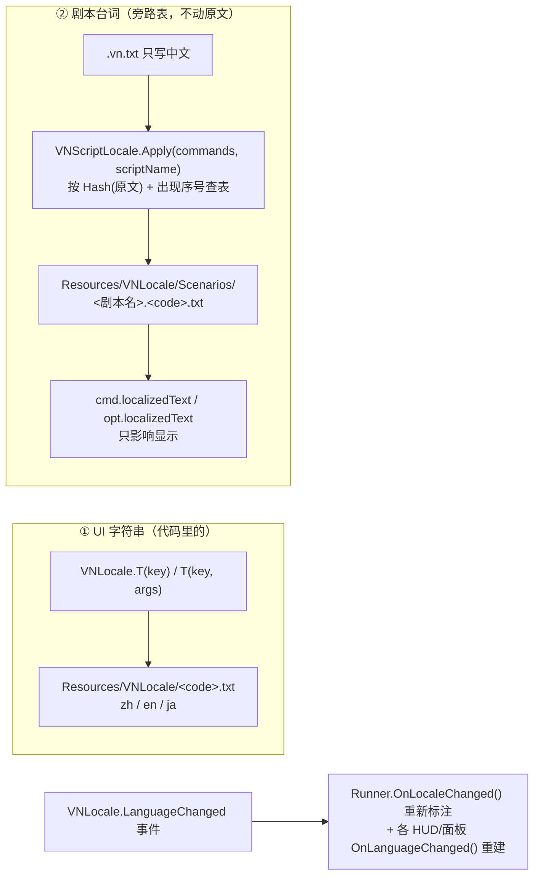

```csharp
public enum VNLanguage { Chinese, English, Japanese }
public static class VNLocale {
    const string PrefKey = "VN.Config.Language";
    static readonly string[] Codes = { "zh", "en", "ja" };
    public static event System.Action LanguageChanged;
    public static VNLanguage Language { get; set; }      // setter 写 PlayerPrefs + 触发事件
    public static string Code { get; }
    public static string T(string key);   public static string T(string key, params object[] args);
    public static Dictionary<string,string> ParseTable(string text);
}
public static class VNScriptLocale {
    public const string TableFolder = "VNLocale/Scenarios";
    public static void Apply(List<VNScriptCommand> commands, string scriptName);
    public static string TextOf(VNScriptCommand cmd);   public static string TextOf(VNChoiceOption opt);
    public static string NextKey(string sourceText, Dictionary<string,int> occurrences);
    public static string Hash(string text);
}
```

**译文是旁路的**，`cmd.text` 永远是原文。`TextOf()` 决定显示哪个。所以：

- `event` 结果行是**逻辑标识符**（结果匹配 / `去过_xx` flag），**不参与翻译**；
- `choice` 匹配按**索引**，翻译不影响分支。

`Hash(text)` + `NextKey(sourceText, occurrences)` 保证同一句台词出现多次也能各自对应。
抽取 / 校验走 `VNLocalizationTools.ExtractAll()`（[`Assets/Project/Scripts/VNEffects/Editor/VNLocalizationTools.cs:36`](Assets/Project/Scripts/VNEffects/Editor/VNLocalizationTools.cs#L36)） / `ValidateAll()`（增量，已译保留）。

### 14.2 字体 [`VNFont`](Assets/Project/Scripts/VNEffects/Script/VNFont.cs)

三级兜底 + Prewarm。**两套资产**：

- `VNFont.Asset` — 正文（全部 TMP 文字的统一入口，禁止 legacy Text）；
- `VNFont.DisplayAsset`（[`Assets/Project/Scripts/VNEffects/Script/VNFont.cs:215`](Assets/Project/Scripts/VNEffects/Script/VNFont.cs#L215)） — **装饰字体**（思源黑体 Black，名牌等少量大字专用，正文别用）。

单开一套的理由：**padding 必须与采样点等比例**——
描边厚度 ≈ `outlineWidth × (padding + 1) × (字号 / 采样点)`，padding 是描边粗细的天花板；
但 padding 占采样点过大（如 64pt 配 24）反而挤掉字形分辨率、把描边糊成淡影。
故装饰字体用 **120pt / padding 22（约 18%）**。

语言切换时正文与装饰字体**分开替换**；换 font 会丢材质实例，故有 `DisplayFontChanged` 事件通知重新上样式。
编辑期存场景的 TMP 文字必须用 `VNFontAssetBuilder.EnsureFontAsset()`（[`Assets/Project/Scripts/VNEffects/Editor/VNFontAssetBuilder.cs:80`](Assets/Project/Scripts/VNEffects/Editor/VNFontAssetBuilder.cs#L80)） 持久化资产。

### 14.3 音频 [`VNAudio`](Assets/Project/Scripts/VNEffects/Script/VNAudio.cs)

**三通道库 + 基准音量标定**：

```csharp
public List<AudioEntry> bgmLibrary, seLibrary, voiceLibrary;   // AudioEntry = id + clip + 基准音量
public List<AudioEntry> library;                               // 旧版单库（兼容）
public AudioClip typingTick;   public float typingTickInterval = 0.055f;
public string CurrentBgm { get; }   public float CurrentBgmVol { get; }   public bool IsVoicePlaying { get; }
public void PlayBgm(id, fade = 1.5f, vol = 1f, line = 0);   public void StopBgm(fade = 1.5f);
public void PlaySe(id, loop = false, vol = 1f, line = 0);    public void StopSe(id, fade = 0.8f);
public bool PlayVoice(id, vol = 1f, line = 0);              // 返回是否真的播了（决定口型跟随）
public void SetVolume(channel, volume, line = 0);
public void ResetForDebug();                                // 调试重建用
public static void TypeTick();
```

**音量公式 = 条目基准音量 × 剧本 `vol:` × 通道音量**。
BGM 是 A/B 双 source 交叉淡化（`_usingA`）；语音播放时 BGM 自动 duck（`SetBgmDucked` / `EffectiveBgmVolume`）。
`_currentBgmScriptVol` 单独记录**只有剧本 `vol:` 参数**——读档时基准音量从库里重新取，
这样调整了素材标定后旧存档也能受益。
循环 SE 用 `class LoopingSe` 单独管理（`StopSe(id)` 按 id 停）。

---

## 15. ★ 四类持久化存储的语义分工

这是全专案最容易搞错、也最值得单列的一张表。**「该不该跟着读档回退」是唯一的分类依据**：

| 存储 | 位置 | 内容 | 读旧档时 | 理由 |
|---|---|---|---|---|
| **① 存档槽** | `persistentDataPath/vn_save_{0..20}.json` + `.png` | 剧本指针、调用栈、全部 flag、舞台快照、SNS 会话、**AI 记忆** | **回退** | 这些是剧情状态 |
| **② 全局 JSON** | `vn_cg_unlocks.json`（[`VNCgUnlocks`](Assets/Project/Scripts/VNEffects/Script/VNCgUnlocks.cs)）<br/>`vn_ai_diary.json`（[`VNAiDiary`](Assets/Project/Scripts/VNEffects/Script/VNAiDiary.cs)）<br/>`vn_tutorial_seen.json`（[`VNTutorialSeen`](Assets/Project/Scripts/VNEffects/Script/VNTutorialSeen.cs)）<br/>`vn_photos/`（[`VNPhotoAlbum`](Assets/Project/Scripts/VNEffects/Script/VNPhotoAlbum.cs)） | CG 解锁、日记、教程看过记录、大头贴相册 | **不回退** | 玩家的**收藏品 / 已知信息**；开新周目也不该重看教程 |
| **③ PlayerPrefs** | 注册表 / plist | 音量、语言（`VN.Config.Language`）、文字速度、显示模式、`VN.Tutorial.Hints`、滚轮开回想 | 与存档无关 | 玩家偏好，跨存档 |
| **④ 开发期日志** | `<项目根>/AiTalkLogs/*.json`、`AiTalkStudio/Memories/*.json` | AI 对话日志、试聊台记忆预设 | 不进 Build、不进 git | 开发工具数据 |

**判定口诀**：

> 「读旧档她不该记得未来」→ 存档槽（[`VNAiMemory`](Assets/Project/Scripts/VNEffects/Script/VNAiMemory.cs)）；
> 「读旧档不该让玩家丢东西」→ 全局 JSON（`VNAiDiary` / `VNCgUnlocks` / `VNPhotoAlbum` / `VNTutorialSeen`）。

**同一个 AI 聊天会话，一次总结产出的两份数据分别落进 ① 和 ②**，这是理解本专案存储哲学的最佳例子。

**一个刻意的反例**：编辑器试聊台的 [`VNAiStudioMemory`](Assets/Project/Scripts/VNEffects/Editor/VNAiStudioMemory.cs) **完全独立于运行时 `VNAiMemory`**——
编辑器往运行时记忆里写等于造出「读旧档她却记得未来」的幽灵状态。
从游戏存档槽导入记忆时，它**自己读 JSON，绝不调 `VNSaveSystem.Load()`（[`Assets/Project/Scripts/VNEffects/Script/VNSaveSystem.cs:218`](Assets/Project/Scripts/VNEffects/Script/VNSaveSystem.cs#L218)）**——
那个会 `VNFlags.Clear()`（[`Assets/Project/Scripts/VNEffects/Script/VNFlags.cs:36`](Assets/Project/Scripts/VNEffects/Script/VNFlags.cs#L36)） 冲掉工程 flag。

---

## 16. 输入优先级栈与全局暂停

### 16.1 [`VNScriptRunner.Update()`](Assets/Project/Scripts/VNEffects/Script/VNScriptRunner.cs) 的优先级栈（顺序即优先级）

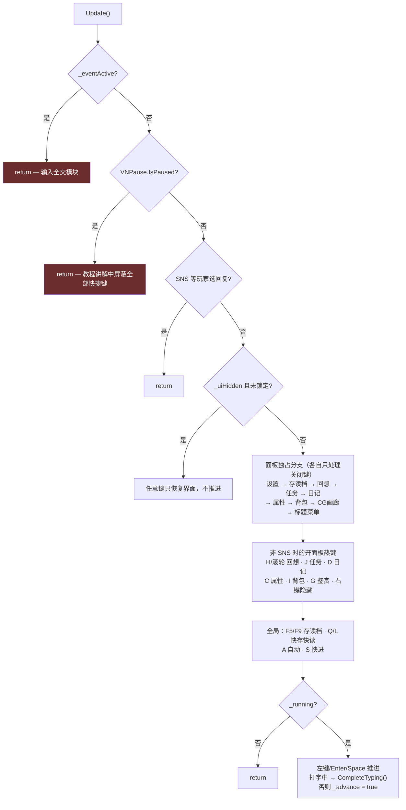

**左键推进的一个坑**：整个画面都是 uGUI（背景 / 立绘 / 对话框都是 Canvas 里的 Image），
`EventSystem.IsPointerOverGameObject()` 恒为 `true` 会把点击全部拦掉。
所以用 `IsPointerOverInteractiveUi(mouse)`——**射线命中链向上找 `Selectable`**，
只有点在真按钮 / 滑条 / 输入框上才不推进。`Enter` / `Space` 一定要留着，否则玩家可能被卡死。

点击喷水模式（`liquid click on`）期间左键归喷水，`Enter` / `Space` 仍推进。

**[`RequestAdvance()`](Assets/Project/Scripts/VNEffects/Script/VNScriptRunner.cs#L2101) 的存在理由**：[`Update()`](Assets/Project/Scripts/VNEffects/Script/VNFogScore.cs#L59) 第一行就是 `if (_eventActive) return;`，
于是模块内部用 [`RunInlineCo()`](Assets/Project/Scripts/VNEffects/Script/VNScriptRunner.cs#L291) 播的阻塞台词会死等 `_advance`，玩家点破屏幕也过不去。
模块在阻塞期间自己检测推进输入，转发到这个入口（语义一致：还在打字就先补完，打完了才真推进）。

### 16.2 [`VNPause`](Assets/Project/Scripts/VNEffects/Script/VNPause.cs) / `VNTime`

```csharp
public static class VNPause {
    public class Handle { ... }                    // 绑宿主对象，宿主销毁即失效
    public static event System.Action<bool> Changed;
    public static bool IsPaused { get; }
    public static string Reasons { get; }          // 诊断用
    public static Handle Acquire(Object owner, string reason);
    public static void Release(ref Handle handle);
    public static void ReleaseAll();               // ★ Runner 的兜底
}
public static class VNTime {
    public const float MaxStep = 0.05f;            // 单帧上限，防瞬移
    public static float Delta { get; }             // 暂停时为 0
    public static float Time { get; }
}
```

**为什么不能用 `Time.timeScale = 0`**：模块三铁律 ② 规定用 `unscaledDeltaTime`（躲 Skip 变速），
于是球照飞、倒计时照跑。真正能冻住它们的只有「模块自己早退 + dt 归零」。

**释放路径有五条**（正常结束 / ESC / `CancelForDebug` / 被 Destroy / 换场景），
**漏一条就是游戏永久卡死**——所以除了句柄绑宿主，Runner 还有 [`ReleaseAll()`](Assets/Project/Scripts/VNEffects/Script/VNPause.cs#L99) 兜底。

### 16.3 教程 [`VNTutorialPlayer`](Assets/Project/Scripts/VNEffects/Script/VNTutorialPlayer.cs) 的三个细节

1. **淡出之后才解除暂停**——推进那一下点击 / ESC 的 `wasPressedThisFrame` 必须已复位，
   否则同一帧被模块再吃一次（ESC 尤其要紧，羽毛球拿它当认输）。
2. **进教程强制显示系统光标、退出还原原值**（互动模块把它藏了，不抢回来玩家点不了「下一步」）。
3. **洞的位置每帧从目标的世界四角换算**（`VNTutorialAnchors.Register(id, rect)` 注册），
   **不抄 `anchoredPosition`**（ZoomRoot / TiltRoot 的运镜会让它对不上）；
   也**绝不能按物体名或路径找**——小游戏 UI 全是程序化生成的，
   改一次布局路径寻址就静默挖到空气上且没有任何报错。

```csharp
public static VNTutorialPlayer Instance { get; }
public static VNTutorialDef Find(string id);
public static IEnumerator PlayIdCo(string id, bool force = false);
public static void PlayAuto(string id, MonoBehaviour host);
public bool ShouldPlay(VNTutorialDef def, bool force);
public IEnumerator PlayCo(VNTutorialDef def, bool force = false);
public void CancelImmediate();
```

「看过了」记录走 [`VNTutorialSeen`](Assets/Project/Scripts/VNEffects/Script/VNTutorialSeen.cs)（**全局 JSON**）：`Has(id)` / `Mark(id)` / [`ResetAll()`](Assets/Project/Scripts/VNEffects/Script/VNTutorialSeen.cs#L83) / `Enabled`
（后者存 PlayerPrefs `VN.Tutorial.Hints`，设置面板可关可重置）。ESC 跳过也算看过。

---

## 17. 编辑器工具链

### 17.1 菜单全图（`Tools → VN Effects →`）

```
Tools/VN Effects/
├── 剧本编辑器 Scenario Editor              VNScenarioEditorWindow
├── 剧本检查 Lint Scenarios (Ctrl+Shift+L)  VNScenarioLinterWindow
├── 镜头编排 Camera Sequence Editor          VNCamseqEditorWindow
├── 素材浏览器 Asset Browser                 VNAssetBrowserWindow
├── 演示场景 Demo Scenes/
│   ├── 重建特效演示场景 Create Demo Scene
│   └── 重建剧本演示场景 Create Script Demo Scene    ← ★ 会 NewScene(EmptyScene)
├── 场景装机 Install To Scene/            （增量、可重复执行、不重建场景）
│   ├── 液体喷溅 Liquid Splash              VNLiquidInstaller
│   ├── 限时问答 Quiz Module                VNQuizInstaller
│   ├── 羽毛球对战 Badminton Module         VNBadmintonInstaller
│   ├── 拍大头照 Photo Booth Module         VNPhotoBoothInstaller
│   ├── 亲密互动 Interaction Module         VNInteractionInstaller
│   ├── 擦雾 Fog Wipe                       VNFogWipeInstaller
│   └── AI 自由聊天 AI Talk Module          VNAiTalkInstaller
├── 预览 Preview/
│   ├── 角色立绘预览 Character Visual Preview    VNCharacterVisualPreviewWindow
│   ├── 天气预览 Weather Preview                 VNWeatherPreviewWindow
│   ├── 部位区域编辑器 Touch Zone Editor         VNTouchZoneEditorWindow
│   └── 擦雾调参 Fog Wipe Tuning                 VNFogTuneWindow
├── UI 皮肤 UI Skins/
│   ├── 导出皮肤模板（默认+样例）             VNUiSkinExporter
│   ├── 导出无框渐变皮肤（白·粉·黑）          VNSoftSkinExporter
│   └── 系统主题：导出默认模板 / 排程·结算 / 设置面板 / 校验    VNSystemUiSkinExporter
├── AI/
│   ├── AI 试聊台 AI Talk Studio             VNAiStudioWindow
│   ├── 花费报表 Cost Report                  VNAiCostReport
│   ├── 测试连接（默认 / Gemini / DeepSeek）   VNAiConnectionTester
│   ├── 查看 Key 状态 / 试聊 3 轮
├── 游戏配置 Game Config/
│   └── 创建或选中配置资产 / 从场景导入 / 重扫素材目录   VNGameConfigTools
├── 本地化 Localization/ 抽取剧本译文 / 校验剧本译文      VNLocalizationTools
├── 字体 Fonts/ 生成 TMP 字体资产 / 重烘中文字体 / 修复材质引用   VNFontAssetBuilder
├── 教程 Tutorials/ 导出羽毛球示例教程                   VNTutorialSamples
└── 贴图 Textures/ 套用 Sprite 导入设置到选中项          VNTextureImportDefaults
```

另有右键菜单：`CONTEXT/VNAiPersonaDef/在 AI 试聊台里打开`、
`CONTEXT/VNCharacterDef/角色立绘预览`、`Assets/VN Effects/角色立绘预览`。

### 17.2 剧本可视化编辑器（三文件 + 两个辅助）

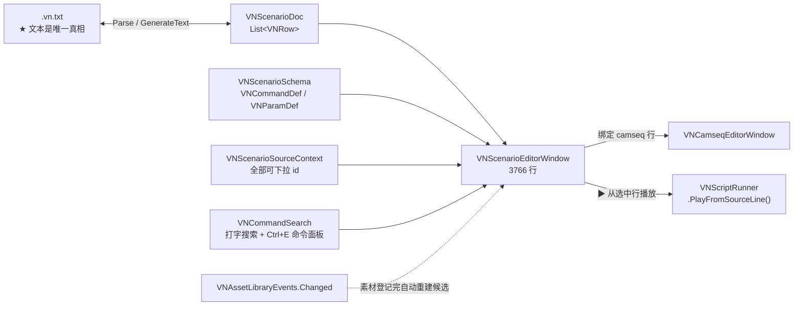

**[`VNScenarioDoc`](Assets/Project/Scripts/VNEffects/Editor/VNScenarioDoc.cs)（1002 行）**：

```csharp
public enum VNRowKind { Raw, Say, Command }
public class VNRow {
    public VNRowKind kind;   public string raw;   public bool isAsync;   public bool disabled;
    public string speaker, expression, text;                     // Say
    public string keyword;                                       // Command
    public readonly Dictionary<string,string> values;            // ★ 字段化的参数
    public readonly List<string> extraTokens;                    // 认不出的原样保留
    public List<VNChoiceOptionRow> options;   public List<string> camLines;
    public string Get(string id);   public void Set(string id, string v);   public VNRow Clone();
}
public static VNScenarioDoc Parse(string source);   // 注释 / 空行原样保留
public string GenerateText();                       // 保存 = 逐行重新生成
public List<string> CollectLabels() / CollectFlags();
public List<VNIssue> Validate(VNScenarioSourceContext ctx);   // 窗口内实时校验
```

`VNScenarioSourceContext` 汇集全部可下拉的 id：
`characterIds` / `expressions` / `backgroundIds` / `cgIds` / `bgmIds` / `seIds` / `voiceIds` /
`eventIds` / `questIds` / `weatherIds` / `interludeIds` / `tutorialIds` / `dialogueSkinIds` /
`choiceSkinIds` / `scenarioLabels` / `scenarioPaths` / `qualifiedLabelIds`。

**[`VNScenarioSchema`](Assets/Project/Scripts/VNEffects/Editor/VNScenarioSchema.cs)（698 行）** 声明每条命令长什么样：

```csharp
public enum VNParamSource { Text, Enum, Character, Expression, Background, Cg,
                            Bgm, Se, Voice, Event, Quest, Label, AssetId, ... }
public class VNParamDef {
    public string id, label;   public bool kwarg;   public VNParamSource source;
    public string[] options;   public string defaultValue;   public string dependsOn;
    public float weight;       public bool softRef;          // 候选只是提示，认不出不报错
    public string assetType, assetIdField;                   // AssetId 用
}
public class VNCommandDef {
    public string keyword, category, hint;   public VNParamDef[] parameters;
    public bool blockChoice, blockCamseq;
    public IEnumerable<VNParamDef> Positional();   public VNParamDef FindKwarg(string key);
}
public static VNCommandDef Find(string keyword);
public static VNCommandDef Find(string keyword, string variant);   // ★ event 按模块 id 变体
public static bool HasEventVariant(string moduleId);
public static readonly Dictionary<string, VNParamDef[]> EventVariants;
public static readonly HashSet<string> EventKwargUniverse;
// 选项单一来源：EaseNames / Slots / Sides / EmoteNames / MarkNames / FxNames / CamZoomModes / CamAnchors
```

**★ `event` 行按模块 id 长出参数格**——`vs:` / `target:` / `powerstat:` 这些是各模块自己定义的。
全塞一张表会让每个 event 行画出二十几个格子，一个不登记又全变成「unrecognized token」警告。
**`EventVariants` 表的唯一真相是各模块 `OnLaunch` 里的 `ctx.Kw(...)`**，加模块参数时同步补一行。
所以 `event` 行画成**两行**（第一行通用参数、第二行模块专属，「* 结果行」顺次下移）。

> **位置参数的存储键是 `module` 不是 `id`**——badminton / quiz / shop / plan / interact 自己就有
> `id:` 参数，同名会互相覆盖、保存时写出 `event 新手 id:新手`。
>
> 参数来源 `AssetId` 扫指定资产类型给下拉（id 字段名各资产不统一，表里**显式写死字段名**不用反射猜；
> 候选**必须缓存**，`OptionsFor` 每帧都被调）；`softRef` = 候选只是提示、认不出不报错
> （用在 badminton 的 `vs:`，对手全由 `id:` 的资产决定）。

**窗口的关键能力**：

| 能力 | 实现 |
|---|---|
| 素材候选按覆盖语义取数 | `PickLibrary(fromConfig, fromScene)` — [`VNGameConfig`](Assets/Project/Scripts/VNEffects/Script/VNGameConfig.cs) 填了就用它的，留空才回退场景组件。**以前只读场景组件，导致在配置资产里新登记的素材在下拉里根本搜不到** |
| 素材登记后自动刷新 | `VNAssetLibraryEvents.RaiseChanged()`（[`Assets/Project/Scripts/VNEffects/Editor/VNAssetLibraryEvents.cs:26`](Assets/Project/Scripts/VNEffects/Editor/VNAssetLibraryEvents.cs#L26)）（**只在 `ApplyModifiedProperties()` 返回 true 时发**——OnGUI 每帧都 Apply，无条件广播 = 每帧重建全部候选；订阅方 `OnDisable` 必须退订，否则静态事件会攥着已销毁窗口的引用） |
| 热重载调试 | Play Mode 中播放按钮不禁用，用内存文本原地重跑，不退出 Play Mode / 不触发域重载；播放前静默自动保存；10Hz 轮询 `runner.CurrentLine` 高亮当前行；工具栏播放控制条（暂停 / 单步 / 重播本行 / 上一条） |
| 跨域重载存活 | `ISerializationCallbackReceiver`；**加新窗口状态必须同时改 `OnBeforeSerialize` 和 `OnEnable`** |
| 隐注释 / 空行 | `RowHeight` 返回 0，索引不变，所有编辑操作零影响；**只隐空行与 `#`**（孤儿 `*` / `>` 行也是 Raw，藏了就找不回来） |
| 打字搜索 | [`VNCommandSearch`](Assets/Project/Scripts/VNEffects/Editor/VNCommandSearch.cs)：行首命令按钮**右键** = 打字换命令（左键仍是分类菜单）；`Ctrl+E` 向导式命令面板（选命令 → 逐个问位置参数 → 可选参数菜单循环 → Enter 插入 / Shift+Enter 插上方 / Tab 跳过 / Esc 取消）；**匹配只做子串包含**（中英皆可，不做模糊 / 拼音） |
| 快捷键 | `Enter` / `Shift+Enter` 插台词行、`F5` 播选中行、`F6` 重播、`F8` 暂停、`F10` 单步、`Ctrl+S` 保存、`Ctrl+Enter` / `Ctrl+Shift+Enter`（走 ShortcutManager，可在 Edit → Shortcuts 改） |
| 分类配色 | `ColorCategoryIds` + `CategoryColorPrefPrefix`，存 EditorPrefs |
| 中文翻译表 | `CommandTranslations` / `CategoryTranslations` / `TransitionTranslations` / `EntranceTranslations` / `ExitTranslations` / `SideTranslations` / `EmoteTranslations` / `MarkTranslations` |

### 17.3 镜头编排 [`VNCamseqEditorWindow`](Assets/Project/Scripts/VNEffects/Editor/VNCamseqEditorWindow.cs)（3289 行）

- **双向绑定**一行 `camseq`：改窗口 → 回写 `VNRow.camLines`（[`Assets/Project/Scripts/VNEffects/Editor/VNScenarioDoc.cs:49`](Assets/Project/Scripts/VNEffects/Editor/VNScenarioDoc.cs#L49)）；改剧本行 → 窗口跟随（可开「跟随选中」）。
- 画布两种模式共用一套绘制：`整图`（全景 + 取景框，可拖点）/ `镜头视角`（拖进度条 = 运镜动画，只读）——
  差别只是 `ViewPoint` 那一层坐标变换。
- 底图**三级回退**：手动指定 → 绑定行推算出的背景 / CG → 场景当前那张。
- 按推算站位画**真实立绘**（可开关），数据源是行左侧「舞台一览」同一套 `TryGetRowStage`。
- `场景预览` 把绑定行的背景 / 立绘摆进场景让 Game 视图也对（带 URP 后处理）；
  临时立绘一律 `HideFlags.DontSave`（绝不写进场景文件、域重载自动销毁），关掉全部还原。
- 辅助线逐项勾选（`enum Guides`，存 EditorPrefs `VNCamseq.Guides`）：三分线 / 中心十字 / 安全区 / 对话框遮挡区。
  **整图模式画在选中路径点的取景框内**（对话框不随镜头缩放，遮挡区只能按占一屏的比例落位）；
  镜头视角模式铺满画布。遮挡区尺寸**实测 `VNStage.dialogue`（[`Assets/Project/Scripts/VNEffects/Script/VNStage.cs:59`](Assets/Project/Scripts/VNEffects/Script/VNStage.cs#L59)）**，量不到才退回默认布局。
- 时间轴：顶部刻度条（`RulerHeight = 14`，点 / 拖 = 移播放头）+ 段块区（`TrackHeight = 30`，
  点 = 选中路径点，拖右边界 = 改时长）；`MinSegWidth = 14`（0 秒瞬切段也要点得中）、
  `EdgeGrab = 5`、`SnapStep = 0.1`（按 Ctrl 自由）。
- **撤销是窗口内独立栈**（`UndoDepth = 64`，快照 = [`GenerateText()`](Assets/Project/Scripts/VNEffects/Editor/VNScenarioDoc.cs#L347) 文本，
  `UndoIdleSeconds = 0.35` 让拖滑条合并成一次），`Ctrl+Z/Y` 走 ShortcutManager 窗口作用域，
  **不挂 Unity 全局 Undo**；换绑定行清空历史。
- 辅助文件：[`VNCamWaypoint`](Assets/Project/Scripts/VNEffects/Editor/VNCamWaypoint.cs)（严格 `TryParse` / `Format`，与运行时 `ParseCamWaypoint` 同构；
  震屏下拉 `VNCamShakeUi` 也在这儿，两个窗口共用）、`VNCamseqText`（`TrySplit` / `Join`）、
  `VNCamseqTemplates`（11 条内置模板，`{char}` 占位按当前角色替换；用户预设存
  `Assets/VNEffects/CamseqPresets.asset`）。

> **路径点行禁用 `CharacterPopup` / `SpritePopup`**——那套是异步回调、会把值写进 `VNRow.values`（[`Assets/Project/Scripts/VNEffects/Editor/VNScenarioDoc.cs:44`](Assets/Project/Scripts/VNEffects/Editor/VNScenarioDoc.cs#L44)），
> 和 `camLines` 是两条路径；必须用同步的 `PopupString` / `EditorGUI.Popup`。

### 17.4 静态校验器 [`VNScenarioLinter`](Assets/Project/Scripts/VNEffects/Editor/VNScenarioLinter.cs)（1657 行）

**复用 `VNScriptParser.Parse`（[`Assets/Project/Scripts/VNEffects/Script/VNScriptParser.cs:112`](Assets/Project/Scripts/VNEffects/Script/VNScriptParser.cs#L112)）**（注释明言：两套分词必然漂移，历史上正因此 94 处跳转静默失效）。

```csharp
public enum VNLintSeverity { Error, Warning, Info }
public class VNLintIssue { severity; code; file; assetPath; line; message; hint; public string Short; }
public static List<VNLintIssue> LintAll();
class ScriptFile { ... }    // 每文件的 labels / 写过的 flags / 用过的各类 id
class Registry { ... }      // 全工程已登记的资产 id 索引
```

检查族（每个是一个 `Check*` 方法）：

| 方法 | 查什么 | 典型严重度 |
|---|---|---|
| `CheckLabels` | 重名 label | Error |
| `CheckParams` | `params` 声明与 `call` 实参 | Error |
| `CheckAssets` | 角色 / 表情 / 背景 / CG / 音频 / 天气 / 皮肤 / 教程 / 过场 id 未登记 | **故意只报 Warning**（防狼来了效应） |
| `CheckChoices` | 空 choice、全条件互斥、cost 无解 | Warning |
| `CheckEvents` | 结果名不在 `BuiltinOutcomes` 表、`wipefog-cg-before-event`、`interact` 缺 `* 拒绝`、`aitalk` 缺 `* 失败` | Warning |
| `CheckSns` | 子命令拼写（`SnsSubcommands`）、`reply` 缺候选 | Warning |
| `CheckJumpTargets` | 悬空跳转（跨文件，`Resolve`） | Error |
| `CheckCallContracts` | 参数契约 | Error |
| `CheckSubroutineReturns` | 子程序回不去（`ReachesEnd` / `Follow` 做可达性分析） | Error |
| `CheckLoopGuards` | 死循环风险（`FlagNames(condition)` 提取条件里的 flag） | Warning |
| `CheckUnreferencedLabels` | label 未被引用 | Info |
| `CheckEmptyLibraries` | 素材库整个空 | Warning |

辅助：`CheckEnum<T>` / `CheckSide` / `CheckId` / `CheckLiquidRange` / `CheckCharacter` / `CheckExpression`；
拼写纠错走 `Suggest(wrong, candidates)` + `Distance(a, b)`（编辑距离）；
`Dynamic(s)` 判断含 `${}` 的动态值一律放行。
入口 `VNScenarioLinterWindow.Open()`（[`Assets/Project/Scripts/VNEffects/Editor/VNScenarioLinterWindow.cs:16`](Assets/Project/Scripts/VNEffects/Editor/VNScenarioLinterWindow.cs#L16)）（`Ctrl+Shift+L`）。

### 17.5 素材浏览器 [`VNAssetBrowserWindow`](Assets/Project/Scripts/VNEffects/Editor/VNAssetBrowserWindow.cs) + 配套

**设计出发点**：本专案文件名是 AI 生成的原始 prompt 或纯数字（`1.png`、
`masterpiece, very aesthetic… s-1095962266.png`），**看名字根本认不出图**。
所以**以缩略图为主、id 为标签**。

| 文件 | 关键点 |
|---|---|
| `VNAssetBrowserWindow`（962 行） | 左栏九类带条数（`Cats` 表）；图片走大缩略图网格、音频走波形列表，**都做了虚拟化**（只画可见行）；底部详情栏改 id / 换素材 / 试听 / 定位 / 移除；右键「用文件名填 id」；「只看未登记」的扫描目录**从已登记条目反推**不写死（`Assets/CG` 与 `Assets/Art/Images/CG` 并存过） |
| [`VNAssetUi`](Assets/Project/Scripts/VNEffects/Editor/VNAssetUi.cs)（538 行） | **Sprite 缩略图不用 `AssetPreview`**（异步，几十张一起等会闪空白）——Sprite 自己知道在哪张 texture 的哪个 UV，`DrawTextureWithTexCoords` 同步画即可（texture 不必可读）。音频没这捷径只能异步 + 占位，但**不能无限等**（自给 3 秒窗口；`IsLoadingAssetPreview(int)` / `GetInstanceID()` 在 Unity 6.5 是 **error 级弃用**不能用）。试听走 `UnityEditor.AudioUtil` 反射（`PlayPreviewClip` / 老版 `PlayClip` 逐个探测，探不到就灰掉按钮） |
| [`VNConfigEntryDrawers`](Assets/Project/Scripts/VNEffects/Editor/VNConfigEntryDrawers.cs)（339 行） | 背景 · CG · 音频 · UI 皮肤四个条目的**紧凑单行 drawer**；**drawer 挂在类型上**，所以 [`VNStage`](Assets/Project/Scripts/VNEffects/Script/VNStage.cs) / [`VNAudio`](Assets/Project/Scripts/VNEffects/Script/VNAudio.cs) 组件的同名列表也一并变紧凑 |
| [`VNAssetTheme`](Assets/Project/Scripts/VNEffects/Editor/VNAssetTheme.cs)（405 行） | 配色主题（默认 / 樱花粉白，顶栏 🌸 切换，进 EditorPrefs）。**Unity 编辑器整体只有 Light/Dark 改不了**（USS 打包在编辑器资源里不开放覆盖，第三方替换 skin 的做法升级即坏），但自己 IMGUI 画的窗口每一像素归自己管。圆角靠**程序化生成白色圆角贴图 + `GUI.color` 染色**（static 贴图域重载会丢，故 lazy 重建 + `HideFlags.DontSave`）。**换浅色底后必须显式覆盖每个 `GUIStyle` 的文字色**——Dark 主题下 EditorStyles 文字是浅色的，直接用就是白底白字；且要覆盖 normal/hover/active/focused 及 `on*` 共八个状态。主题是**叠加不是替换**：`Enabled == false` 时所有绘制原样退回 Unity 原生 |
| [`VNTextureImportDefaults`](Assets/Project/Scripts/VNEffects/Editor/VNTextureImportDefaults.cs)（188 行） | 素材目录里**首次导入**的图自动设 `Sprite (2D and UI)` + `Single`（`OnPreprocessTexture` 在导入前跑）。**白名单目录**（`Roots`）——绝不能全项目一刀切（`Art/Models/**` 下 60+ 张法线 / 粗糙度贴图按 sRGB 的 Sprite 导入会让光照全错且极难联想到导入设置）。只在 `importSettingsMissing` 时设，所以手调过的 Pivot / MaxSize / Multiple 切图永不被打回。**坑**：`importSettingsMissing` ≠「没有 .meta」——meta 存在却缺完整设置块时也为 true；而想用「.meta 不存在」卡死新文件**也不行**，Unity 调 preprocessor 前就已写盘 |

### 17.6 AI 试聊台 [`VNAiStudioWindow`](Assets/Project/Scripts/VNEffects/Editor/VNAiStudioWindow.cs)（1089 行）

**不进 Play Mode 调人格与提示词**。三栏 = 左改参数 / 中聊天流 / 右 **system prompt 实时预览**
（不发请求不花钱，改一个字立刻重拼——调 `boundaries`、`speechStyle` 的主力）。
中栏可点选项、可自由输入任意回复（绕开三选一）、可重跑本轮看方差、可从任意轮重新分岔
（靠 `VNAiConversation.TruncateToTurn(turnIndex)`）。

| 配套 | 职责 |
|---|---|
| [`VNAiStudioDraft`](Assets/Project/Scripts/VNEffects/Editor/VNAiStudioDraft.cs)（250 行） | **临时 SO 副本**当草稿层：`SerializedObject` 迭代画 = 零 UI 代码就有全部字段、加新字段自动跟上；写回逐属性 copy 而**不用 `CopySerialized`**（那会把 `m_Name` 一起抄成 `xxx(Clone)`） |
| [`VNAiStudioSession`](Assets/Project/Scripts/VNEffects/Editor/VNAiStudioSession.cs)（349 行） | 会话驱动，域重载后靠轮次记录 `BuildRequest` + `RecordReply` 重建历史 |
| [`VNAiStudioMemory`](Assets/Project/Scripts/VNEffects/Editor/VNAiStudioMemory.cs)（370 行） | 可命名记忆预设（`<项目根>/AiTalkStudio/Memories/*.json`，不进 git）；两个独立开关：`注入记忆`（勾掉再跑一遍 = 直接对比有无记忆的差别）与 `结束时做总结`（结果先预览再决定收不收）。导入三源：试聊后总结 / 从 `AiTalkLogs` 日志（**要发一次总结请求**，日志里没有 summary/topics/facts）/ 从游戏存档槽（**自己读 JSON**） |
| [`VNAiStudioLog`](Assets/Project/Scripts/VNEffects/Editor/VNAiStudioLog.cs)（94 行） | 导出到 `AiTalkLogs/Editor/`，**与游戏内同格式**所以两边能互相对比 |
| [`VNAiEditorCoroutine`](Assets/Project/Scripts/VNEffects/Editor/VNAiEditorCoroutine.cs)（106 行） | 编辑器协程泵，与自检菜单共用 |
| [`VNAiCostReport`](Assets/Project/Scripts/VNEffects/Editor/VNAiCostReport.cs)（414 行） | 花费累计报表：扫 `AiTalkLogs/`（含 `Editor/`）全部 json，按月 / 日 / 人格 / 模型 / 来源聚合，可导 CSV。**默认按当前单价重算**（日志存了 token 数、模型名与缓存命中数，能修正历史上按写死单价算出的错误金额；高峰倍率按日志里那场对话当时的时间判） |
| [`VNAiConnectionTester`](Assets/Project/Scripts/VNEffects/Editor/VNAiConnectionTester.cs)（245 行） | 测试连接（默认 / Gemini / DeepSeek）、查看 Key 状态、试聊 3 轮 |

### 17.7 场景生成器与装机器

**两种截然不同的策略**：

| | 生成器 [`VNEffectsDemoSetup`](Assets/Project/Scripts/VNEffects/Editor/VNEffectsDemoSetup.cs)（1490 行） | 装机器 `VN*Installer` |
|---|---|---|
| 做法 | `NewScene(EmptyScene)` **从零重造** | **增量**补组件到当前场景 |
| 幂等 | 每次结果一致（因为从零） | **可重复执行** |
| 代价 | 场景里的手工绑定全丢 → 所以有 `VNGameConfig` | 无 |
| 用途 | 加了新演出组件后重建演示场景 | 给老场景补一个玩法模块 |

装机器的典型内容（以 `VNLiquidInstaller.Install()`（[`Assets/Project/Scripts/VNEffects/Editor/VNLiquidInstaller.cs:25`](Assets/Project/Scripts/VNEffects/Editor/VNLiquidInstaller.cs#L25)） 为例）：Canvas 下补 [`VNWetScreen`](Assets/Project/Scripts/VNEffects/VNWetScreen.cs)
+ 场外补 [`VNLiquidSplash`](Assets/Project/Scripts/VNEffects/VNLiquidSplash.cs) + 两层互连并回填 `VNStage`。
**老场景不跑它的话 `liquid` 命令会静默无效果**。
[`VNQuizInstaller`](Assets/Project/Scripts/VNEffects/Editor/VNQuizInstaller.cs) 补禁用的 `QuizTemplate`（**必须带 RectTransform**）+ 登记题库；
[`VNPhotoBoothInstaller`](Assets/Project/Scripts/VNEffects/Editor/VNPhotoBoothInstaller.cs)（481 行）缺资产会自动铺一套默认的。

### 17.8 其余工具

| 工具 | 职责 |
|---|---|
| [`VNGameConfigTools`](Assets/Project/Scripts/VNEffects/Editor/VNGameConfigTools.cs) | [`CreateOrSelect()`](Assets/Project/Scripts/VNEffects/Editor/VNGameConfigTools.cs#L32) 建 / 选配置资产；[`ImportFromScene()`](Assets/Project/Scripts/VNEffects/Editor/VNGameConfigTools.cs#L74) 场景绑定回填资产；[`RescanAssetFolders()`](Assets/Project/Scripts/VNEffects/Editor/VNGameConfigTools.cs#L178) 扫目录自动登记定义资产 / 章节（`ScanChapters`）/ CG（`ScanCg` + `EnsureSpriteImport`）；[`HookPlayModeCacheClear()`](Assets/Project/Scripts/VNEffects/Editor/VNGameConfigTools.cs#L305) 进出 Play Mode 清缓存 |
| [`VNLocalizationTools`](Assets/Project/Scripts/VNEffects/Editor/VNLocalizationTools.cs) | [`ExtractAll()`](Assets/Project/Scripts/VNEffects/Editor/VNLocalizationTools.cs#L36) 增量抽取翻译表（已译保留）；`ValidateAll()` 查缺译 |
| [`VNFontAssetBuilder`](Assets/Project/Scripts/VNEffects/Editor/VNFontAssetBuilder.cs) | [`CreateMenu()`](Assets/Project/Scripts/VNEffects/Editor/VNFontAssetBuilder.cs#L33) 预烘焙 TMP 动态字体资产；[`RebakeChineseFont()`](Assets/Project/Scripts/VNEffects/Editor/VNFontAssetBuilder.cs#L53)；[`RepairFontMaterialReferences()`](Assets/Project/Scripts/VNEffects/Editor/VNFontAssetBuilder.cs#L103)；[`EnsureFontAsset()`](Assets/Project/Scripts/VNEffects/Editor/VNFontAssetBuilder.cs#L80) |
| [`VNUiSkinExporter`](Assets/Project/Scripts/VNEffects/Editor/VNUiSkinExporter.cs) | 烘焙对话框 / 选项默认皮肤 prefab 并自动登记（默认 + 顶部 + 右列样例） |
| [`VNSoftSkinExporter`](Assets/Project/Scripts/VNEffects/Editor/VNSoftSkinExporter.cs) | 一键出三套**无框渐变**皮肤（白 / 粉 / 黑：整屏底部渐变带 + 居中台词，`shineFrame` 留空即无边框） |
| [`VNSystemUiSkinExporter`](Assets/Project/Scripts/VNEffects/Editor/VNSystemUiSkinExporter.cs)（661 行） | `ExportAll()` / [`ExportEventPanels()`](Assets/Project/Scripts/VNEffects/Editor/VNSystemUiSkinExporter.cs#L68) / [`ExportConfigPanel()`](Assets/Project/Scripts/VNEffects/Editor/VNSystemUiSkinExporter.cs#L96) / `ValidateAll()` |
| [`VNCharacterVisualPreviewWindow`](Assets/Project/Scripts/VNEffects/Editor/VNCharacterVisualPreviewWindow.cs)（1176 行） | 角色资产可视化调参（尺寸 / 站位 / 旋转 / 眨眼 / 口型 / 头像框取实时预览） |
| [`VNWeatherPreviewWindow`](Assets/Project/Scripts/VNEffects/Editor/VNWeatherPreviewWindow.cs) | [`VNWeatherDef`](Assets/Project/Scripts/VNEffects/VNWeatherDef.cs) 调参实时预览 |
| [`VNTouchZoneEditorWindow`](Assets/Project/Scripts/VNEffects/Editor/VNTouchZoneEditorWindow.cs)（569 行） | 在立绘上拖框画部位（拖框体 = 移动、拖右下角 = 改尺寸）；点选用运行时同一个 `Contains`；继承框画灰线、本层实线、禁忌部位红色；**撤销是窗口内独立栈**；改完必须 [`InvalidateCache()`](Assets/Project/Scripts/VNEffects/Script/VNTouchZoneDef.cs#L116) |
| [`VNFogTuneWindow`](Assets/Project/Scripts/VNEffects/Editor/VNFogTuneWindow.cs)（331 行） | 上半按「每秒擦除面积 ≈ 笔刷直径 × 鼠标速度」**算出**预计通关秒数并给手感评语，下半是可拖鼠标试擦的掩码预览。**这个窗口是刚性需求不是加分项**——难度唯一来源是笔刷面积 vs 回雾速度，手感全压在参数上 |
| [`VNGameConfigEditor`](Assets/Project/Scripts/VNEffects/Editor/VNGameConfigEditor.cs)（619 行） | 九页分页 Inspector + 智能列表（见 11.2） |
| [`VNTutorialSamples`](Assets/Project/Scripts/VNEffects/Editor/VNTutorialSamples.cs) | 导出羽毛球示例教程资产 |
| [`VNTextPromptWindow`](Assets/Project/Scripts/VNEffects/Editor/VNTextPromptWindow.cs) | 通用文本输入弹窗 |

---

## 18. 横切不变量与技术债

### 18.1 全专案硬约定（新代码必须遵守）

1. **所有 DOTween Tween `SetLink(gameObject)`**；循环效果 `Start/Stop` 成对 API。
2. **事件模块与菜单类 UI 用 unscaled 时间 + `SetUpdate(true)`**；dt 一律走 `VNTime.Delta`（[`Assets/Project/Scripts/VNEffects/Script/VNPause.cs:144`](Assets/Project/Scripts/VNEffects/Script/VNPause.cs#L144)）；
   [`Update()`](Assets/Project/Scripts/VNEffects/Script/VNFogScore.cs#L59) 首行 `if (VNPause.IsPaused) return;`（**必须在 `ReadInput` 之前**）。
3. **输入只用新 Input System**（`Keyboard.current` / `Mouse.current`），禁用旧版 `Input.` API。
4. **玩家可见字符串一律 `VNLocale.T(key)`**；TMP 字体一律 [`VNFont.Asset`](Assets/Project/Scripts/VNEffects/Script/VNFont.cs)；禁止 legacy Text。
5. **调色走 `SetGrade(通道, ...)`**，缩放走 `DOScaleMultiplier` / `DOCamScaleMultiplier` 双通道。
6. **每张图独立材质实例**（[`VNImageEffectController`](Assets/Project/Scripts/VNEffects/VNImageEffectController.cs) 管理）；改 `sharedMaterial` = 污染全局。
7. **贴图全程序化生成**（[`VNProceduralTextures`](Assets/Project/Scripts/VNEffects/VNProceduralTextures.cs) 1011 行 + [`VNFoliageTextures`](Assets/Project/Scripts/VNEffects/VNFoliageTextures.cs) + [`VNPhotoTextures`](Assets/Project/Scripts/VNEffects/Script/VNPhotoTextures.cs)
   + [`VNFogTextures`](Assets/Project/Scripts/VNEffects/Script/VNFogTextures.cs)），零美术依赖。
8. **「旧场景自愈」**：引用为空自动 Find / 自动建（[`VNStage.AutoWire`](Assets/Project/Scripts/VNEffects/Script/VNStage.cs)、Runner 的 `Ensure*` 族）——
   加新字段不必重建场景。
9. **防卡死兜底遍布交互路径**：choice 全隐藏 → 全显示；全付不起 → 全解禁；map 无可用地点 → 直接返回；
   sns reply 同理。
10. **静默重放（`silent` 参数）**贯穿 `ApplyFlagCommand` / `VNStatsHud.Apply`（[`Assets/Project/Scripts/VNEffects/Script/VNStatsHud.cs:108`](Assets/Project/Scripts/VNEffects/Script/VNStatsHud.cs#L108)） / `VNQuestLog.Apply`（[`Assets/Project/Scripts/VNEffects/Script/VNQuestLog.cs:72`](Assets/Project/Scripts/VNEffects/Script/VNQuestLog.cs#L72)） /
    `ApplyTimeCommand`——同一实现服务运行时与调试重建，避免两份逻辑漂移。
11. **运行时创建带 `Awake` 配置的组件**：先 `SetActive(false)` 挂好赋值再激活。
12. **粒子 `velocityOverLifetime` 三轴曲线模式必须一致**。
13. **纯逻辑层与 MonoBehaviour 分离**：[`VNBadmintonBallistics`](Assets/Project/Scripts/VNEffects/Script/VNBadmintonBallistics.cs) / [`VNFogMask`](Assets/Project/Scripts/VNEffects/Script/VNFogMask.cs) / [`VNFogScore`](Assets/Project/Scripts/VNEffects/Script/VNFogScore.cs) /
    [`VNTouchScore`](Assets/Project/Scripts/VNEffects/Script/VNTouchScore.cs) / [`VNPhotoScore`](Assets/Project/Scripts/VNEffects/Script/VNPhotoScore.cs) / [`VNAiConversation`](Assets/Project/Scripts/VNEffects/Script/VNAiConversation.cs) / [`VNExpression`](Assets/Project/Scripts/VNEffects/Script/VNExpression.cs) / [`VNEquipment`](Assets/Project/Scripts/VNEffects/Script/VNEquipment.cs) /
    `VNTouchZoneDef.Contains`（[`Assets/Project/Scripts/VNEffects/Script/VNTouchZoneDef.cs:172`](Assets/Project/Scripts/VNEffects/Script/VNTouchZoneDef.cs#L172)） / `VNCamera.CharacterScaleFor`（[`Assets/Project/Scripts/VNEffects/VNCamera.cs:49`](Assets/Project/Scripts/VNEffects/VNCamera.cs#L49)） 全都可单测，
    且**编辑器工具与运行时共用同一份**。
14. **模块自绘 UI 默认 `raycastTarget = false`**（EventLayer 60 在 ChoicePanel 45 之上）。
15. **`VNTouchCursor.Dispose()`（[`Assets/Project/Scripts/VNEffects/Script/VNTouchCursor.cs:217`](Assets/Project/Scripts/VNEffects/Script/VNTouchCursor.cs#L217)） 必须在四处调**（`Finish` / `CancelForDebug` / `OnDestroy` / `OnDisable`）。

### 18.2 已知技术债与风险点

（分析过程中在源码里实际核对过的，非推测）

| # | 位置 | 问题 |
|---|---|---|
| 1 | `VNScriptRunner.ApplyFlagCommand`（[`Assets/Project/Scripts/VNEffects/Script/VNScriptRunner.cs:842`](Assets/Project/Scripts/VNEffects/Script/VNScriptRunner.cs#L842)） | `flag 名 rand:1-100` 在调试重建时会**重新掷骰**（注释已自认），重建出的分支状态可能与实际游玩不同；`event` 结果同样不重放 |
| 2 | `VNStage.ShowInstant()`（[`Assets/Project/Scripts/VNEffects/Script/VNStage.cs:997`](Assets/Project/Scripts/VNEffects/Script/VNStage.cs#L997)） line 1020 | 重建 y 坐标用写死的 `-60f + def.positionOffset.y`，与 [`SlotPosition()`](Assets/Project/Scripts/VNEffects/Script/VNStage.cs#L282) 的 `-60f` 魔数耦合；`VNScriptRunner.DebugSlotX()`（[`Assets/Project/Scripts/VNEffects/Script/VNScriptRunner.cs:825`](Assets/Project/Scripts/VNEffects/Script/VNScriptRunner.cs#L825)） 也复制了同一组站位常数——**同一组数字散在三处** |
| 3 | [`VNQteModule.cs`](Assets/Project/Scripts/VNEffects/Script/VNQteModule.cs) line 3 | 多余的 `using Unity.AppUI.UI;`（未使用） |
| 4 | `VNSaveSystem.Load()`（[`Assets/Project/Scripts/VNEffects/Script/VNSaveSystem.cs:218`](Assets/Project/Scripts/VNEffects/Script/VNSaveSystem.cs#L218)） | 直接在静态方法里改 [`VNFlags`](Assets/Project/Scripts/VNEffects/Script/VNFlags.cs)（读档失败时 flag 可能已被清）。目前由调用方 `LoadFrom()` 的顺序保证安全，但 `Load` 兼有副作用值得留意；[`VNAiStudioMemory`](Assets/Project/Scripts/VNEffects/Editor/VNAiStudioMemory.cs) 正因此绕开它自己读 JSON |
| 5 | `VNEquipment.Equip/Unequip/Use` | 每次调用都 `Object.FindFirstObjectByType<VNStatsHud>()` 做场景查找，背包高频操作时略浪费（有缓存空间） |
| 6 | `CLAUDE.md` 目录树 | 与实际路径不一致（见文首对照表） |
| 7 | flag 命名空间 | 没有编译期保护，改前缀要全局搜索；Lint 的 `CheckLoopGuards` / `FlagNames` 只能部分缓解 |
| 8 | [`VNScriptRunner.RebuildStateBefore()`](Assets/Project/Scripts/VNEffects/Script/VNScriptRunner.cs) | 318 行的巨型 switch，每加一条有持续状态的命令都要改它——这是「三处同步」里最容易漏的一处 |
| 9 | `VNScenarioSchema.EventVariants`（[`Assets/Project/Scripts/VNEffects/Editor/VNScenarioSchema.cs:149`](Assets/Project/Scripts/VNEffects/Editor/VNScenarioSchema.cs#L149)） | 手工维护、与各模块 `OnLaunch` 的 `ctx.Kw(...)` 无编译期关联，加参数忘了补表就退回基础定义（不报错，静默降级） |

### 18.3 路线图（`CLAUDE.md` 记录）

下一步 **P3：台词内嵌演出标记 `{shake}{w:0.5}` + `VNDirector` 名场面命令**。

---

## 附录 A：剧本 DSL 命令速查（48 条）

| 分类 | 命令 |
|---|---|
| 台词 | `<角色> [表情]: 文本` / `: 旁白` / 行尾 `@` = 异步 |
| 画面 | `bg` `cg` `transition` `interlude` `letterbox` `bgscroll` `reset` |
| 角色 | `show` `hide` `move` `emote` `mark` `overlay` `imprint` `portrait` |
| 氛围 | `weather` `mood` `fx` `liquid` `sakura` `shake` |
| 镜头 | `camera` `camseq`（+`> 路径点`） `camcut` `camto` |
| 音频 | `bgm` `se` `voice` `volume` |
| 控制流 | `label` `jump` `call` `return` `params` `chapter` `if` `choice`（+`* 选项`） |
| 状态 | `flag` `stat` `time` `quest` |
| 玩法 | `event`（+`* 结果`） `tutorial` |
| 界面 | `ui` `hideHUD` `sns` |
| 杂项 | `wait` |

## 附录 B：全局快捷键

| 键 | 功能 | 键 | 功能 |
|---|---|---|---|
| 左键 / Enter / Space | 推进（打字中 = 催促） | `F5` / `F9` | 存档 / 读档面板（20 槽） |
| 右键 | 隐藏界面（再点还原） | `Q` / `L` | 快存 / 快读（槽 0） |
| `H` / 滚轮上滑 | 回想 Backlog | `A` / `S` | 自动 / 快进 |
| `J` | 任务日志 | `C` | 属性面板 |
| `I` | 背包 | `G` | CG 鉴赏（CG｜照片两页） |
| `D` | AI 日记本 | `Esc` | 关闭当前面板 |

---

*本文档由 2026-09-02 的源码通读生成。代码变动后请以源码为准，并按 `vn-doc-update` 技能同步。*
