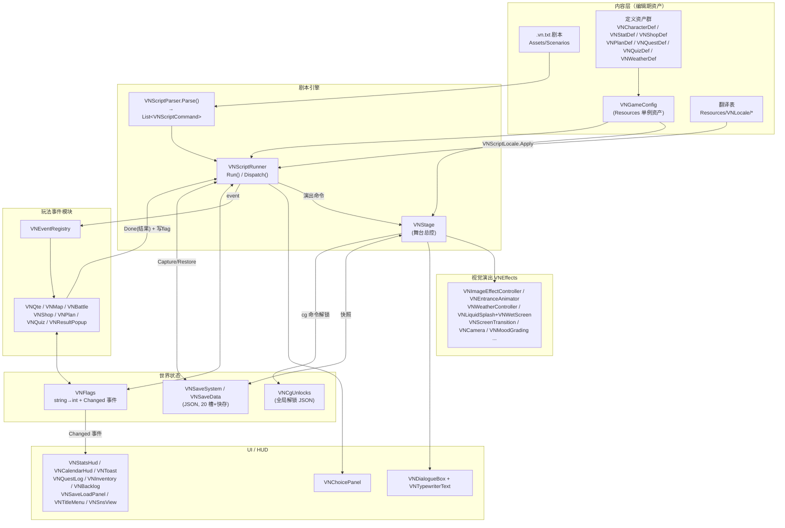
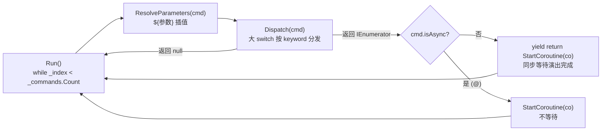
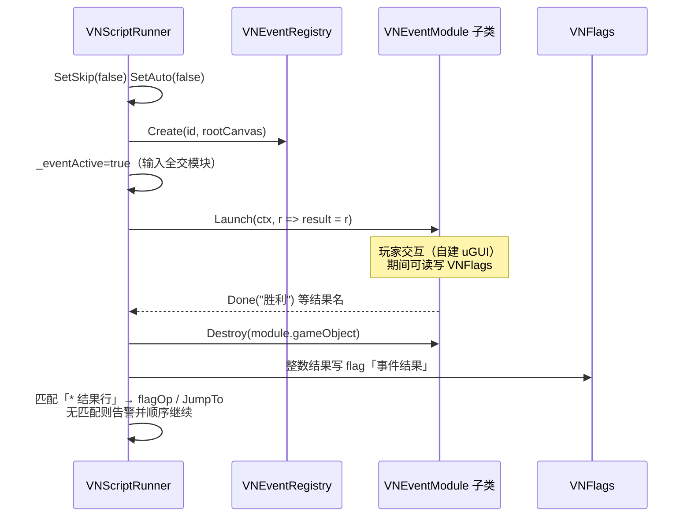
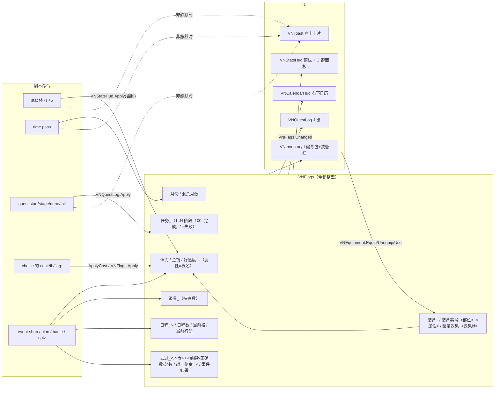
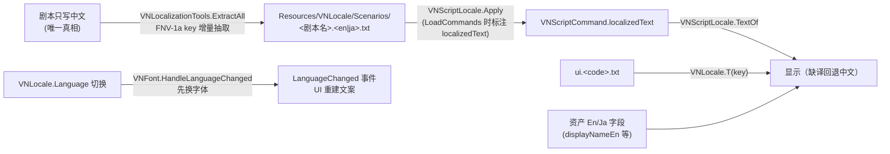

# CodebaseAnaylze.md — 全专案玩法与资料流分析

> 本文档基于**实际源码通读**（`Assets/Project/Scripts/VNEffects/` 下 133 个 C# 文件，约 2.4 万行）独立分析而成，
> 与 `ProjectCodeGuide.md`（逐脚本使用指南）定位不同：本文重在**玩法系统全景 + 系统间资料流**，
> 深入到类与方法级。所有类名/方法名均与当前代码一致（2026-08 快照，分支 `agent/font-fallback-warmup`）。
>
> ⚠ 与 `CLAUDE.md` 的目录描述不一致处（以实际为准）：
> - 代码实际在 `Assets/Project/Scripts/VNEffects/`（CLAUDE.md 写的是 `Assets/Scripts/VNEffects/`）
> - 场景实际在 `Assets/Project/Scenes/`；Shader 实际在 `Assets/Art/Shaders/`
> - `VNQteModule.cs` 有一个多余的 `using Unity.AppUI.UI;`（未使用）

---

## 目录

1. [游戏是什么：主玩法循环](#1-游戏是什么主玩法循环)
2. [全局资料流总图](#2-全局资料流总图)
3. [剧本引擎核心（Parser → Runner → Stage）](#3-剧本引擎核心)
4. [世界状态层：VNFlags / VNExpression](#4-世界状态层)
5. [存档系统与三条状态恢复通道](#5-存档系统)
6. [玩法事件模块系统（event 命令）](#6-玩法事件模块系统)
7. [养成 / 经济 / 装备 / 任务 / 日程](#7-养成经济装备任务日程)
8. [SNS 手机聊天与 CG 鉴赏](#8-sns-手机聊天与-cg-鉴赏)
9. [内容资产层：VNGameConfig 与各定义资产](#9-内容资产层)
10. [视觉演出与特效系统](#10-视觉演出与特效系统)
11. [UI 与皮肤系统](#11-ui-与皮肤系统)
12. [本地化与字体](#12-本地化与字体)
13. [音频系统](#13-音频系统)
14. [编辑器工具链](#14-编辑器工具链)
15. [横切约定与技术债观察](#15-横切约定与技术债观察)

---

## 1. 游戏是什么：主玩法循环

本项目是一个 **Unity 6 (6000.0.62f1) + URP 17 的 2D 视觉小说（Galgame）引擎 + 游戏本体**，
特点是「重视觉演出 + 自研纯文本剧本 DSL + 养成玩法混合」。玩家体验的主循环：

```
读剧本台词（打字机逐字）→ 点击推进 → 遇到 choice 做选择（可带条件/花费）
   → 遇到 event 进入玩法小游戏（战斗/QTE/地图/商店/排程/问答）
   → 玩法结果写回 flag → 剧本按 flag 分支（if / jump / call）
   → 养成属性成长（stat/time/quest/装备）反过来影响后续选项与战斗
   → 随时 F5/F9/Q/L 存读档、H 回想、A/S 自动快进、G 画廊、I 背包、J 任务、C 属性
```

剧本内容在 `Assets/Scenarios/*.vn.txt`（共 20 个文件），既有演示脚本
（`BattleDemo` / `QuizDemo` / `SnsDemo` / `LiquidDemo` / `WeatherDemo` / `EntranceDemo` 等），
也有正式游戏结构：`主循环.vn.txt`、`第1章`~`第3章`、`好感事件_星野结衣`、`节日活动集`、`结局集`、
`公共片段`（供 `call 公共片段::xx` 复用的子程序库）——即一个「章节推进 + 周日程排程 + 好感/属性养成 + 多结局」的养成型 Galgame。

**设计基石（理解全部资料流的钥匙）**：

1. **文本是唯一真相** —— `.vn.txt` 是剧本的唯一存储形式；可视化编辑器、Lint、翻译表全部围绕它。
2. **一切玩法状态都是 `VNFlags` 里的 `string → int`** —— 属性、金钱、道具、装备、任务、日程、
   去过的地点、答题成绩……全部是命名约定的 flag。因此**存档 / if 分支 / 调试重建**对任何新玩法零改动。
3. **内容登记在 `VNGameConfig` 资产而非场景** —— 场景可被生成器随时清空重建，资产不丢。
4. **演出与逻辑分离** —— 事件模块「三铁律」禁止玩法模块直接改舞台演出。

---

## 2. 全局资料流总图



关键闭环：**剧本 → 事件模块 → flag → 剧本分支/HUD**。flag 是所有系统间唯一的「货币」。

---

## 3. 剧本引擎核心

### 3.1 VNScriptParser（`Script/VNScriptParser.cs`，静态类）

把剧本全文一次性解析为命令列表，**运行时与编辑器工具（Lint / 可视化编辑器）共用同一实现**，
保证「校验器看到的命令流 = Runner 执行的命令流」。

| 成员 | 说明 |
|---|---|
| `Parse(string source) → List<VNScriptCommand>` | 主入口。逐行：`#` 注释跳过；`*` 开头 → `ParseChoiceOption()` 挂到上一个 choice/event/sns reply；`>` 开头 → `ParseCamWaypoint()` 挂到上一个 camseq；行尾 `@` 置 `isAsync`；首 token 在 `Keywords` 集合 → `ParseCommand()`，否则 → `ParseSay()` |
| `Keywords`（HashSet） | 全部命令关键字单一来源：bg/cg/show/hide/emote/mark/wait/camera/shake/weather/mood/fx/liquid/sakura/transition/reset/label/jump/call/return/params/flag/stat/time/if/choice/chapter/move/bgm/se/voice/volume/camseq/camcut/camto/portrait/event/quest/letterbox/ui/hideHUD/sns |
| `ParseCommand()` | token 按 `key:value` 分入 `kwargs`，其余入 `args`。三个特判：`文件::标签` 限定地址不当 kwarg；`camto/camcut` 首参（`角色:部位`）不当 kwarg；`sns time/system` 后的自由文本不当 kwarg |
| `ParseSay()` | 台词行 `说话者 [表情]: 内容`（支持全角/半角冒号）；无冒号或冒号开头 = 无名牌旁白 |
| `ParseChoiceOption()` | `* 文本 [if:条件] [cost:金钱-100] [flag:好感+1] [-> 标签]`，从行尾逐个摘参数 token |
| `ParseEnum<T>()` | 枚举容错解析（失败告警回默认值），全项目复用 |

**数据结构**：`VNScriptCommand`（keyword/args/kwargs/isAsync/line + say 专用 speaker/expression/text +
`localizedText` 译文标注 + `options`/`camPoints` 附属块），`VNChoiceOption`，`VNCamWaypointDef`。
取参助手：`Arg(i)` / `ArgF(i)` / `Kw(key)` / `KwF(key)`。

### 3.2 VNScriptRunner（`Script/VNScriptRunner.cs`，2351 行，MonoBehaviour）

剧本解释器 + 全局输入路由 + 存读档协调者。

**生命周期**：`Start()` 里 `ApplyGameConfig()`（资产覆盖入口剧本/章节表）→ 按需自建
`VNBacklog / VNQuestLog / VNStatsHud / VNInventory / VNCgGallery / VNCalendarHud`（`FindFirstObjectByType` 找不到就 `new GameObject().AddComponent`，**旧场景自愈**模式）→
`EnsureSaveLoadPanel() / EnsureQuickToolbar() / EnsureConfigPanel()` → 若有 `VNTitleMenu.showOnStart` 则标题接管启动，否则 `Play(script)`。

**主循环**（协程）：



- `Run()`：逐条取命令 → `ResolveParameters()` → `Dispatch()`；异常 catch 后继续（一行坏不崩全局）。
  播毕检查 call 栈未清报错。
- `Dispatch(cmd)`：**全部命令的调度中枢**。演出类命令基本是一行
  `return WaitTween(stage.Xxx(...))` 委托给 VNStage；流程类命令就地处理。
- 台词：`SayCo()` → 按 `stage.IsSnsOpen` 分流 `NormalSayCo()`（对话框+打字机+`_backlog.Record()`，
  等 `_advance`；`_waitingAtSay=true` 期间才允许存档）或 `SnsSayCo()`（聊天气泡）。
  Auto 等待公式：`autoDelay + 字数 × 0.045s`；Skip 时 `CompleteTyping()` + 0.07s 即过。
- 选项：`ChoiceCo()` —— `if:` 不满足隐藏（全隐藏时防卡死全显示）、`cost:` 走
  `VNStatsHud.FormatCostLabel()/CanAfford()`（付不起置灰，全付不起防卡死全解禁）→
  `stage.choicePanel.Show()` → 选中后 `ApplyCost()` / `VNFlags.Apply(flagOp)` / `JumpTo(jumpLabel)`。
- 等待原语：`WaitCo(sec)`（Skip 加速）、`WaitTween(Tween)`。

**分支与子程序**：

| 方法 | 语义 |
|---|---|
| `Prepare()` / `LoadCommands()` | 解析 + `VNFont.Prewarm(全文)` + `VNScriptLocale.Apply()` + `BuildLabelMap()` |
| `JumpTo(address, line)` | `VNStoryAddress.TryParse` 拆 `文件::label`；跨文件时**先在临时结构解析并确认 label 存在**才切换（失败不破坏当前状态） |
| `CallTo(cmd)` / `TryBindCallParameters()` / `ReturnFromCall()` | 子程序：`VNCallFrame`（返回文件/命令表/索引/参数字典）压 `_callStack`（上限 `MaxCallDepth=64`）；目标 label 后第一条 `params` 声明形参（`名字` 或 `名字=默认值`），实参从 call 的 kwargs 绑定 |
| `ResolveParameters()` / `VNParameterInterpolator.Interpolate()` | 执行前把命令中所有 `${参数名}` 换成当前 call 帧实参（单层不递归；label/params 本身不插值） |
| `SwitchChapter()` / `FindChapter()` | `chapter <文件>` 尾调用式切换（清 call 栈）；章节须在 `chapters` 列表（VNGameConfig 覆盖）登记 |
| `ApplyFlagCommand()` | `flag 名 / 名 3 / 名 +1 / 名 rand:1-100`（`TryParseRandRange` 支持负数区间） |
| `ApplyTimeCommand()` | `time set 月 [remain:N]` / `time pass [months:N] [refill:off\|属性]` —— 写 `月份`/`剩余月数` flag、行动力按 `VNStatDef.maxValue` 回满 |
| `EventCo()` | 见第 6 节 |
| `SnsCo()` / `SnsReplyCo()` | 见第 8 节 |
| `CameraCo()` / `CamseqCo()` / `PrecutFor()` | 运镜；`PrecutFor` 处理 `bg transition:` 与紧随 `camseq start:cut` 的同帧衔接（转场盖屏瞬间先瞬切首镜头） |

**输入路由**（`Update()`，全新版 Input System）：优先级依次为
事件模块进行中（全部输入交模块）→ SNS 等待回复 → UI 隐藏态恢复 → 设置面板 → 存读档面板 →
回想 → 任务日志 → 属性面板 → 背包 → CG 画廊（含全屏差分翻页）→ 标题菜单 → 各面板快捷键
（H/滚轮=回想、J=任务、C=属性、I=背包、G=画廊、右键=隐 UI、F5/F9/Q/L 存读、A/S 自动快进）→
推进判定：`IsPointerOverInteractiveUi()` 用 `EventSystem.RaycastAll` 向上找 `Selectable`
（不能用 `IsPointerOverGameObject`，全屏皆 uGUI 会拦掉一切）；`liquid click on` 时左键归喷水。

**模式**：`SetAuto()` / `SetSkip()` 互斥；Skip 用 `DOTween.timeScale = skipTimeScale(4)` 全局加速，
`VNToast.SetMode("SKIP ▶▶"/"AUTO ▶")` 显示角标；`OnDestroy()` 恢复 timeScale。

### 3.3 VNStage（`Script/VNStage.cs`，1520 行，MonoBehaviour）

「剧本命令 → 演出组件 API」的落地层，也是**舞台状态的权威持有者**（存档快照从这里取）。

**初始化**：`Awake()` → `ApplyGameConfig()`（角色/背景/CG 库资产覆盖）+ `AutoWire()`
（20 余个演出组件引用为空时 `FindFirstObjectByType` 自动补线；`VNAudio`/`VNSnsView` 找不到则自建；
`kenBurns` 自动补挂并把默认开启状态种入 `_fxStates`）。

**角色管理**：

- `ActiveCharacter`（内部类）：一个在场角色的完整句柄 = `VNCharacterDef def` + GameObject +
  `Image` + `VNImageEffectController fx` + `VNEntranceAnimator animator` + `VNCharacterEmotes emotes` +
  `VNCharacterBlink / VNCharacterBlinkOverlay`（按 `def.blinkMode` 二选一生效）+
  `VNCharacterMouth mouth` + `VNCharacterMarks marks` + 当前表情 + `casualEntrance` 标记。
  存于 `_active` 字典，`Get(id)` 查询。
- `CreateCharacter(def)`：运行时从零生成上述完整组件栈（含 `VNGlowBackdrop`、`VNFootShadow`），
  并向 `speakerHighlight.Register()` 注册、`RefreshRegistries()` 同步色调匹配表。
- `Show(id, at, expr, presetName, from, duration, line)`：站位 `SlotPosition()`（left=-380/center=0/right=+380，支持裸数字）+
  `def.positionOffset` 标定；**同步三处基准位**（`animator.SetBasePosition` / `emotes.SetBasePosition` / `fx.SetFloatBaseY`，
  否则出场动画会把角色拽回旧位）；`SideFor()` 按站位推断进场方向；
  `VNEntranceAnimator.PlayEntrance(preset, side, scale)`，`IsCasual(preset)` 决定待机不开周期扫光。
- `Hide()`：`PlayExit()` 完成后 `Destroy`；`Move()`：悬浮暂停 → 基准位同步 → `DOAnchorPos` → 恢复悬浮。
- `ApplyExpression()`：换表情图 + 按宽高比以 `HeightFor()`（`characterHeight × def.sizeScale`）重算尺寸 +
  眨眼/口型组件通知；可见时 `SpawnExpressionGhost()` 做旧表情残像交叉溶解（`expressionCrossfade=0.25s`）。
- `Emote(id, name)`：分发到 `VNCharacterEmotes.Surprise/Angry/Shy/Dejected/Recover/Nod/HeadShake`。
- `Mark(id, name, mode, pos, size, hold)`：漫符，`VNCharacterMarks.TryParse`（英文正名+中文别名）→
  `Show(keep)/FadeOut/ClearAll`。

**背景 / CG**：

- `SetBackground(id, transitionName, line, onCovered)`：查 `backgrounds` 库 →
  `SwapStageImage()`；CG 显示中只记账（`CurrentBackgroundId`），画面等 `cg off` 恢复。
- `SwapStageImage()`：优先 `VNScreenTransition.SupportsDirectBackground()` 走
  `PlayBackground()`（新旧图在同一张 quad 上用 `VNDirectBackgroundTransition.shader` 直接过渡），
  否则 `transition.Play(type, onCovered)` 盖屏换图；换图后 `VNToneMatch.MatchTo(sprite)` 立绘调色。
- `ShowCg(id, transition, keepChars, keepFx, line, instant)`：`VNCgUnlocks.Unlock(id)` 全局解锁 →
  `FadeCharLayer()`（CanvasGroup 淡出立绘层，GO 保持活跃状态无损）→
  `PauseCgAmbientFx()`（暂停 `CgAmbientFxNames`={godrays,clouds,haze,shimmer,meteor,skycloud} 与天气，记入
  `_cgPausedFx`/`_cgSavedWeatherId` 供恢复）；`HideCg()` 逆操作并恢复底层背景。

**fx 开关分发**：`Fx(name, arg, line)` —— `ToggleFxNames`（godrays/dof/clouds/haze/shimmer/heartbeat/dutch/speedlines/letterbox/meteor/skycloud/filmgrain/crt/kenburns）记入 `_fxStates`（存档依据）；
一次性演出（`shockwave`、`speedlines burst`）不记状态；`filmgrain`/`crt` 互斥且手动接管 mood 自动滤镜；
`focus` 分发到 `VNVignetteFocus.FocusOn/ClearFocus`。

**情绪联动**：`SetMood(m)` → `VNMoodGrading.SetMood`（双 Volume 权重交叉）+
`autoMemoryLetterbox`（Memory 自动上 `VNLetterbox`）+ `autoMoodRetroFilter`
（Memory→胶片 / Dream→CRT，`_letterboxAuto`/`_retroAuto` 记录「自动开的」，离开时才自动撤）。

**天气**：`SetWeather(id, density, wind, windSet, speed, size)` —— 覆盖参数由 VNStage 统一持有
（`_weatherDensity` 等字段；存档、CG 暂停恢复、调试重建三处共用）→ `ApplyWeather()` →
`VNWeatherController.SetWeatherId()`。

**液体**：`Liquid(action, VNLiquidArgs, line)` 分发：`splash→VNLiquidSplash.Burst`、
`spray→StartSpray/StopSpray`、`click→SetClickMode`、`wet→VNWetScreen.SetWet`、`dry→Dry`、`cover→SetCover`；
`ResetLiquid()` 清场。存档时 `CaptureLiquid()` **直接读组件属性**（与天气不同，液体无暂停语义，组件即权威）。

**台词分发**：`Say(speaker, expr, text, followVoice)` —— 注册角色则切表情 + `speakerHighlight.SetSpeaker()` +
`dialogue.SetPortrait(def.GetPortrait(...))` + `dialogue.Say(def.LocalizedDisplayName, text)` +
`mouth.BeginSpeaking()`；未注册者名字原样显示（旁白）。`StopSpeaking()` 全员闭嘴。

**镜头点解析**：`ResolveCamPoint(token, line)` —— 九宫格锚点（topleft…bottomright/origin）、
裸坐标 `x,y`、`角色[:部位]`（head=+0.36 高、chest/waist/feet/up/mid/down 比例偏移）→ 画布坐标。

**快照**：`CaptureSnapshot(data)` / `RestoreSnapshot(data, instant)` / `ClearStage()` / `ShowInstant()` 见第 5 节。

---

## 4. 世界状态层

### VNFlags（`Script/VNFlags.cs`，静态类）

全项目唯一的世界状态：`Dictionary<string,int>`。

- `Get / Set / Add / Clear / All`；任何变化触发 `event Action Changed`
  （`VNStatsHud`、`VNCalendarHud` 等 UI 订阅；约定「标脏 + 下帧刷新」因为读档会连发）。
- `Apply(op)`：`"名字"`=置 1、`"名字+2"/"名字-1"`=增减（choice 的 `flag:`、事件模块都走它）。
- `Evaluate(cond, line)`：委托 `VNExpression.TryEvaluate`。

### VNExpression（`Script/VNExpression.cs`）

手写递归下降解析器，支持 `! + - * / %`、六种比较、`&& ||`、括号、整数与标识符（读 flag），
0/非 0 即假/真；`checked` 溢出保护、除零报错。三个入口：
`TryEvaluate()`（运行时求值）、`TryValidate()`（Lint 用只查语法）、
`TryCollectIdentifiers()`（Lint 收集条件里用到的 flag 名做「读了但从未写过」检查）。

### 辅助

- `VNStoryAddress.TryParse()` / `NormalizeFile()`：`文件::标签` 地址解析与文件名归一化（去 `.vn.txt`、小写）。
- `VNParameterInterpolator.Interpolate()`：`${参数}` 文本插值（call 参数系统）。

---

## 5. 存档系统

### VNSaveData / VNSaveSystem（`Script/VNSaveSystem.cs`）

- `VNSaveData`：`saveVersion=3`、`commandIndex`（恢复点=正在显示那句台词的命令索引）、`chapter`、
  `lastLine`、call 栈（`CallFrameSave` 列表 + 当前参数）、全部 flag（names/values 平行数组）、
  舞台状态（backgroundId / weather+四个覆盖参数 / mood / bgm+vol / portraitOff / fxOn 列表 /
  cgId+keepChars+keepFx / dialogueSkin+choiceSkin / `LiquidSave` / `CharSave` 列表(id/x/expr/marks/casualEntrance) /
  SNS 会话与 `snsMessages` 全量消息）。**每个新增字段都带旧存档缺省兼容注释**（如 NaN 拆成
  `xxxSet`+值两字段，因为 JsonUtility 写不了 NaN）。
- `VNSaveSystem`：`SlotCount=20` + 快存专用槽 0；`Save(slot, data, thumbnail)`（JSON + PNG 缩略图到
  `persistentDataPath`）、`Load(slot)`（**顺手恢复 VNFlags**）、`Peek(slot)`（只读元数据不动 flag，
  20 槽面板预览用）、`LoadThumbnail(slot)`、`HasSave(slot)`。

### 三条状态恢复通道（vn-save-compat 技能对应的「三处同步」）

```mermaid
flowchart TB
    subgraph 写入
        A["VNScriptRunner.SaveTo(slot, thumb, quick)<br/>仅 _waitingAtSay 时允许"] --> B["CaptureCallStack()"]
        A --> C["VNStage.CaptureSnapshot(data)"]
        C --> C2["VNSnsView.CaptureSnapshot()"]
        B --> D["VNSaveSystem.Save()"]
        C --> D
    end
    subgraph 读档
        E["LoadFrom(slot)"] --> F["SwitchChapter(data.chapter)"]
        F --> G["RestoreCallStack()"]
        G --> H["VNStage.RestoreSnapshot(data)<br/>ClearStage→皮肤→背景→天气→mood→fx→BGM→液体→ShowInstant×N→CG→SNS"]
        H --> I["ResumeAt(data.commandIndex)"]
    end
    subgraph 调试重建["编辑器「从选中行播放」"]
        J["PlayFromSourceLine(source, line, rebuild:true)"] --> K["RebuildStateBefore(index)<br/>把前面所有命令静默重放成一个内存快照"]
        K --> H2["stage.RestoreSnapshot(snapshot, instant:true)"]
    end
```



`RebuildStateBefore()`（Runner 内，约 280 行）是**第三条通道**：不真的执行前置命令，而是把
bg/cg/liquid/weather/mood/letterbox/reset/portrait/ui/show/hide/move/mark/say(表情)/bgm/se/volume/fx/
flag/quest/stat/time/camcut/camto/sns 逐条**静默重放**进一个 `VNSaveData` 快照
（`RebuildShowState` / `RebuildMoveState` / `RebuildMarkState` / `ReplaySnsCommand` / `ReplaySnsSay` 等辅助），
choice/jump/call/if/event/sns reply 无法推断玩家选择 → 记 `hasBranching` 告警「按文件顺序处理」。
存档截图管线：`RequestSavePanel()` → `CaptureSaveThumbnailCo()` →
`VNCameraFade.CaptureThumbnailCo(320,180)`（token 防竞态）→ `VNSaveLoadPanel.OpenSave(thumbnail)`。

---

## 6. 玩法事件模块系统

### 契约（`Script/VNEventModule.cs` / `VNEventRegistry.cs`）

- `VNEventContext`：`eventId / stage(只读约定) / kwargs / outcomes(剧本结果行名单) / line`；
  `AcceptsOutcome(name)` 判断剧本是否接住该结果；`Kw/KwF/KwI` 取参。
- `VNEventModule`（抽象基类）：`Launch(ctx, onDone)` → 子类 `OnLaunch(ctx)` 搭 UI 交互 →
  `Done(outcome)`（幂等，只回调一次）；`RecordInBacklog`（虚属性，流程型模块返回 false）；
  `CancelForDebug()`（剧本中断清理钩子）。
  **三铁律**：不碰舞台演出 / unscaled 计时 + `SetUpdate(true)` / 所有 Tween `SetLink(gameObject)`。
- `VNEventRegistry`：`modules` 列表（id → 禁用模板/预制体），`Create(id, canvas, line)` 实例化到
  `EnsureLayer()` 建的 EventLayer（`LayerSortingOrder=60`，在选项面板 45 与转场 100 之间）。

### Runner 侧生命周期（`VNScriptRunner.EventCo()`）



事件期间 `stage.dialogue.HideBox()`、快捷键全禁；存档天然被「仅台词处可存」挡住。

### 七个内置模块与 flag 契约

| 模块（类） | 剧本用法 / 结果名 | 读写的 flag（数据流核心） |
|---|---|---|
| `VNQteModule` | `event qte time: target: title:` → `success`/`fail` | 无（纯结果分支） |
| `VNMapModule` | `event map title: [bg:]` → 结果名=地点名；`Location`（归一化坐标+`condition` 显隐表达式）配置在模板/`VNGameConfig.mapLocations` | 写 `去过_<地点>`+1（`markVisited`），已去过显 ✓ |
| `VNBattleModule` | `event battle enemy: ehp: eatk: php: patk: pdef: escape:` → `胜利`/`失败`/`逃跑`；回合流程 `StartPlayerTurn→OnAttack/OnHeavy/OnGuard/OnEscape→DealToEnemy→EnemyTurn`，`Variance()` ±30% 浮动，暴击 10%×1.7，重击 65% 命中×1.8，防御减 60% | **读**：`phpstat:/patkstat:/pdefstat:` 指定的属性 flag（`StatOrKw()` 三级：flag > 剧本直填 > 组件默认，养成联动桥）；**写**：`战斗剩余HP`（车轮战/伤势分支） |
| `VNShopModule` | `event shop id:` → `离开`；买/卖双页签 | 金钱走 `VNStatsHud.Apply`（`VNShopDef.currencyStat`，默认 `金钱`）；持有数 `道具_<id>`；卖出触发 `VNEquipment.HandleItemLost()` |
| `VNPlanModule` | ① 排程面板 `event plan slots:7 pool:... id:` → `confirm`：写 `日程_1..N`=行动编号、`日程数`、`当前格`=0；② 派发 `event plan op:next`（无 UI 秒回，`RecordInBacklog=false`）→ `next`/`end`：`当前格`+1、该格编号抄进 `当前行动` | `SlotFlagPrefix="日程_"` / `CountFlag="日程数"` / `CursorFlag="当前格"` / `ActionFlag="当前行动"`；剧本侧用 `if 当前行动==N jump ...` 循环逐日执行 |
| `VNQuizModule` | `event quiz id: count: pick: time: pass: flag:` → `全对`/`及格`/`失败`；每题限时（最后 3 秒 `UrgentSeconds` 红色脉动），超时按答错；单题奖惩 `VNShopDef.StatOp` 走 StatsHud | 写 `<flagPrefix>正确数` / `<flagPrefix>总数`（`CorrectFlagSuffix`/`TotalFlagSuffix`），剧本可 if 细分 |
| `VNResultPopupModule` | `event result grade:fail\|normal\|good\|great`：判定冲条 0→100 悬念（`suspenseDuration`）→ `StyleOf(grade)` 四档大字 + 星光爆发；皮肤走 `VNResultPopupSkin` | 无（纯演出弹窗） |

所有模块 UI **全程序化生成**（`VNProceduralTextures.RoundedRectSprite/RadialGlowSprite` + `VNFont.Asset`），零素材依赖；皮肤化的（plan/result）优先 `VNSystemUiSkinUtility.Instantiate` 实例化主题 prefab，失败退程序化。

---

## 7. 养成、经济、装备、任务、日程

这一层没有独立的「存档格式」——**一切都是 flag 命名约定**，下图是完整的资料流：



### VNStatDef / VNStatsHud（属性）

- `VNStatDef`（ScriptableObject）：`id`（=flag 名）、`displayName(+En/Ja)`、`icon/color`、
  `useClamp/minValue/maxValue`、`initialValue`、`style`（`VNStatStyle` Number/Bar/Grade）、`unit`、
  `gradeSteps`（阈值→等级字母）、`showInHud`；方法 `Clamp()` / `GradeOf()` / `Format()` / `Normalized()`。
- `VNStatsHud`：`stats` 列表（VNGameConfig 覆盖）；
  - `Apply(name, valueToken, silent, line)`：`stat` 命令入口——支持 `+N/-N/绝对值`（也兼容 `stat 体力+5` 连写），
    `def.Clamp` 钳制 → `VNFlags.Set` → 非静默时 `VNToast.Show`（图标+主题色+涨跌色条）；
    HUD 就地演出（数字滚动/条补间/图标弹跳/`+N` 上飘）由内部 `RefreshHud` 响应 `VNFlags.Changed` 完成。
  - 花费四件套：`ParseCostOp()`（静态解析 `金钱-100`）、`CanAfford()`（按 `minValue` 下限判断）、
    `FormatCostLabel()`（选项右侧小字）、`ApplyCost()` —— 被 `ChoiceCo` 与商店复用。
  - `EnsureInitials()`：把 `initialValue` 种进尚不存在的 flag；`Toggle/Open/Close` C 键完整面板；
    `SetHudVisible()` 供隐 UI。
- `VNCalendarHud`：常量 `MonthFlag="月份"` / `RemainFlag="剩余月数"`；月份 flag 不存在自动隐藏。

### VNQuestDef / VNQuestLog（任务）

- `VNQuestDef`：id/title/description/stages（三语字段 + `Title`/`LocalizedDescription`/`StageText()` 回退）。
- `VNQuestLog`：`FlagPrefix="任务_"`，`StageDone=100`、`StageFailed=-1`；
  `Apply(op, id, stage, silent, line)` 处理 `start`（可指定起始阶段）/`stage`/`done`/`fail`，
  写 flag + Toast；`StageOf()` 静态查询；J 键面板 `Toggle/Open/Close/RebuildList`。

### VNShopDef / VNInventory / VNEquipment（道具与装备）

- `VNShopDef`：`shopId/shopName(三语)/currencyStat/items`；`Item`：
  id/displayName/description(三语)/icon/price/sellPrice/maxOwned/condition(显示条件表达式)/
  `equipSlot`（`VNEquipSlot` 1~7 部位）/`statBonuses`（`StatOp` 列表，穿戴属性加成）/
  `passiveEffects`（`PassiveEffect` 特殊效果 id+量+label）/`useOps`（使用效果）/`consumeOnUse`；
  `Owned => VNFlags.Get("道具_"+id)`。**商店资产兼任全游戏道具目录**。
- `VNInventory`：I 键背包（左道具列表 + 右 7 格装备栏 + 介绍区 + 右键菜单 装备/卸下/使用）；
  `Awake` 注入 `VNEquipment.ItemResolver = FindItem`；皮肤走系统主题 `inventoryPrefab`。
- `VNEquipment`（纯静态，状态全在 flag）：
  - `Equip(item)`：同部位旧装备先静默 `Unequip` → 每条 `statBonuses` 过 `VNStatDef.Clamp` 后写属性，
    **实际生效量**记 `装备实增_<部位>_<属性>`（解决 98+5 钳到 100、卸下只能扣 2 的不对称）→
    写 `装备_<id>`=部位号 → `RecomputeEffects()`。
  - `Unequip(itemId)`：按 `装备实增_` 记录扣回（同样过钳制）。
  - `Use(item)`：`useOps` 走 `VNStatsHud.Apply`（有飘字）；消耗后持有归零且在装备中则强制卸下。
  - `RecomputeEffects()`：按全部已装备道具重算 `装备效果_<效果id>` 合计（清 stale 条目）；
    **效果的生效逻辑由剧本 `if 装备效果_金钱加倍>=1 jump ...` 判断**，代码不认识具体效果。
  - `HandleItemLost()`：失去道具（卖出）后的强制卸下钩子。

### 日程循环（火山的女儿式）

剧本侧完整循环（`VNPlanModule` 注释里的契约）：

```
event plan slots:7 pool:打工,学习,剑术训练,休息   ← 排程面板，写 日程_1..7
label 执行日程
event plan op:next                               ← 当前格+1，编号抄进 当前行动
* next
* end -> 周末结算
if 当前行动==1 jump 行动_打工
...（每个行动结尾 jump 执行日程）
label 周末结算
event result grade:good                          ← 结算大弹窗
time pass                                        ← 过月 + 行动力回满 + 日历刷新
```

---

## 8. SNS 手机聊天与 CG 鉴赏

### VNSnsView / VNSnsMessage（`Script/VNSnsView.cs` 963 行）

- **不是 event 模块**——它是台词呈现层的替换，因此聊天中途可存档（气泡停顿处=合法存档点）。
- `sns open <角色> [id:] [title:] [me:]` 后：Runner 的 `SayCo()` 检测 `stage.IsSnsOpen` 分流到
  `SnsSayCo()`，台词行渲染成气泡——`IsPlayerSender(sender, alias)` 判定「我」（`me:` 别名或
  `PlayerSender="me"`）在右、对方在左；无名牌旁白 = 居中系统条。
- `VNSnsMessage`：id/sessionId/sender/kind（`KindText/Voice/Image/System/Time`）/text/assetId/
  unlock/read/played；可序列化直接进存档（`snsMessages` 列表）。
- 关键方法：`Open()/Close()`、`AppendText/AppendVoice/AppendImage/AppendNotice`、`MarkRead()`、
  `TypingCo(sec)`（正在输入动画）、`ReplyCo(texts, timeout, onPick)`（候选回复面板；超时回调 -1）、
  `CaptureSnapshot()/RestoreSnapshot()`（按消息列表整屏重建）。
- Runner 侧 `SnsCo()` 分发子命令；`SnsReplyCo()` 复用 choice 的 `*` 行机制（支持 `if:`/`flag:`/`->`，
  不支持 `cost:`；`timeout:` 配 `late:` 标签 + `lateflag:` 实现「已读不回」分支）。
- `sns open` 强制 `SetSkip(false)/SetAuto(false)`；聊天消息不进回想（聊天窗本身就是历史）。
- `sns image` 默认 `unlock:yes` → 同样走 `VNCgUnlocks.Unlock`。

### VNCgUnlocks / VNCgGallery

- `VNCgUnlocks`（静态）：全局解锁存储，**独立 JSON**（与存档槽分离，周目间共享）；
  `Unlock(id)` / `IsUnlocked(id)` / `All`。
- `VNCgGallery`：G 键画廊；目录取 `VNStage.cgLibrary`，`CgEntry.group` 相同的合并为一格翻差分；
  `Open/Close/Toggle`、全屏浏览 `CloseViewer/ViewerNext/ViewerPrev`（Runner 的 Update 里接←→键）。

---

## 9. 内容资产层

### VNGameConfig（`Script/VNGameConfig.cs`，Resources 单例）

固定路径 `Assets/Resources/VNGameConfig.asset`；`Active` 属性懒加载（`SetActive()` 可显式覆盖，
`ClearCache()` 编辑器清缓存）。**覆盖语义单一规则**：资产里非空的列表/字段覆盖场景组件同名设置，
留空保持场景原样——统一由 `ApplyList<T>(source, ref target)` 实现。

登记内容（对应消费者）：

| 字段 | 消费者 |
|---|---|
| `entryScript` / `chapters` | `VNScriptRunner.ApplyGameConfig()` |
| `gameTitle(+En/Ja)` / `titleBackground` / `titleBgm` | `VNTitleMenu` |
| `dialogueSkins` / `choiceSkins`（`UiSkinEntry` id→prefab）+ `FindSkin()` | `VNStage.SetUiSkin()` |
| `systemUiSkin`（`VNSystemUiSkinSet`） | 各系统面板经 `VNSystemUiSkinUtility.Prefab()` |
| `characters` / `backgrounds` / `cgLibrary` | `VNStage.ApplyGameConfig()` |
| `weatherDefs` | `VNWeatherController.ResolveFoliageDef()` |
| `bgmLibrary/seLibrary/voiceLibrary` + `typingTick` + 通道音量覆盖 | `VNAudio` |
| `mapSprite` / `mapLocations` | `VNMapModule` |
| `stats/shops/plans/quests/quizzes` | `VNStatsHud` / `VNShopModule`·`VNInventory` / `VNPlanModule` / `VNQuestLog` / `VNQuizModule` |

### 定义资产一览

- `VNCharacterDef`（第 3.3 节已述）：表情表、眨眼双模式（`VNBlinkMode.FullSprite/Overlay`）、口型、
  漫符锚点/自定义图、尺寸标定（`sizeScale/positionOffset/rotationZOffset`）、头像
  （`GetPortrait()` 支持独立头像表或立绘裁切）。
- `VNWeatherDef`：飘落天气全参数（叶型 `VNLeafShape`、三层 `LayerSettings`、密度/速度/尺寸/横摆/
  旋转/翻页帧速/风与阵风/地面堆积/环境调色），`EnsureLayers()/CopyFrom()/DefaultId()/ParseBuiltinId()`。
- `VNQuizDef`：三语题干 `Question`（2~4 `Option`、`answerIndex`、单题限时、`rewardOnCorrect/penaltyOnWrong`）、
  `defaultTimeLimit`、`flagPrefix`、`ValidQuestions()`。
- `VNPlanDef`：`ActionDef`（编号/三语名/收益文案/图标/condition）、`FindByNumber()`。
- `VNStatDef` / `VNShopDef` / `VNQuestDef` 见第 7 节。

---

## 10. 视觉演出与特效系统

### 10.1 场景容器层级（整屏运动可叠加的原因）

```
Canvas (Screen Space - Camera, 1920×1080)
└─ SceneRoot   ← VNScreenShake（位置震动）+ VNHeartbeat（缩放脉动）
   └─ ZoomRoot ← VNCamera（运镜：缩放+平移）
      └─ TiltRoot ← VNDutchAngle（荷兰角旋转+防露角放大）
         ├─ LayerBack（背景+云影, VNParallax 8px）
         ├─ LayerMid（GodRays, 13px）
         └─ LayerFront（立绘层=VNStage.characterLayer, 19px）
对话框(40) / ChoicePanel(45) / EventLayer(60) / VNCameraFade(90) / ScreenTransition(100)
场外粒子 sortingOrder 10~31
```

每种整屏运动独占一层 Transform，互不覆写，可任意叠加。

### 10.2 单图特效：VNImageEffectController（每图独立材质实例）

背景与每个立绘都挂一个；`Mat` 属性惰性实例化 `VNImageEffect.shader` 材质。方法族：

- 溶解：`SetDissolve/GetDissolve/DODissolve/SetDissolveStyle`（噪声+HDR 边缘色）
- 扫光：`SetShineStyle/PlayShine/StartShineLoop/StopShineLoop`
- 发光：`StartBreathingGlow/StopBreathingGlow/PulseEmission`；闪白：`SetFlash/DOFlash`
- 调色：`SetHSV/DOBrightness/DOSaturation`（`VNSpeakerHighlight`、`VNToneMatch` 都经它调）
- 形变：`SetWave`（波浪）、`SetRimLight/DORimAmount`（轮廓光）、`SetWaterShimmer/DOShimmerAmount`（波光）、
  `SetBlur/DOBlur`（9-tap 模糊，UI 无深度缓冲的伪 DoF 基础）
- 动作：`StartFloating/StopFloating/ResumeFloating/SetFloatBaseY`（悬浮）、
  `StartBreathingMotion/StopBreathingMotion`（呼吸缩放）、
  `DOScaleMultiplier/ResetScaleMultiplier`（**倍率缩放机制**，避免直接改 localScale 与其他缩放打架）、
  `SetBaseRotationZ`（素材倾斜标定）、`StopAllLoops`

### 10.3 出入场：VNEntranceAnimator

- `VNEntrancePreset` ×10（日常向 Crossfade/SlideIn/StepIn/WalkIn + 华丽向 溶解辉光/滑入/弹出/扫光/爆闪/残影冲入）、
  `VNExitPreset` ×4（Fade/Dissolve/RunOut/Sink）、方向 `VNSide`。
- `PlayEntrance(preset, side, durationScale)` / `PlayExit(...)`：返回 Sequence（Runner 同步等待）；
  `BaseDuration()` 基准时长换算 `dur:` 参数；`IsCasual()` 判定日常向（不开周期扫光，此标记**进存档**）；
  `StartIdleEffects(shineInterval)` 待机悬浮+呼吸+可选扫光；`SetBasePosition()` 基准位同步；
  `PrepareHidden()` 供登场前隐藏。

### 10.4 天气双后端：VNWeatherController → VNFoliageSystem / VNAmbientParticles

- `SetWeatherId(id, transition, density, wind, speed, size)` **三级解析**：
  ① `ResolveFoliageDef()` 查 `VNGameConfig.weatherDefs` 自定义资产 →
  ② `VNWeatherDef.ParseBuiltinId()` 内置叶型别名（petals/maple/ginkgo/leaves/bamboo + 中文）→
  ③ `VNWeather` 枚举（Rain/Snow/Fireflies/None）。
- 飘落类走 `VNFoliageSystem.Create(def, ...)`：三层景深实体粒子（`VN/ParticleAlpha` 普通透明混合），
  `VNFoliageTextures` 程序化图集（12 翻转帧 × 4 形态变体，RGB 明暗 A 形状），每粒子独立相位横摆、
  自动阵风、尺寸↔速度伪透视、地面堆积；`ApplyOverrides()/Gust()/Burst()/SetAmbient()/SetDef()`。
- 雨/雪/萤火虫走 `VNAmbientParticles.Create(preset, ...)`（预设 ×8：尘埃/星光/光斑/花瓣/雨+溅落/雪/萤火虫/雾；
  发光类用 `VN/Additive` 加法混合）；`PlaySparkleBurst()` 静态爆发。
- `applyMoodGrading` 联动 `SetAmbient()` 调色；`VNSakuraBurst.Play()` 樱吹雪组合技（阵风+Burst+补风+近景大瓣）。

### 10.5 液体两层：VNLiquidSplash + VNWetScreen

- 舞台层 `VNLiquidSplash`：空中水珠（拉伸公告板 Body + HDR Glow + 碎珠三发射器）；
  `Burst()`（一次性爆溅）、`StartSpray()/StopSpray()`（间歇喷）、`SetClickMode()`（点击喷水）、
  `ClearInstant()`；`dir` 为 NaN = 朝镜头（正交伪透视：放射+加速+放大）；
  命中屏幕的水珠按 `screenChance` 调用 `wetScreen.Splat()` —— **两层互连是效果成立的前提**
  （`VNStage.AutoWire()` 负责接线）。
- 屏幕层 `VNWetScreen`：镜头水渍 uGUI 对象池；`Drop` 结构区分小水点（WaterSpeck 细长图）与
  大滴（WaterDrop 假折射剖面，撞击形变→挂住 cling→下滑 vel→拖痕 streakLen→蒸发 dry 四段状态机）；
  `Splat/SplatBurst/SetWet(常驻湿镜头)/Dry/SetCover(盖不盖对话框)/ClearInstant`。
- `VNLiquidPreset.Get(id, line)`：water/blood/ink/slime 四套内置（黏度=重力+拉伸+下滑速度+干涸时间协同）。

### 10.6 转场 / 镜头 / 全屏氛围

- `VNScreenTransition`：`VNTransition` ×8（噪声溶解/百叶窗/瓦片/圆扩散/水墨/爆闪/光斑/眨眼）；
  `Play(type, onCovered)`（盖屏瞬间回调换图）、`PlayBackground()`（直接背景过渡快路径，
  `SupportsDirectBackground()` 判定）、`PlayFrom(worldTarget)`。
- `VNCamera`：`PushIn/SnapZoom/Pan/DollyZoom/ResetCamera`（camera 命令五式）+
  `Cut/GoTo/PlayPath/PlayPathCo`（camcut/camto/camseq），`Waypoint` 支持每点 ease 与 `fade`
  交叉叠化（`VNCameraFade.CaptureCo` 截屏做旧画面残影）；`ComputeOffset()` 含画布钳制防露角。
- 常驻氛围（Show/Hide/Toggle 成对 API，开关状态进 `_fxStates`）：
  `VNGodRays`（光束）、`VNCloudShadows`（云影）、`VNDriftingClouds`（云本体）、`VNShootingStars`（流星）、
  `VNHeatHaze`（热浪+蒸汽）、`VNKenBurns`（背景漂移，**默认开启**）、`VNLetterbox`（电影黑边）、
  `VNRetroFilter`（`SetMode(Film/Crt)`）、`VNSpeedLines`（速度线，`Burst()` 一次性）、
  `VNScreenShockwave`（`Play(strength)` 情绪水波）、`VNFakeDoF`（背景模糊+前景微放大）、
  `VNVignetteFocus`（聚焦渐晕）、`VNEdgeGlow`（`Show(VNEmotionGlow)` 情绪泛光）。
- 鼠标交互：`VNParallax`（视差）、`VNMouseStardust`（拖尾）、`VNClickRipple`（点击涟漪）。
- `VNMoodGrading`：`VNMood` 八种情绪（含 Memory/Dream），双 URP Volume 权重交叉过渡 `SetMood()`。
- `VNProceduralTextures`（静态）：全部贴图程序化生成（`RoundedRectSprite/RoundedFrameSprite/
  RadialGlowSprite/SparkleSprite/SpeedLines(variant)/MarkSprite(kind)`），零美术依赖。
- Shader 家族（`Assets/Art/Shaders/`）：`VNImageEffect`（uGUI CGPROGRAM 单图多效果）、`VNAdditive`、
  `VNParticleAlpha`、`VNScreenTransition`、`VNDirectBackgroundTransition`、`VNShockwave`、`VNRetroFilter`。
- 发光管线约定：HDR 颜色(>1) 材质属性 + URP Bloom(阈值 1.0)；uGUI 顶点色被钳到 1 所以 HDR 必须走材质。

---

## 11. UI 与皮肤系统

### 对话框与选项

- `VNDialogueBox`：`Say(speakerName, content)`（名牌+内容+箭头+头像窗）、`SetPortrait(sprite, scale, offset)`、
  `SetPortraitEnabled()`、`Show/HideBox`、`CompleteTyping()`、`SetTextSpeed()`、`SetInterfaceVisible()`、
  `ApplySkin(VNDialogueSkin)`（皮肤 prefab 槽位绑定，`HasCustomSkin`；无皮肤=程序化流光边框默认）。
- `VNTypewriterText`：TMP `textInfo` 顶点动画逐字上浮淡入；`Play(content)/Complete/IsTyping`、
  `charsPerSecond`（设置面板可调）；逐字触发 `VNAudio.TypeTick()` 打字音。
- `VNChoicePanel`：`Show(Option[] {text, costLabel, interactable}, onChosen)`（飞入/悬停扫光/落选溶解）、
  `ForceClose()`、`ApplySkin(VNChoiceSkin)`。

### 皮肤两条线

1. **对话框/选项皮肤**（`VNDialogueSkin` / `VNChoiceSkin`，挂 prefab 根的槽位声明组件）：
   在 `VNGameConfig.dialogueSkins/choiceSkins` 登记 id，剧本 `ui dialogue|choice <id|default>` 切换
   （`VNStage.SetUiSkin()`），**当前皮肤 id 进存档**；槽位可留空降级。
   起步模板：`VNUiSkinExporter.ExportAll()`（Tools → UI Skins → Export Skin Prefabs）。
2. **系统菜单全局主题**（`VNSystemUiSkinSet` 资产，**不进存档**）：11 个 prefab 槽
   （titleMenu/configPanel/cgGallery/backlog/saveLoad/quickToolbar/statsHud/statsPanel/inventory/plan/resultPopup）；
   每类界面对应一个 `VNSystemUiSkinBehaviour` 子类槽位组件（`VNTitleMenuSkin`、`VNSaveLoadSkin`+`VNSaveSlotSkin`、
   `VNConfigPanelSkin`、`VNBacklogSkin`+`VNBacklogEntrySkin`、`VNCgGallerySkin`+`VNCgCellSkin`、
   `VNQuickToolbarSkin`+`VNToolbarActionSlot`、`VNStatsHudSkin`+条目、`VNStatsPanelSkin`+行、
   `VNInventorySkin`+`VNInventorySlotSkin`+`VNInventoryRowSkin`、`VNPlanSkin`+两种行、`VNResultPopupSkin`）；
   统一经 `VNSystemUiSkinUtility.Instantiate<T>(prefab, parent, owner)` 安全实例化——
   `CollectValidationErrors()` 校验必需槽位，**单项失败只退回该项的程序化 UI**。
   模板导出：`VNSystemUiSkinExporter.ExportAll()/ExportEventPanels()/ValidateAll()`。

### 系统面板

- `VNTitleMenu`：同场景覆盖层（Canvas 500）；`Initialize(runner, stage)/Open/NotifyGameplayStarted()`
  （任何入口开播自动收层）；开始=`runner.StartNewGame()`（清 flag 从入口剧本头播），
  继续=最新档含快存，读档/鉴赏/设置复用现成面板。
- `VNSaveLoadPanel`：20 槽网格（`VNSaveSystem.Peek` 预览+缩略图）；
  `OpenSave(thumbnail)/OpenLoad/ShowLoadMode/Close`；打开期间 Runner `PauseForSaveLoadMenu()`
  （`Time.timeScale=0`）。
- `VNConfigPanel`：音量/文字速度/显示模式/语言，写 PlayerPrefs，启动即应用。
- `VNQuickToolbar`：对话框下沿快捷条（存/读/回想/自动/快进等按钮），`Initialize(runner)`。
- `VNBacklog`：`Record(displayName, text)`（上限 `maxEntries=200`）+ H 键/滚轮面板。
- `VNToast`（静态）：左上堆叠卡片队列（上限 5，`Show(msg, icon, iconColor, accent, hold)`）+
  右上 `SetMode()` AUTO/SKIP 角标；全项目的「系统反馈」出口。

---

## 12. 本地化与字体



- `VNLocale`：语言持久化（PlayerPrefs）+ UI 字符串表 `T(key)`/`T(key,args)`
  （回退链：当前语言→中文→key 本身）+ `ParseTable()`（`key = value` 格式，两类表共用）。
- `VNScriptLocale`：台词/选项旁路翻译表。key = `Hash()`（FNV-1a 32 位 8 位十六进制）+ `-` + 同文出现序号
  （`NextKey()`，运行时与抽取工具共用保证一致）；**命令流跨语言完全一致** → 存档命令索引、分支、
  调试重建全语言通用；event 结果行是逻辑标识符不翻译。
- `VNFont`：TMP 字体统一入口。三级兜底（预烘焙动态资产 → 随包字体运行时建 → OS 字体），
  中文=霞鹜文楷（缺字 fallback Noto Sans SC）、英文=Noto Sans SC、日文=Noto Sans JP；
  `Prewarm(text)` 把剧本全文预热进动态图集（加载期光栅化，台词零卡顿——Runner 的
  `LoadCommands`/`JumpTo` 与 `VNScriptLocale.Apply` 都调用）；`HandleLanguageChanged()` 全场景换字体。

---

## 13. 音频系统

`VNAudio`（`Script/VNAudio.cs`）：

- 三通道三库：`bgmLibrary/seLibrary/voiceLibrary`（`AudioEntry` = id + clip + **基准音量**标定；
  旧混合 `library` 兼容保留）；VNGameConfig 可整体覆盖。
- BGM：双 `AudioSource`（`_bgmA/_bgmB`）交叉淡入淡出无缝切曲，`PlayBgm(id, fade, vol, line)/StopBgm(fade)`；
  `CurrentBgm/CurrentBgmVol` 进存档（基准音量读档时从库里重取）。
- SE：`PlaySe(id, loop, vol, line)`（一次性 `PlayOneShot`；循环音每个独立 AudioSource 存 `_loopingSe`
  字典）、`StopSe(id, fade)`。
- Voice：`PlayVoice(id, vol, line)` 单通道顶替式；播语音时 BGM 按 `voiceBgmReduction` 自动闪避；
  `IsVoicePlaying` 供 `VNCharacterMouth` 口型跟随（`voice` 命令一次性绑定到下一句台词，
  Runner 的 `_voicePendingForNextSay`）。
- 打字音：`TypeTick()`（静态，节流 `typingTickInterval` + 随机音高）。
- `SetVolume(channel, v)` 通道音量（设置面板持久化）；`ResetForDebug()` 调试重建静默复位。
- **最终音量公式：条目基准音量 × 剧本 `vol:` 参数 × 通道音量**。

---

## 14. 编辑器工具链

### 场景生成器：VNEffectsDemoSetup（1311 行，静态）

- `CreateDemoScene()`（Tools → Create Demo Scene）：从**空场景**一键重建整个特效演示场景
  （容器层级/材质/粒子/管理器全自动，`VNEffectsDemo` 组件提供全部按键试玩与 `UpdateHint()`）。
- `CreateScriptDemoScene()`：重建剧本演示场景（VNStage 全引用连线、扫 `Assets/Scenarios` 自动登记章节、
  扫 `Assets/CG` 灌 CG 库等）。**场景是消耗品、资产是真相**的工程化落点。

### 剧本可视化编辑器（三文件）

- `VNScenarioDoc`：`Parse(source)`（文本 ↔ `VNRow` 列表，`VNRowKind` Raw/Say/Command，
  注释空行原样保留）、`GenerateText()`（保存=逐行重新生成规范化文本）、
  `CollectLabels()/CollectFlags()`；`VNScenarioSourceContext` 汇集全部可下拉的 id
  （角色/表情/背景/CG/音频/事件/任务/天气/跨文件 label）。
- `VNScenarioSchema`：`VNCommandDef/VNParamDef` 声明每条命令的参数表单（下拉来源 `VNParamSource`、
  choice/camseq 特殊块标记）；`Find(keyword)`；`EaseNames/Slots/Sides/EmoteNames/MarkNames/FxNames/CamAnchors`
  等选项单一来源。
- `VNScenarioEditorWindow`（2058 行）：ReorderableList 编辑、Enter/Shift+Enter 插行、
  校验面板点击定位、文本页签、外部修改检测、Ctrl+Z/Y；内嵌音频试听
  （`Play/StopAll/IsPlaying` 反射 AudioUtil）；「▶ 从选中行播放」经 Bridge `Request(source, line, rebuild)`
  进播放模式后调 `VNScriptRunner.PlayFromSourceLine()`。

### 静态校验器：VNScenarioLinter（1144 行）

- **复用 `VNScriptParser.Parse`**（注释明言：两套分词必然漂移，历史上正因此 94 处跳转静默失效）。
- 严重度：Error（悬空跳转/重名 label/子程序回不去/emote 名错）、Warning（素材未登记、
  事件结果名不在 `BuiltinOutcomes` 表）、Info（label 未引用）；资产类故意只报 Warning（防狼来了效应）。
- 索引结构 `ScriptFile` 收集每文件的 labels/写过的 flags/背景/CG/音频/表情/事件/地点/题库/天气/皮肤 id。
- 入口 `VNScenarioLinterWindow.Open()`（Ctrl+Shift+L）。

### 其他工具

| 工具 | 职责 |
|---|---|
| `VNGameConfigTools` | `CreateOrSelect()` 建/选配置资产；`ImportFromScene()` 场景绑定回填资产；`RescanAssetFolders()` 扫目录自动登记定义资产/章节/CG |
| `VNLocalizationTools` | `ExtractAll()` 增量抽取翻译表（`Entry`=key/context/source，已译保留）；`ValidateAll()` 查缺译 |
| `VNFontAssetBuilder` | `CreateMenu()` 预烘焙 TMP 动态字体资产；`RebakeChineseFont()`；`RepairFontMaterialReferences()`；`EnsureFontAsset()` 供编辑期存场景的 TMP 持久化字体 |
| `VNLiquidInstaller.Install()` | 液体两层**增量装进当前场景**（不重建、可重复执行；老场景不跑则 `liquid` 命令静默无效果） |
| `VNQuizInstaller.Install()` | quiz 模板增量安装 + 题库登记 |
| `VNUiSkinExporter.ExportAll()` | 烘焙对话框/选项默认皮肤 prefab 并自动登记 |
| `VNSystemUiSkinExporter` | `ExportAll()/ExportEventPanels()/ValidateAll()` 系统主题模板 |
| `VNCamseqEditorWindow`（961 行） | camseq 镜头路径可视化编辑（路径点/zoom/ease/xfade 预览回放 + `VNCamseqPresetLibrary` 预设），生成 `> 路径点` 文本行 |
| `VNCharacterVisualPreviewWindow`（1061 行） | 角色资产可视化调参（尺寸/站位/旋转/眨眼/口型/头像框取实时预览） |
| `VNWeatherPreviewWindow` | `VNWeatherDef` 调参实时预览（play mode 下经 `VNWeatherController.PreviewDef()`） |

---

## 15. 横切约定与技术债观察

**全局硬约定**（源码中反复出现、新代码必须遵守）：

1. 所有 DOTween Tween `SetLink(gameObject)`；循环效果 Start/Stop 成对。
2. 事件模块与菜单类 UI 用 unscaled 时间 + `SetUpdate(true)`（Skip 的 `DOTween.timeScale` 与
   存档暂停的 `Time.timeScale=0` 都不能影响它们）。
3. 输入只用新 Input System（`Keyboard.current`/`Mouse.current`）。
4. 玩家可见字符串一律 `VNLocale.T(key)`；TMP 字体一律 `VNFont.Asset`。
5. 「旧场景自愈」：引用为空自动 Find/自动建（`VNStage.AutoWire`、Runner 的 Ensure 族）——
   加新字段不必重建场景。
6. 防卡死兜底遍布交互路径：choice 全隐藏→全显示、全付不起→全解禁、sns reply 同理。
7. 静默重放（silent 参数）贯穿 `ApplyFlagCommand/VNStatsHud.Apply/VNQuestLog.Apply/ApplyTimeCommand`——
   同一实现服务运行时与调试重建，避免两份逻辑漂移。

**观察到的技术债 / 风险点**（分析过程中发现，供参考）：

- `flag 名 rand:1-100` 在调试重建时会**重新掷骰**（`ApplyFlagCommand` 注释已自认），重建出的
  分支状态可能与实际游玩不同；event 结果同样不重放。
- `VNEquipment.Equip/Unequip/Use` 里 `Object.FindFirstObjectByType<VNStatsHud>()` 每次调用都做场景查找，
  背包高频操作时略浪费（有缓存空间）。
- `VNStage.ShowInstant()` 重建 y 坐标用写死的 `-60f + def.positionOffset.y`，与 `SlotPosition()`
  的 `-60f` 魔数耦合（Runner 的 `DebugSlotX()` 也复制了同一组站位常数，共三处）。
- CLAUDE.md 的目录树与实际路径不一致（见文档开头）；`VNQteModule` 有未使用的 `using Unity.AppUI.UI;`。
- `VNSaveSystem.Load()` 直接在静态方法里改 `VNFlags`（读档失败时 flag 可能已被清）——目前
  由调用方 `LoadFrom()` 的顺序保证安全，但语义上 Load 兼有副作用值得留意。

---

*本文档由代码通读生成；后续代码变动请以源码为准，并按 vn-doc-update 技能同步。*
